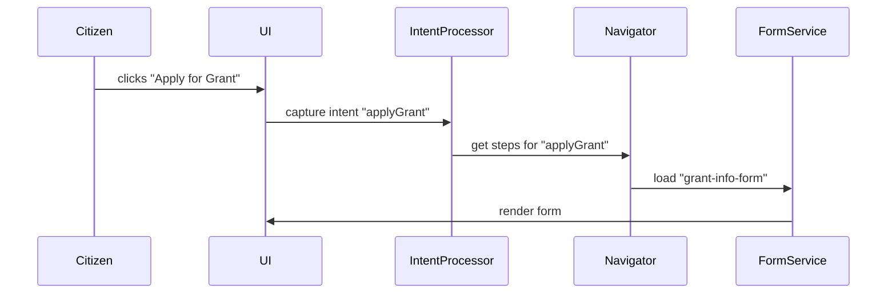

# Chapter 1: Intent-Driven Navigation

Welcome to HMS-MKT! In this chapter, we introduce **Intent-Driven Navigation**, a UX pattern that steers users toward their goals—like filing a complaint, requesting a permit, or applying for a grant—by asking simple questions and then showing the right forms and steps.

---

## 1. Why Intent-Driven Navigation?

Imagine you’re a citizen who wants to apply for a small-business grant at NASA. You visit a big government portal and see dozens of links: “Space Policy,” “Research Data,” “Finance,” “Forms,” “Audits.” It’s overwhelming!

Intent-Driven Navigation acts like a friendly guide or chatbot:

  • It asks: “What do you want to do today?”  
  • You pick “Apply for a Grant.”  
  • It immediately shows you the NASA grant application form and next steps.

This cuts out confusion and speeds up the user’s journey—just what busy citizens and agency staff need.

---

## 2. Key Concepts

1. **Intent**  
   A user’s goal (e.g., `applyGrant`, `fileComplaint`, `reviewDraft`).

2. **Intent Detection**  
   How we capture the user’s choice (a button click, chatbot answer, etc.).

3. **Navigation Flow**  
   A predefined sequence of screens/forms tied to each intent.

4. **Action Handler**  
   Logic that runs when a user completes a step (e.g., save data, call an API).

---

## 3. Using Intent-Driven Navigation

Below is a minimal example in JavaScript. We define a map from intent names to the list of steps (form IDs).

```js
// src/navigation/intentMap.js

export const intentMap = {
  applyGrant: ['grant-info-form', 'budget-form', 'submit-review'],
  fileComplaint: ['complaint-details', 'evidence-upload', 'confirmation']
};
// No more than 10 lines — a simple lookup table.
```

```js
// src/navigation/IntentNavigator.js

import { intentMap } from './intentMap';

export function navigateByIntent(intent) {
  const steps = intentMap[intent] || [];
  // Show each step in order
  steps.forEach(stepId => {
    // UI.showForm is a pseudo-function that loads a form
    UI.showForm(stepId);
  });
}

// Example usage:
navigateByIntent('applyGrant');
// This will show: grant-info-form → budget-form → submit-review
```

**What happens:**  
1. The user picks an intent.  
2. `navigateByIntent` looks up the steps.  
3. Each form loads in sequence.

---

## 4. Under the Hood: Step-by-Step

Here’s a quick non-code walkthrough:

1. **User Action:** Citizen clicks “Apply for Grant.”  
2. **Intent Processor:** Captures `applyGrant`.  
3. **Navigator:** Loads the form sequence from the map.  
4. **UI Layer:** Renders the first form.  
5. **Action Handler:** On form submit, saves data and moves to next step.

### Sequence Diagram



---

## 5. Peek at the Internal Code

Let’s see a trimmed version of `IntentNavigator.js`:

```js
// src/navigation/IntentNavigator.js

export class IntentNavigator {
  constructor(map) {
    this.map = map; // e.g., intentMap
  }

  detectIntent(userChoice) {
    // In real life, we might use NLP or button IDs
    return userChoice; 
  }

  async run(intent) {
    const steps = this.map[intent] || [];
    for (const step of steps) {
      // Imagine fetchFormConfig loads JSON describing fields
      const cfg = await fetchFormConfig(step);
      UI.renderForm(cfg); // render the form
      await UI.waitForSubmit(step); // wait user input
    }
  }
}
```

- `detectIntent` is where you could plug in a chatbot or NLP.  
- `run` loops through each step, fetches config, and renders it.

---

## 6. Analogy: Airport Guidance

Think of an airport information desk:
  1. You tell the agent “I’m flying to Boston.”  
  2. They hand you a gate map and boarding pass instructions.  
  3. You follow the signs and reach your gate.

Intent-Driven Navigation is that agent: concise, goal-focused guidance.

---

## 7. Summary & Next Steps

You’ve learned what Intent-Driven Navigation is, why it helps in complex government portals, how to wire up a simple intent-map, and what happens behind the scenes. Next, we’ll build the visual components to render those forms seamlessly.

Continue to [Frontend Interface Library](02_frontend_interface_library_.md) to see how our UI toolkit works with these navigation flows!

---

Generated by [AI Codebase Knowledge Builder](https://github.com/The-Pocket/Tutorial-Codebase-Knowledge)