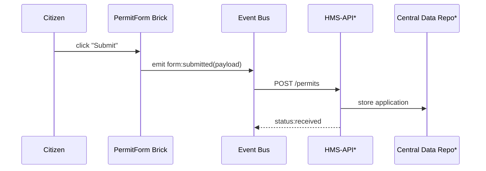

# Chapter 1: Interface Layer (HMS-MFE & Portals)


> “Citizens should spend minutes—not months—finding government services.”  
> — Every frustrated taxpayer, ever

The Interface Layer is the public face of HMS-ACT.  
Think of it as the government’s **lobby**: doors for citizens, kiosks for staff, and tablets for ministers—​all assembled from the same set of Lego-like UI bricks.

---

## 1. Why Do We Need an Interface Layer?

### A 60-Second Story  
Maria owns a small bakery in Austin. She wants a federal permit to ship her award-winning cookies to military bases overseas. Traditionally she would:

1. Discover a PDF buried three clicks deep on a .gov site.  
2. Print, fill, sign, scan, and email it.  
3. Wait weeks for status updates—with zero visibility.

With HMS:

1. Maria visits **permit.gov** (a portal built with HMS-MFE).  
2. She fills out an online form that *also* powers an internal inspector dashboard.  
3. Real-time status and notifications keep her in the loop.

The Interface Layer solves two pains:

* **Consistent experience** — Citizens, staff, and leadership see the same data in different skins.  
* **Faster delivery** — Agencies compose portals from ready-made bricks instead of reinventing UI wheels.

---

## 2. Key Concepts in Plain English

| Term | Friendly Explanation |
|------|----------------------|
| **Portal** | A full website (public or internal) assembled from HMS-MFE bricks. |
| **Micro-Frontend (MFE)** | A self-contained UI piece, like “Upload Document,” that can live on any portal page. |
| **UI Brick** | Our nickname for an MFE—small, reusable, snap-together component. |
| **Event Bus** | A messenger hallway where bricks talk (“Form Submitted!”). |
| **Localization Hook** | A placeholder where translators drop text for Spanish, French, etc. |

Analogy:  
Building a portal is like creating a wall of Lego plates—snap blue bricks for forms, red bricks for charts, and yellow bricks for notifications.  
The Event Bus is the chat channel they all listen to.

---

## 3. Building Your First Portal (A Teeny Demo)

Below is a **React-ish** example that mounts two HMS-MFE bricks: a PermitForm and a StatusTimeline.

```javascript
// portal/index.js  (12 lines)
import { createRoot } from 'react-dom/client';
import { PermitForm, StatusTimeline, EventBus } from '@hms-mfe/bricks';

function App() {
  return (
    <EventBus>
      <PermitForm agency="CFTC" />     {/* Citizen enters data */}
      <StatusTimeline />               {/* Shows live status */}
    </EventBus>
  );
}

createRoot(document.getElementById('root')).render(<App />);
```

What happens?

1. `PermitForm` broadcasts `form:submitted` on the Event Bus.  
2. `StatusTimeline` listens and refreshes progress.  
3. Both bricks automatically pull styles from the agency theme (e.g., usa-blue for CFTC).

---

## 4. Step-By-Step Under the Hood

How does a simple “Submit” click travel through the stack?



`*` We’ll dive into these layers in later chapters.

---

## 5. Extending for Staff Kiosks

Imagine an inspector at the U.S. Army depot.  
She logs into **staff.army.gov**—a private portal using the *same* bricks:

```javascript
// kiosk/dashboard.js  (10 lines)
import { TaskQueue, DocumentViewer } from '@hms-mfe/bricks';
import { withRoleGuard } from '@hms-auth'; // from next chapter 👀

export default withRoleGuard('inspector', () => (
  <>
    <TaskQueue filter="pending" />
    <DocumentViewer />
  </>
));
```

`withRoleGuard` is explained in [Role & Identity Management (Accounts & Authorization)](02_role___identity_management__accounts___authorization__.md).

---

## 6. Customizing Look & Feel

Each agency ships a tiny JSON file:

```json
// themes/cftc.json
{
  "primaryColor": "#005ea2",
  "logo": "/img/cftc-seal.svg",
  "fontFamily": "Source Sans Pro"
}
```

At build time (or dynamically), the portal loader injects these values so every brick instantly “re-skins” without code changes—just like USAID’s ForeignAssistance.gov redesign.

---

## 7. A Peek at the Interface Layer Repo

The project tree (simplified):

```
hms-interface/
 ├─ bricks/
 │   ├─ PermitForm/
 │   ├─ StatusTimeline/
 │   └─ TaskQueue/
 ├─ themes/
 ├─ event-bus/
 └─ README.md
```

### Mini Implementation: The Event Bus

```javascript
// event-bus/index.js  (18 lines)
import React, { createContext, useCallback, useContext, useRef } from 'react';

const BusContext = createContext();

export function EventBus({ children }) {
  const listeners = useRef({});

  const emit = useCallback((type, data) =>
    (listeners.current[type] || []).forEach(fn => fn(data)), []);

  const on = useCallback((type, fn) => {
    listeners.current[type] = (listeners.current[type] || []).concat(fn);
  }, []);

  return (
    <BusContext.Provider value={{ emit, on }}>
      {children}
    </BusContext.Provider>
  );
}

export const useBus = () => useContext(BusContext);
```

Explanation:

1. `emit` pushes messages.  
2. Bricks call `useBus().on('event', fn)` to listen.  
3. All stays in-browser—fast and light.

---

## 8. Where Does This Fit in HMS-ACT?

The Interface Layer glues into other layers you’ll meet soon:

* Talks to the orchestration engine in [HMS-ACT Orchestration Engine](09_hms_act_orchestration_engine_.md).  
* Relies on the auth layer described next.  
* Uses components documented in [Micro-Frontend Component Library (HMS-MFE)](15_micro_frontend_component_library__hms_mfe__.md).

---

## 9. Recap

You learned:

1. The Interface Layer offers Lego-style bricks for building portals.  
2. Micro-frontends communicate through an Event Bus.  
3. The same bricks power citizen, staff, and leadership views with different skins.

Ready to let users log in and see personalized content?  
Jump to [Role & Identity Management (Accounts & Authorization)](02_role___identity_management__accounts___authorization__.md).

---

Generated by [AI Codebase Knowledge Builder](https://github.com/The-Pocket/Tutorial-Codebase-Knowledge)