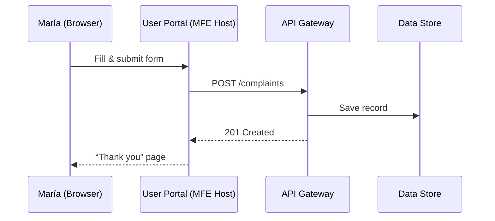

# Chapter 1: Interface Layer (HMS-MFE / User & Admin Portals)

Welcome! Think of this layer as the entrance lobby of a large federal building.  
Citizens walk in through the **User Portal** doors, employees swipe their badges at the **Admin Portal** desk, and both groups immediately see clear signs, braille labels, and ramps that follow accessibility rules.  
Our goal in this chapter is to show you how that digital lobby is built.

---

## 1 . Why does this layer exist?

Use-case:  
María, a first-time home-buyer in Phoenix, wants an *Affordable Housing Permit* from the U.S. Department of Housing and Urban Development (HUD).  

1. María opens the User Portal, fills out an online form, and hits “Submit”.  
2. Officer Lee at HUD opens the Admin Portal, sees María’s request in a dashboard, digitally signs the permit, and overrides the AI’s “low priority” flag because housing is time-sensitive.  
3. Both people move on with their day.

Without an Interface Layer they would be emailing PDFs back and forth.  
With it, they use **one shared, consistent, and accessible web experience**—even though each HUD, EOIR, or FLETC team can brand the pages in their own style.

---

## 2 . Key Ideas in Plain English

| Term                | What it means (beginner view)                                                         |
|---------------------|---------------------------------------------------------------------------------------|
| User Portal         | Public website where citizens file permits, complaints, FOIA requests, etc.          |
| Admin Portal        | Intranet for officials to approve, reject, or escalate those submissions.            |
| Micro-Frontend (MFE)| A small, isolated piece of UI (e.g., “permit-form”) that can be plugged in like Lego. |
| Design System       | A library of buttons, modals, charts that all look federal-grade and 508-compliant.  |
| Theme               | Color & logo overrides so each agency still “looks like itself”.                     |

---

## 3 . Quick Start – Building a “Submit Complaint” Page

Let’s build the simplest possible page in the User Portal.

```tsx
// File: mfes/complaint-form.tsx
import { TextInput, Select, Button } from '@hms/design-system';

export default function ComplaintForm() {
  return (
    <form>
      <TextInput
        label="Describe the issue"
        aria-describedby="issueHelp"
        required
      />
      <Select label="Agency" options={['HUD', 'EOIR', 'FLETC']} />
      <Button type="submit">Send Complaint</Button>
    </form>
  );
}
```

Explanation (plain words):

1. We import **TextInput**, **Select**, and **Button** from the Design System—no CSS files needed.  
2. The `aria-describedby` attribute and built-in contrast automatically satisfy Section 508.  
3. When the user clicks **Send Complaint**, the form is submitted to the backend (we’ll connect it later).

---

### Live preview during development

```bash
$ npm run portal:user
```

Visit `http://localhost:4200/complaint`—your page hot-reloads each time you edit.

---

## 4 . Connecting to the Backend (high-level only)

We will dive deep into APIs in [Backend API Gateway (HMS-API / HMS-MKT)](03_backend_api_gateway__hms_api___hms_mkt__.md).  
For now, imagine you call a single REST endpoint:

```ts
await fetch('/api/complaints', {
  method: 'POST',
  body: JSON.stringify(formData)
});
```

The Interface Layer only worries about **collecting** the data and **displaying** results; it delegates heavy work to other layers.

---

## 5 . How things flow under the hood

A tiny sequence diagram:



Main takeaways:

• The portal does **zero** direct database work.  
• MFEs are sandboxed, so a crash in one widget won’t bring down the whole site.

---

## 6 . Digging a Little Deeper (but still beginner-friendly)

Folder peek:

```
hms-mfe/
 ├─ host/
 │   └─ shell.tsx
 ├─ mfes/
 │   ├─ complaint-form.tsx
 │   └─ permits-dashboard.tsx
 └─ design-system/  ← shared across all MFEs
```

shell.tsx (simplified):

```tsx
import { BrowserRouter, Routes, Route } from 'react-router-dom';
import ComplaintForm from '../mfes/complaint-form';

export default function Shell() {
  return (
    <BrowserRouter>
      <Routes>
        <Route path="/complaint" element={<ComplaintForm />} />
        {/* more routes later */}
      </Routes>
    </BrowserRouter>
  );
}
```

Explanation:

1. `Shell` is the *glue* that wires MFEs to routes.  
2. Each MFE is lazy-loaded, meaning unused code never gets downloaded—handy for low-bandwidth rural users.

---

## 7 . Accessibility & Theming

```css
/* File: design-system/themes/hud.css */
:root {
  --primary: #0063a5; /* HUD blue */
  --contrast: #ffffff;
}
```

Drop a single `<link>` tag in the HTML, and the entire portal switches to HUD branding **without** breaking accessibility color ratios.

---

## 8 . Common Mistakes & How to Avoid Them

Mistake: Hard-coding colors or fonts in MFEs.  
Fix: Always consume variables from the Design System theme.

Mistake: Making API calls directly in deeply nested components.  
Fix: Centralize calls in a *service layer* so you can later plug in smart routing from [Intent-Driven Navigation & Guided Journeys](02_intent_driven_navigation___guided_journeys_.md).

---

## 9 . Recap

• The Interface Layer is your digital lobby—public & staff enter through tailored doors.  
• You built a simple “Submit Complaint” page using **ready-made, accessible components**.  
• Under the hood, micro-frontends stay isolated while sharing one design system.  

Ready to guide users from Page A to Page B based on *why* they came, not just *where* they clicked?  
Jump to [Intent-Driven Navigation & Guided Journeys](02_intent_driven_navigation___guided_journeys_.md).

---

Generated by [AI Codebase Knowledge Builder](https://github.com/The-Pocket/Tutorial-Codebase-Knowledge)