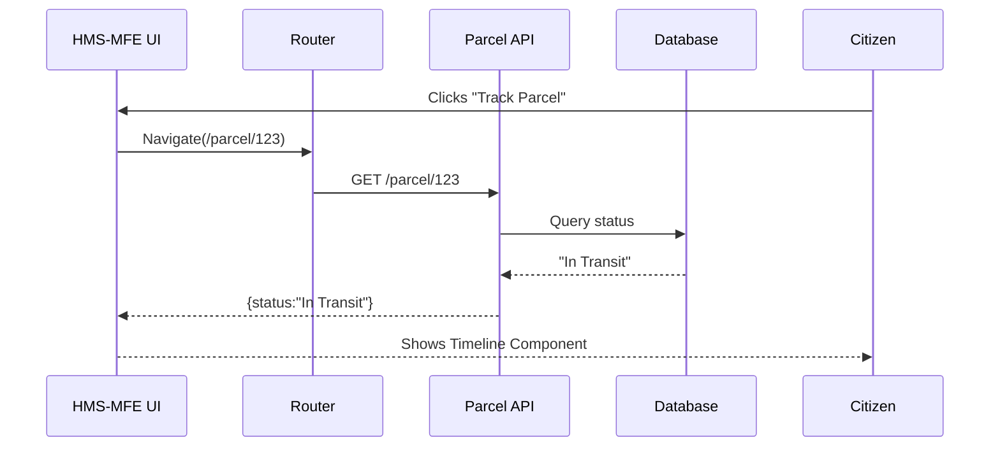

# Chapter 1: Interface Layer (HMS-MFE)


*“Think of HMS-MFE as the digital lobby of a federal building—bright signs, clear instructions, and a single counter where every visitor starts their journey.”*

---

## 1. Why Do We Need an Interface Layer?

Imagine a citizen, Maya, stationed overseas with the **Military Postal Service Agency (MPSA)**.  
She wants to:

1. Check the status of a missing parcel.  
2. Apply for a reimbursement form.  
3. Switch the website to Spanish so her parents can follow along.

Without a unified interface layer, each of those tasks might live on a different website, look different, and ask for the same information over and over. HMS-MFE solves this by giving every agency a **shared set of buttons, forms, dashboards, themes, and languages**—so Maya can glide through her tasks without friction.

---

## 2. Key Concepts (In Plain English)

| Concept | What It Really Means | 1-Sentence Analogy |
|---------|----------------------|--------------------|
| Micro-Front-End (MFE) | Small, independent UI pieces that plug together like LEGO bricks. | “Each agency brings its own LEGO brick, but they all snap onto the same board.” |
| Reusable Components | Pre-built buttons, inputs, tables, etc. | “Uniform stamps you can stick on any form.” |
| Theming | Swap colors, fonts, or logos without rewriting code. | “Change the paint on a room, not the walls.” |
| i18n (Internationalization) | Load language packs on demand. | “Flip the bilingual sign at the info desk.” |
| Accessibility (a11y) | WCAG-compatible colors, aria-labels, keyboard support. | “Wheelchair ramps for digital spaces.” |

---

## 3. A 3-Minute Tour with Code

Below are ultra-small snippets to show how HMS-MFE feels in code.
*(Each block ≤ 20 lines, heavily simplified.)*

### 3.1 A Uniform Button

```tsx
// src/components/Button.tsx
import React from "react";

export function Button({ label, onClick, variant = "primary" }) {
  const base = "px-4 py-2 rounded focus:outline-none";
  const styles = {
    primary: "bg-blue-700 text-white",
    danger: "bg-red-600 text-white",
  };
  return (
    <button
      className={`${base} ${styles[variant]}`}
      onClick={onClick}
    >
      {label}
    </button>
  );
}
```

**What just happened?**  
We created a single `<Button>` that every agency can reuse and theme (blue for “Submit”, red for “Delete”) without duplicating code.

---

### 3.2 A Quick Language Switcher

```tsx
// src/i18n/useTranslation.ts
const phrases = {
  en: { trackParcel: "Track Parcel" },
  es: { trackParcel: "Rastrear Paquete" },
};

export function t(key, lang = "en") {
  return phrases[lang][key] || key;
}
```

**Usage**

```tsx
import { t } from "./i18n/useTranslation";
<h1>{t("trackParcel", user.lang)}</h1>
```

Maya toggles Spanish, and every phrase updates—no new screen required.

---

### 3.3 A Simple Dashboard Layout

```tsx
// src/layouts/Dashboard.tsx
import { Sidebar } from "../navigation/Sidebar";

export function Dashboard({ children }) {
  return (
    <div className="flex">
      <Sidebar />
      <main className="flex-1 p-6">{children}</main>
    </div>
  );
}
```

Plug any agency-specific module (`<PermitStatus/>`, `<GrantWizard/>`) into `<Dashboard>` and it inherits the same look & feel.

---

## 4. What Happens Under the Hood?

Below is a high-level journey when Maya clicks “Track Parcel”.



### Step-by-Step (No Code)

1. **Unified Button** captures the click.  
2. **Router** (part of [Intent-Driven Navigation & Journeys](02_intent_driven_navigation___journeys_.md)) loads the right page.  
3. API call happens; UI shows a spinner from the component library.  
4. Once data returns, a **Timeline** component renders the status in the selected language and theme.

---

## 5. Peeking at File Structure

```
hms-mfe/
  src/
    components/
      Button.tsx
      Input.tsx
    layouts/
      Dashboard.tsx
    navigation/
      Router.tsx
    themes/
      default.ts
      government-blue.ts
    i18n/
      useTranslation.ts
```

Each folder isolates a concern. If the **Office of Servicemember Affairs** wants a new color theme, they only touch `themes/servicemember.ts`.

---

## 6. Mini Implementation Deep-Dive

### 6.1 Theming in ≤ 15 Lines

```ts
// src/themes/government-blue.ts
export default {
  colors: {
    primary: "#2541B2",
    secondary: "#EFF2F7",
    danger: "#C41E3A",
  },
  font: "'Public Sans', sans-serif",
};
```

A global `<ThemeProvider>` injects these values into every Button/Sidebar:

```tsx
// src/App.tsx
import ThemeProvider from "./themes/Provider";
import govBlue from "./themes/government-blue";

<ThemeProvider theme={govBlue}>
  <Router />
</ThemeProvider>
```

Swap `govBlue` for `darkMode` or `highContrast` without touching component logic.

---

## 7. Hands-On Exercise (Try It!)

1. Clone the repo (placeholder).  
2. Run `npm start`.  
3. Change the primary color in `government-blue.ts` to `#00695C` (teal).  
4. Refresh—every **primary** button instantly updates. 🎉

---

## 8. Where We’re Headed Next

You now know how HMS-MFE offers a **consistent, themeable, and accessible** front door for any agency process—from parcel tracking to grant applications.

In the next chapter we’ll see how users move through that front door with purposeful flows using [Intent-Driven Navigation & Journeys](02_intent_driven_navigation___journeys_.md).

---

*Welcome to the lobby—let’s start guiding people to the right desks!*

---

Generated by [AI Codebase Knowledge Builder](https://github.com/The-Pocket/Tutorial-Codebase-Knowledge)