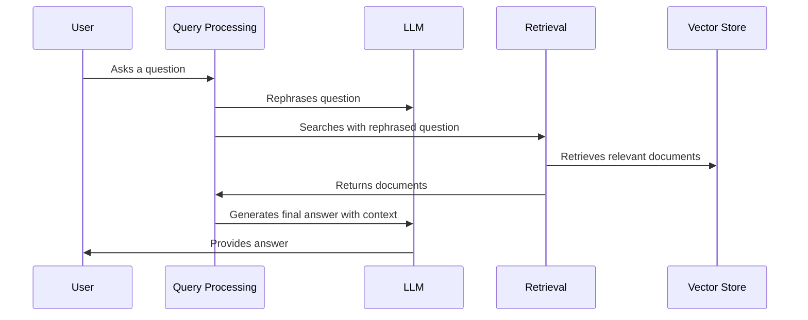

# Chapter 1: LLM (Large Language Model)

Imagine you're building a chatbot that can answer questions about the LangChain documentation.  You want it to be smart enough to understand complex questions and provide helpful, accurate answers.  This is where Large Language Models (LLMs) come in.  They are the "brains" of our chatbot.

## What is an LLM?

An LLM is like a super-reader that has read a vast amount of text and can understand and generate human-like text. It's trained on massive datasets and can perform various tasks, from summarizing information to answering questions and even writing creative content. In our chatbot, the LLM is responsible for understanding your questions, figuring out what information is needed, and crafting the final answer based on that information.

Think of it like asking a really knowledgeable friend a question. Your friend (the LLM) listens to your question, thinks about what they know, and then gives you an answer.

## How does an LLM work in our chatbot?

In our chatbot, the LLM works in conjunction with other components like the [Retrieval](02_retrieval_.md) system and the [Vector Store](03_vector_store_.md). Here's a simplified breakdown:

1. You ask a question to the chatbot.
2. The LLM helps rephrase your question to make it easier to search for relevant information.  This is like your friend (the LLM) clarifying what you're asking before looking for the answer.
3. The rephrased question is used to search the [Vector Store](03_vector_store_.md), which contains information from the LangChain documentation. This is like your friend searching their memory or notes for relevant information.
4. The [Retrieval](02_retrieval_.md) system returns the most relevant pieces of information. This is like your friend finding the most helpful passages in their notes.
5. The LLM takes your original question and the retrieved information and generates a final answer.  This is like your friend combining their knowledge with the information they found to give you a complete answer.



##  Looking under the hood

Let's look at a simplified code snippet to see how the LLM is used:

```python
# backend/chain.py (simplified)
from langchain.chat_models import ChatOpenAI

# ... other code ...

def get_response(question, chat_history, retriever):
    # ... other code to rephrase the question and retrieve documents ...

    llm = ChatOpenAI(temperature=0) # Initialize the LLM
    response = llm.predict_messages(
        [
            # ... system message and chat history ...
            {"role": "user", "content": question}, # Your question
            {"role": "assistant", "content": retrieved_docs} # Retrieved info
        ]
    )
    return response.content
```

This simplified code shows how the LLM (`ChatOpenAI`) is used to generate the final answer.  The `predict_messages` function takes your question and the retrieved documents as input and generates the answer.

## Conclusion

LLMs are the core of our chatbot, enabling it to understand questions and generate informative answers. They work together with other components like [Retrieval](02_retrieval_.md) and [Vector Store](03_vector_store_.md) to provide a comprehensive answer to your questions. Now that we understand the role of the LLM, let's explore how we retrieve relevant information from the LangChain documentation in the next chapter: [Retrieval](02_retrieval_.md).


---

Generated by [AI Codebase Knowledge Builder](https://github.com/The-Pocket/Tutorial-Codebase-Knowledge)