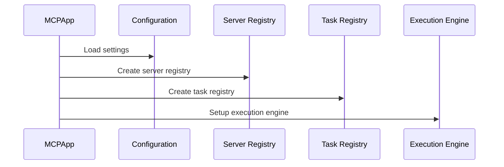

# Chapter 1: MCPApp

Imagine you're building an AI application that can access different tools and services, like fetching web pages, reading files, or interacting with a database.  You'll need a way to manage all these different components and their interactions. That's where the `MCPApp` comes in.  Think of it as the conductor of an orchestra, coordinating all the different instruments (tools and services) to play a harmonious tune (your AI application).

## What problem does MCPApp solve?

Let's say you want to build a simple AI assistant that can summarize the latest news articles about a specific topic. This assistant needs to:

1. Search for relevant news articles online.
2. Fetch the content of those articles.
3. Summarize the fetched content.

Each of these steps might involve a different tool or service. The `MCPApp` helps you organize and manage these tools, making it easier to build your AI assistant.

## Key Concepts

The `MCPApp` is the main container for your AI application. It manages the lifecycle of your [Agents](02_agent.md), [MCP Servers](04_mcp_server.md), and [Workflows](03_workflow.md).

## Using MCPApp

Here's a simplified example of how to use `MCPApp` to build a basic AI application:

```python
import asyncio

from mcp_agent.app import MCPApp
from mcp_agent.agents.agent import Agent
from mcp_agent.workflows.llm.augmented_llm_openai import OpenAIAugmentedLLM

app = MCPApp(name="my_news_summarizer")

async def summarize_news(topic):
    async with app.run() as agent_app:
        news_agent = Agent(
            name="news_agent",
            instruction="Summarize news articles about a given topic.",
            server_names=["fetch"], # This agent will use the 'fetch' MCP server
        )
        async with news_agent:
            llm = await news_agent.attach_llm(OpenAIAugmentedLLM)
            summary = await llm.generate_str(f"Summarize news about {topic}")
            return summary

async def main():
    summary = await summarize_news("AI")
    print(summary)

if __name__ == "__main__":
    asyncio.run(main())

```

This code initializes an `MCPApp` and defines a `summarize_news` function. Inside this function, it creates a `news_agent` that uses the `fetch` [MCP Server](04_mcp_server.md) to retrieve news articles.  The agent then uses an [AugmentedLLM](05_augmentedllm.md) to generate a summary.

## Internal Implementation

When you call `app.run()`, the `MCPApp` initializes several components:

1. **Configuration:** Loads settings from `mcp_agent.config.yaml` and `mcp_agent.secrets.yaml`. These files contain information about [MCP Servers](04_mcp_server.md), LLM providers, and logging.
2. **Server Registry:** Creates a registry of available [MCP Servers](04_mcp_server.md).
3. **Task Registry:** Creates a registry of available tasks (used by [Workflows](03_workflow.md)).
4. **Execution Engine:** Sets up the execution environment (e.g., asyncio).



The `MCPApp` also handles cleanup when `app.run()` exits, ensuring that all resources are released.

Here's a simplified look at the `initialize` function from `src/mcp_agent/app.py`:

```python
async def initialize(self):
    # Load configuration
    self._context = await initialize_context(self._config_or_path)
    # ... other initialization steps ...
```

And the `cleanup` function:

```python
async def cleanup(self):
    # ... cleanup steps ...
    await cleanup_context()
```

## Conclusion

The `MCPApp` provides a foundation for building AI applications by managing the lifecycle of your [Agents](02_agent.md), [MCP Servers](04_mcp_server.md), and [Workflows](03_workflow.md). It handles configuration, server management, and task registration, allowing you to focus on the core logic of your application. Now that we understand the role of the `MCPApp`, let's explore the concept of an [Agent](02_agent.md) in the next chapter.  [Agent](02_agent.md) is a key component in interacting with the tools and services managed by the `MCPApp`.


---

Generated by [AI Codebase Knowledge Builder](https://github.com/The-Pocket/Tutorial-Codebase-Knowledge)