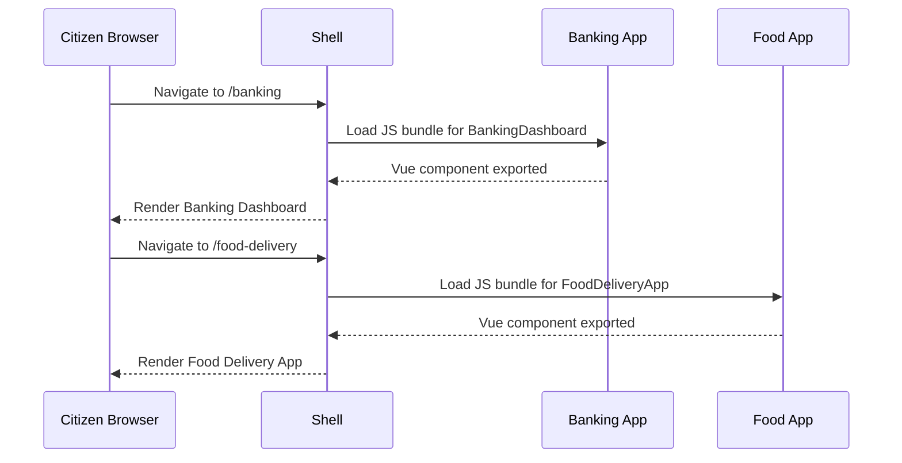

# Chapter 1: Micro-Frontend (HMS-MFE)  

> “Think of our platform as a government services mall: every agency can run its own register, but citizens still walk the same hallways.”

---

## 1. Why Micro-Frontends?

Imagine the Delta Regional Authority (DRA) wants to launch an **Economic-Impact Dashboard** while the Census Bureau is preparing a **2024 Survey Form**.  
Traditionally, both teams must touch one huge code-base, wait for synchronized releases, and pray nothing else breaks.

With HMS-MFE each team ships a *tiny, self-contained* Vue application (“shop”) that is plugged into the same shell (“mall”). Citizens see one seamless website, while agencies work at their own pace. Result: faster releases, lower risk, and true inter-agency agility.

---

## 2. Core Ideas in Plain English

| Concept | Everyday Analogy | 1-Sentence Explanation |
|---------|------------------|------------------------|
| Shell | Mall building | Hosts common walls, navigation, styling. |
| Micro-App | Individual shop | Own cash register, staff, inventory—yet still part of the mall. |
| Routing | Mall directory | Decides which shop appears when a visitor clicks a link. |
| Shared Design System | Federal style guide | Ensures every shop uses the same fonts, colors, badges. (See [Frontend Component Library & Design System](02_frontend_component_library___design_system_.md)) |
| Independent Deployment | Separate leases | A shop can renovate without closing the whole mall. |

---

## 3. A 5-Minute “Hello Agency” Walk-Through

We’ll add two agency screens:

1. BankingDashboard (FDIC-style oversight)  
2. FoodDeliveryApp (city permit portal)

### 3.1 Create the Micro-Apps

`components/pages/dashboards/banking/BankingDashboard.vue`

```vue
<template>
  <div class="banking-dashboard">
    <h1>Banking Dashboard</h1>
  </div>
</template>
```

`components/pages/apps/FoodDeliveryApp.vue`

```vue
<template>
  <div class="food-delivery-app">
    <h1>Food Delivery App</h1>
  </div>
</template>
```

*What just happened?*  
Each file is a **stand-alone Vue component**. No globals, no hidden dependencies. The DRA team could own one repo; the city health department another.

### 3.2 Register with the Shell

`src/mfeManifest.json` (fictional  simplified file)

```json
{
  "routes": [
    { "path": "/banking", "module": "BankingDashboard" },
    { "path": "/food-delivery", "module": "FoodDeliveryApp" }
  ]
}
```

Explanation:  
• When a citizen visits `/banking`, the shell **lazy-loads** `BankingDashboard.vue`.  
• When they visit `/food-delivery`, it loads `FoodDeliveryApp.vue`.  
No re-deploy of unrelated screens is required.

### 3.3 Try It Out

```bash
npm run dev   # shell starts on http://localhost:5173
```

Open the two URLs. Notice that:

1. The header/footer look identical (provided by the shared design system).  
2. Only the center pane changes—exactly like walking into another shop.

---

## 4. Digging One Layer Deeper (but still friendly)

### 4.1 What Happens Under the Hood?



### 4.2 Key Implementation Points

1. **Code-Splitting** – the shell fetches only the JS chunk needed for the current route.  
2. **Scoped CSS** – each micro-app’s styles live in its own file, avoiding collisions.  
3. **Event Bus (Optional)** – micro-apps can communicate through a tiny, shared Pub/Sub library when coordination is needed (e.g., global sign-out).

#### Mini Event Bus Example (8 lines)

```js
// src/lib/eventBus.js
const listeners = {};
export const publish = (e, p) => (listeners[e]||[]).forEach(fn=>fn(p));
export const subscribe = (e, fn) => {
  listeners[e] = (listeners[e]||[]).concat(fn);
  return () => listeners[e] = listeners[e].filter(f=>f!==fn);
};
```

Usage inside any micro-app:

```js
import { publish } from '@/lib/eventBus';
publish('audit', {screen:'Banking', action:'VIEW'});
```

Even beginners can see that `publish` simply runs every function registered for the event.

---

## 5. Frequently Asked Beginner Questions

**Q: Do all micro-apps have to use Vue?**  
A: In HMS we *recommend* Vue for consistency, but technically the shell can load any framework as a Web Component.

**Q: How do we share fonts and colors?**  
A: Through the component library covered next: [Frontend Component Library & Design System](02_frontend_component_library___design_system_.md).

**Q: What about security?**  
A: Authentication is centralized via the IAM layer (see [Identity & Access Management (IAM)](04_identity___access_management__iam__.md)). Each micro-app receives a validated token, never handles passwords itself.

---

## 6. Recap

You learned that:

• HMS-MFE is a *mall-style* architecture.  
• Each government team can deploy a screen without impacting others.  
• A tiny manifest plus normal Vue files get you started.  

In the next chapter we’ll make those screens look *official* and accessible by tapping into the shared design system.

👉 Continue to [Frontend Component Library & Design System](02_frontend_component_library___design_system_.md)

---

Generated by [AI Codebase Knowledge Builder](https://github.com/The-Pocket/Tutorial-Codebase-Knowledge)