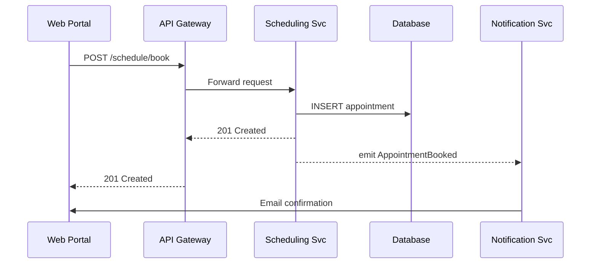

# Chapter 1: Multi-Layered Microservices Architecture

Welcome to HMS-SCM!  
Before we dive into code, let’s first understand the “city map” that all other chapters build upon.

---

## 1. Why Do We Need It? ‑ A Tiny Story

Imagine Alex, a student who wants to apply for a federal grant from the **Department of Education**.  
Alex must:

1. Fill out a complex form (data collection).  
2. Book an appointment to verify documents (scheduling).  
3. Track application status (notifications).  

In a traditional “one-big-app” (a monolith), a single codebase would handle every step. A tiny change (e.g., new disability-related question recommended by the **National Council on Disability**) would force developers to redeploy the *entire* system—risky, slow, and expensive.

A **Multi-Layered Microservices Architecture** splits that giant app into **small, purpose-built services** (like specialized city neighborhoods). Each service can be changed, scaled, or secured *independently* while still working together through well-marked “streets” (APIs).

---

## 2. Core Ideas (Beginner-Friendly)

| Analogy | Real Term | One-Sentence Explanation |
|---------|-----------|--------------------------|
| Building | Microservice | A self-contained program that does one job well (e.g., “Scheduling” or “Form Validation”). |
| Street | API / Service Mesh | The safe path services travel to talk to each other. |
| Zoning Map | Layer | A logical tier that groups related buildings—for example, all “public-facing” houses in one block. |
| City Hall | Governance Layer | Rules and policies that keep every neighborhood compliant (see [Governance Layer (HMS-GOV)](02_governance_layer__hms_gov__.md)). |

### 2.1 The Four Everyday Layers

1. **Interface Layer** – Portals & mobile apps citizens see.  
2. **Gateway Layer** – Traffic cop that routes requests to the right service.  
3. **Service Layer** – Core microservices handling business logic.  
4. **Data & Event Layer** – Databases and event streams that store/relay information.  

We will meet each layer in later chapters, but for now visualize them as stacked rectangles:

```mermaid
flowchart TD
    A[Interface<br>(Web / Mobile)] --> B[API Gateway]
    B --> C[Service Layer<br>(Form, Schedule, Notify)]
    C --> D[Data & Event Layer]
```

---

## 3. A 5-Minute Walk-Through

Below is a *minimal* demo flow for Alex booking an appointment:

1. Alex clicks “Book Time” on the web portal.  
2. Request goes through API Gateway ➜ Scheduling Service.  
3. Scheduling Service stores slot in database and emits `AppointmentBooked` event.  
4. Notification Service listens to that event and sends Alex an email.  

### 3.1 Calling the Scheduling Service

```python
# client_booking.py
import requests

payload = {"student_id": "A123", "slot": "2024-10-05T10:00"}
resp = requests.post("https://api.myhms.gov/schedule/book", json=payload)

print(resp.status_code)      # 201
print(resp.json())           # {"bookingId": "BK-987"}
```

Explanation:  
The tiny script sends JSON to the Gateway. Internally the Gateway forwards it to the Scheduling microservice, which creates the booking and returns a confirmation ID.

---

## 4. What Happens Under the Hood?

Let’s map the internal hop-by-hop journey:



Each arrow is short, purpose-driven, and isolated—proof that no giant “skyscraper” is required.

---

## 5. Peek at the Scheduling Service Code

File: `services/scheduling.py`

```python
from fastapi import FastAPI
from pydantic import BaseModel
import uuid, sqlite3, json, pika  # pika = RabbitMQ client (simplified)

app = FastAPI()

class Booking(BaseModel):
    student_id: str
    slot: str

@app.post("/book", status_code=201)
def book(b: Booking):
    booking_id = f"BK-{uuid.uuid4().hex[:4]}"
    # 1) store
    with sqlite3.connect("hms.db") as db:
        db.execute("INSERT INTO booking VALUES (?,?,?)",
                   (booking_id, b.student_id, b.slot))
    # 2) emit event
    pika.BlockingConnection().channel() \
        .basic_publish(exchange="events",
                       routing_key="AppointmentBooked",
                       body=json.dumps({"id": booking_id}))
    return {"bookingId": booking_id}
```

Walk-through:  
1. Receive JSON ➜ validate with Pydantic.  
2. Save to a simple SQLite table (great for a local demo).  
3. Publish an `AppointmentBooked` event to RabbitMQ so other services (e.g., Notifications) react asynchronously.  

All under 20 lines!

---

## 6. Benefits Recap

• **Agility** – The Scheduling team can change slots logic without touching Form or Notification code.  
• **Scalability** – If everyone books at semester start, we scale *only* Scheduling pods.  
• **Resilience** – A bug in Notifications does not block form submissions.  
• **Compliance** – Governance rules (next chapter!) ensure every service still follows federal standards.

---

## 7. What’s Next?

Now that you can picture our “city,” we’ll visit **City Hall** to learn how rules, policies, and versioning keep the microservices behaving nicely.

Continue to [Governance Layer (HMS-GOV)](02_governance_layer__hms_gov__.md).

---

Generated by [AI Codebase Knowledge Builder](https://github.com/The-Pocket/Tutorial-Codebase-Knowledge)