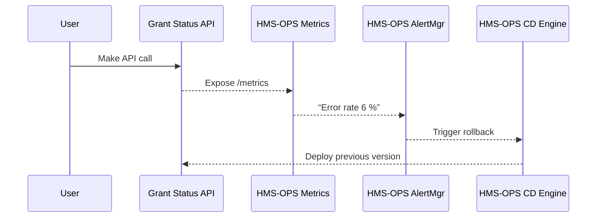

# Chapter 1: Operations & Monitoring Hub (HMS-OPS)

> “Mission Control for every digital public service.”

---

## 1. Why do we need HMS-OPS?

Imagine the **Inter-American Foundation (IAF)** launches a new online grant-application portal.  
Thousands of community groups depend on it. If the site goes down during the final submission hour, projects lose funding and citizens lose trust.

HMS-OPS is built to prevent that nightmare. It:

* Watches every microservice like a weather satellite.
* Warns teams before citizens notice a storm.
* Deploys safe updates (and rolls them back) with one click.
* Opens an incident chat room so responders swarm the issue instantly.

Throughout this chapter we will:

1. Add a tiny microservice to HMS-OPS.
2. See its health on a live dashboard.
3. Trigger an automatic rollback when we introduce an error.

---

## 2. Key Concepts (Beginner Friendly)

| Idea | Think of it as… | Why it matters |
|------|-----------------|----------------|
| **Metrics** | Vital signs (heart rate, blood pressure) | Uptime %, request latency, error count. |
| **Dashboards** | Doctor’s monitor | One screen to spot red alerts fast. |
| **Alerts** | Fire alarm | Ping Slack / SMS when thresholds break. |
| **Continuous Delivery (CD)** | Conveyor belt | Every code change rolls safely into production. |
| **Rollback** | Undo button | If a deployment misbehaves, flip back within seconds. |

---

## 3. Quick-Start: Add Your First Service

We will register a hypothetical “Grant Status API” used by the **National Credit Union Administration (NCUA)** to track grant history for credit unions.

### Step 1. Expose a Prometheus endpoint

```python
# file: grant_status_api/metrics.py
from prometheus_client import start_http_server, Counter

REQUESTS = Counter("gsapi_requests_total", "Total API requests")

def record_request():
    REQUESTS.inc()

if __name__ == "__main__":
    # Start metrics server on :8000/metrics
    start_http_server(8000)
    while True:
        pass  # ← your real app would run here
```

Explanation  
1. We import `prometheus_client`.  
2. `Counter` counts every request.  
3. `start_http_server(8000)` serves metrics on `http://localhost:8000/metrics`.

### Step 2. Tell HMS-OPS about the service

Create a tiny YAML file:

```yaml
# hms-ops/services/grant-status-api.yaml
name: grant-status-api
metrics_url: http://grant-status-api.internal:8000/metrics
owner: ncua-devops@agency.gov
```

Copy it into the `hms-ops/services/` folder (or send it through the API). HMS-OPS will auto-discover the endpoint and begin scraping metrics.

### Step 3. Watch the Dashboard

Open the HMS-OPS web UI → “Services” → “grant-status-api”.  
After ~30 seconds you should see live graphs:

* Requests per minute
* 99th percentile latency
* Error rate

Feel free to generate load (`curl` the endpoint) and watch the graphs move!

---

## 4. Introducing an Error (and Auto-Rollback)

Deploy a version that always raises an exception:

```bash
# ☢️ simulate a bad deployment
kubectl set image deploy/grant-status-api gsapi=registry.gov/gsapi:v2-broken
```

Behind the scenes HMS-OPS checks:

* Error rate > 5 % for 3 minutes  
* Latency spike > 300 ms

If both fire, an **automated rollback** starts:

```plain
⏪ Rollback initiated for grant-status-api to image v1-stable
```

And a Slack channel `#incident-grant-status-api` is created with on-call members auto-added.

---

## 5. What Happens Under the Hood?

### High-Level Flow



Plain-English Steps  

1. The microservice exports metrics continuously.  
2. **Metrics Collector** scrapes them every 15 s.  
3. Alert rules run. If thresholds break, Alert Manager fires.  
4. CD Engine executes the rollback and notifies chat.

---

## 6. Tiny Peek at the Internals

### a) Alert Rule (Prometheus)

```yaml
# file: alerts/grant-status-api.yaml
groups:
- name: grant-status-api
  rules:
  - alert: GSAPI_HighErrorRate
    expr: rate(gsapi_requests_total{status="5xx"}[2m]) 
          / rate(gsapi_requests_total[2m]) > 0.05
    for: 3m
    labels:
      severity: critical
```

Explanation  
The expression measures 5xx errors over total requests. If > 5 % for 3 minutes, alert.

### b) CD Rollback Script (excerpt)

```bash
# file: cd/rollback.sh
SERVICE=$1
PREVIOUS=$(kubectl rollout history deploy/$SERVICE | tail -n1 | awk '{print $1}')
kubectl rollout undo deploy/$SERVICE --to-revision=$PREVIOUS
```

Just grabs the previous Kubernetes revision and undoes.

Both snippets live inside the HMS-OPS codebase but are simple enough for you to adapt.

---

## 7. Where Does HMS-OPS Sit in the Bigger Picture?

```
Citizen ⟶ Interface Layer (HMS-MFE) ⟶ Business Logic microservices
                                        ⬑ observed by HMS-OPS
```

Later chapters will show how HMS-OPS cooperates with:

* [Governance Layer (HMS-GOV)](02_governance_layer__hms_gov__.md) for policy-driven approvals.
* [Workflow Orchestrator (HMS-ACT / OMS)](07_workflow_orchestrator__hms_act___oms__.md) to coordinate multi-step rollouts.

---

## 8. Recap

You learned to:

1. Register a new service with HMS-OPS.  
2. Visualize live health metrics.  
3. Let the platform auto-rollback bad deployments.

HMS-OPS is your safety net, allowing agencies like **NASS** or **IAF** to innovate quickly while keeping services reliable for citizens.

Ready to explore how rules and approvals are codified? Continue to  
[Chapter 2: Governance Layer (HMS-GOV)](02_governance_layer__hms_gov__.md).

---

Generated by [AI Codebase Knowledge Builder](https://github.com/The-Pocket/Tutorial-Codebase-Knowledge)