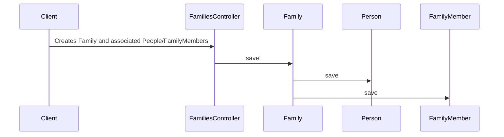

# Chapter 1: Person/Family/FamilyMember

This chapter introduces the core concepts of `Person`, `Family`, and `FamilyMember`, which are fundamental to understanding how our system represents individuals and their relationships.

## Why do we need these concepts?

Imagine we're building a healthcare application.  A central use case is enrolling a family in a health plan. To do this, we need to know who the individuals are, how they're related, and which family they belong to.  That's where `Person`, `Family`, and `FamilyMember` come in.

## Key Concepts

* **Person:** Think of a `Person` as an individual's profile. It stores information like their name, date of birth, contact information, etc.  It's like a digital identity card for each individual in our system.

* **Family:** A `Family` represents a household. It groups related `People` together.  For example, a family could consist of parents and their children, or a single individual.

* **FamilyMember:** A `FamilyMember` connects a `Person` to a `Family`.  It also defines their relationship within the family (e.g., subscriber, spouse, child).  This helps us understand the structure of each family.

## Solving the Use Case: Enrolling a Family

Let's walk through how these concepts work together for family enrollment.

1. **Create People:**  First, we create `Person` objects for each individual in the family.  For example, let's create a `Person` for John and Jane Doe.

2. **Create a Family:** Next, we create a `Family` object to represent the Doe household.

3. **Connect with FamilyMember:** Finally, we create `FamilyMember` objects to connect John and Jane to their family.  John might be the subscriber, and Jane might be the spouse.

```ruby
# Simplified example (actual implementation is more complex)

john = Person.new(first_name: "John", last_name: "Doe")
jane = Person.new(first_name: "Jane", last_name: "Doe")

doe_family = Family.new

john_family_member = FamilyMember.new(person: john, family: doe_family, relationship: "subscriber")
jane_family_member = FamilyMember.new(person: jane, family: doe_family, relationship: "spouse")

doe_family.family_members << john_family_member
doe_family.family_members << jane_family_member

doe_family.save!
```

This code creates two `Person` objects, a `Family` object, and two `FamilyMember` objects, linking everything together.  Now, the Doe family is represented in our system, and we can proceed with their enrollment in a health plan.  (The actual enrollment process involves other concepts like [HbxEnrollment](04_hbxenrollment_.md), which we'll cover in a later chapter.)

## Internal Implementation

When we call `doe_family.save!`, several things happen behind the scenes:



1. The `families_controller.rb` receives the request to create a family.

2. The `Family` model's `save!` method is called.

3. The `save!` method triggers the saving of associated `Person` and `FamilyMember` objects.  This ensures data consistency.

The relevant code for saving a `Family` can be found in `families_controller.rb` and the `Family` model.  The code for saving `Person` and `FamilyMember` is in their respective models.

```ruby
# families_controller.rb (simplified)
def create
  @family = Family.new(family_params)
  @family.save! # This triggers saving of associated objects
end
```

## Conclusion

This chapter introduced the `Person`, `Family`, and `FamilyMember` concepts, explaining how they represent individuals and their relationships.  We used the example of family enrollment to illustrate how these concepts work together.  We also looked at the internal implementation to understand what happens behind the scenes.

Next, we'll explore the concept of a [Plan](02_plan_.md).


---

Generated by [AI Codebase Knowledge Builder](https://github.com/The-Pocket/Tutorial-Codebase-Knowledge)