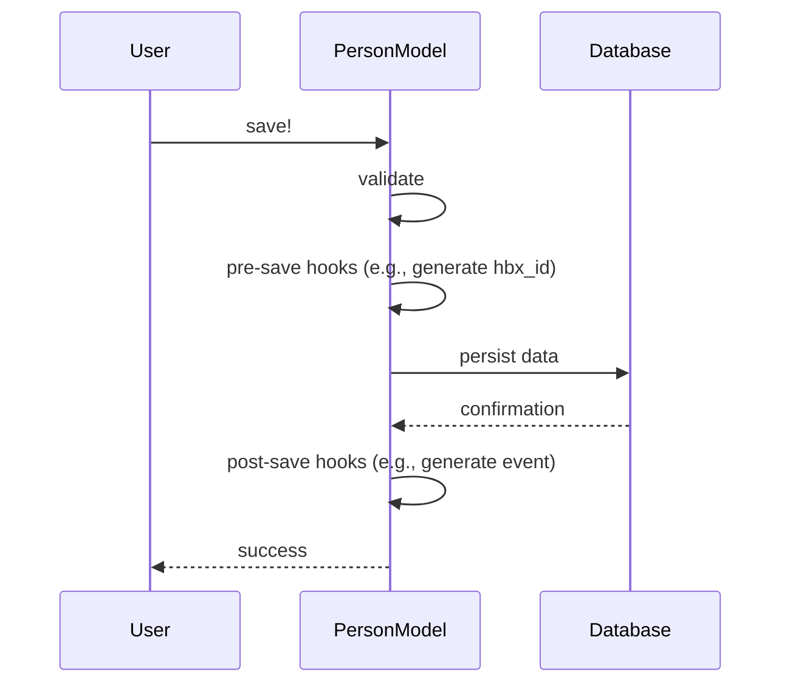

# Chapter 1: Person

This chapter introduces the `Person` concept, a fundamental building block in our system.

## What problem does `Person` solve?

Imagine we're building a system to manage health insurance.  We need a way to represent each individual enrolling in plans, managing their information, and tracking their roles.  How do we store details like their name, contact information, and whether they're an employee or a consumer?  The `Person` model solves this by acting as a central hub for all individual-related data. Think of it like a digital passport for each individual in our system.

## Key Concepts:

1. **Attributes:** A `Person` has various attributes, just like a real passport. These include:
    - `first_name`, `last_name`, `dob` (date of birth), `gender`, `ssn` (social security number), `address`, `phone`, `email`, etc.
    - These attributes help us identify and contact the individual.

2. **Roles:** A `Person` can have different roles in the system. For example, someone could be a `consumer` purchasing insurance individually, an `employee` receiving insurance through their employer, or even a `broker` helping others enroll.  These roles are represented by embedded documents within the `Person` model, such as `consumer_role`, `employee_role`, and `broker_role`.  This allows us to store role-specific information directly within the `Person` record.

## Using the `Person` model

Let's say we want to create a new person named Alice.  We can do this using the `Person` model:

```ruby
# ... other code ...

alice = Person.new(first_name: "Alice", last_name: "Smith", dob: Date.new(1990, 5, 15), gender: "female")
alice.emails.build(kind: "home", address: "alice@example.com")
alice.save!

# ... other code ...
```

This code creates a new `Person` object with Alice's information and saves it to the database.  We've also added an email address for Alice.

## Under the Hood

When you call `alice.save!`, several things happen behind the scenes:

1. **Validation:** The `Person` model validates the input data. For example, it checks if the first name and last name are present and if the date of birth is a valid date.  If the data is invalid, the `save!` operation will raise an error.

2. **Pre-save hooks:**  Before saving, the `Person` model performs some actions, like generating an `hbx_id` if one doesn't exist.  This `hbx_id` is a unique identifier for each person in the system.

3. **Persistence:** The `Person` object, along with its embedded documents (like `emails`), is saved to the database.

4. **Post-save hooks:** After saving, the `Person` model might trigger other actions, such as generating an event to notify other parts of the system that a new person has been created.



The code for these steps is spread across several files, primarily `person.rb`.  Here's a simplified example of the `generate_hbx_id` method:

```ruby
# person.rb
class Person
  # ... other code ...

  def generate_hbx_id
    write_attribute(:hbx_id, HbxIdGenerator.generate_member_id) if hbx_id.blank?
  end

  # ... other code ...
end
```

This method checks if the `hbx_id` is blank and generates a new one if needed.

## Conclusion

This chapter introduced the `Person` model, the central hub for individual data in our system. We learned about its attributes, roles, and how it's used. We also peeked under the hood to understand the internal implementation.  In the next chapter, we'll explore how `Person` objects are grouped into [Families](02_family.md).


---

Generated by [AI Codebase Knowledge Builder](https://github.com/The-Pocket/Tutorial-Codebase-Knowledge)