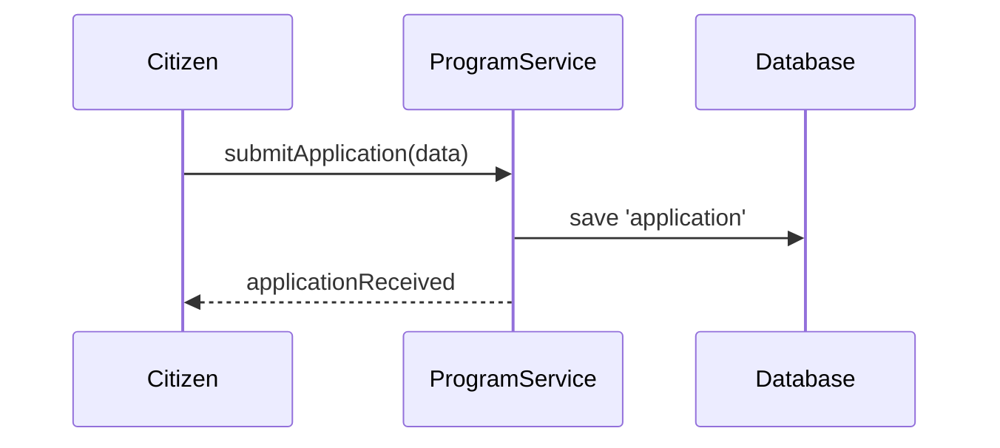

# Chapter 1: Program (Core/Program)

Welcome to the very first chapter of HMS-CDF! In this chapter, we’ll learn about the **Program** abstraction—think of it as a blueprint for a government service or subsidy scheme. By the end, you’ll understand what a Program is, how to configure one, and what happens under the hood when you use it.

---

## 1.1 Why “Program”? A Real-World Analogy

Imagine your city wants to launch a **“Green Energy Subsidy”** for homeowners who install solar panels:

- **Who’s eligible?** Low-income households under \$50,000/year.
- **What steps?** Apply → Review → Disburse funds.
- **How do we track data?** Capture applicant info, panel specs, disbursement records.

A **Program** in HMS-CDF wraps all these rules, steps, and data models into a single, reusable charter. Both the admin portal (HMS-GOV) and citizen portal (HMS-MKT/MFE) read this blueprint to render forms, enforce rules, and show progress.

---

## 1.2 Key Concepts of a Program

1. **Metadata**  
   - `id`, `title`, `description`  
   - Helps identify the service (e.g., `subsidy-green-energy`).

2. **Eligibility Rules**  
   - Who can apply? (e.g., income threshold, residency).  
   - Written as simple JSON conditions.

3. **Workflow Steps**  
   - The ordered sequence of actions.  
   - Example steps:  
     1. `Apply` → `submitApplication`  
     2. `Review` → `reviewApplication`  
     3. `Disburse` → `disburseFunds`

4. **Data Model**  
   - Defines forms and data fields.  
   - Example: `applicationForm.fields = ['name','income','address']`.

---

## 1.3 How to Create and Use a Program

Below is a minimal example in JavaScript. We’ll set up our **Green Energy Subsidy** program:

```js
// 1. Import the Program class
import { Program } from 'hms-cdf/core/program';

// 2. Configure your program
const greenEnergyProgram = new Program({
  id: 'subsidy-green-energy',
  title: 'Green Energy Subsidy',
  description: 'Subsidy for solar panel installation',
  eligibility: {
    incomeLessThan: 50000,
    citizensOnly: true
  },
  steps: [
    { name: 'Apply', action: 'submitApplication' },
    { name: 'Review', action: 'reviewApplication' },
    { name: 'Disburse', action: 'disburseFunds' }
  ],
  dataModel: {
    applicationForm: { 
      fields: ['name', 'income', 'address'] 
    }
  }
});

// 3. Register or start the program
greenEnergyProgram.initialize();
```

Explanation:

- We import and instantiate `Program` with a simple config.
- Calling `initialize()` registers the blueprint—admins can now manage it, and citizens can apply.

---

## 1.4 What Happens Under the Hood?

### 1.4.1 Step-by-Step Walkthrough

1. **Initialization**  
   - `Program.initialize()` validates your config.
2. **Storage**  
   - Saves the program metadata, rules, and model in the database.
3. **API Registration**  
   - Exposes endpoints for `submitApplication`, `reviewApplication`, etc.
4. **UI Sync**  
   - HMS-GOV and HMS-MKT fetch the program blueprint to render forms and buttons.
5. **Runtime Enforcement**  
   - On each action, the system checks eligibility and step order.

### 1.4.2 Sequence Diagram



---

## 1.5 Peek into the Source Code

Let’s open a simplified version of `core/program.ts`:

```ts
// File: core/program.ts
export class Program {
  constructor(private config: ProgramConfig) {
    // 1) Validate config
    // 2) Set defaults if needed
  }

  initialize() {
    // Register program in DB
    Database.save('programs', this.config);

    // Expose API endpoints based on steps:
    this.config.steps.forEach(step => {
      ApiRouter.post(`/${this.config.id}/${step.action}`, (req, res) => {
        // handle each step
      });
    });
  }
}
```

Explanation:

- **Constructor**: checks your `config` shape.
- **initialize()**:  
  1. Persists the blueprint.  
  2. Dynamically creates API routes for each workflow step.

---

## 1.6 Recap and Next Steps

You’ve now seen:

- What a **Program** is and why it matters.  
- How to define eligibility, steps, and data models.  
- The high-level flow from config to runtime.  
- A peek at the core code in `core/program.ts`.

Next, we’ll learn how programs communicate with each other and enforce consistent messaging in [Chapter 2: Protocol (Core/Protocol)](02_protocol__core_protocol__.md).

---

Generated by [AI Codebase Knowledge Builder](https://github.com/The-Pocket/Tutorial-Codebase-Knowledge)