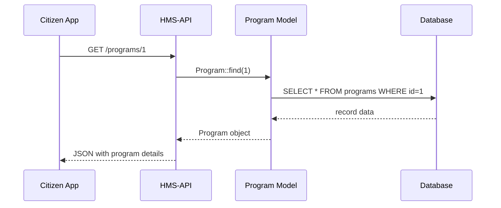
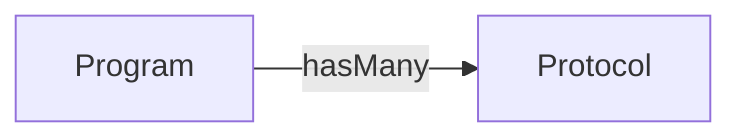

# Chapter 1: Program Model (Core/Program)

Welcome! In this chapter we’ll learn about the **Program** model—a core building block in HMS-API that represents any government program, scholarship, or initiative. Think of a **Program** as a container that holds all the details, rules, and relationships for a public service offering. For example, the “Barry Goldwater Scholarship Program” would be one instance of this model.

---

## Why a Program Model?

Imagine you work at a federal agency that runs multiple initiatives:

- A scholarship program for undergraduate science students  
- An infrastructure grant for rural broadband  
- A disaster relief fund  

Each of these is different, but they share common elements: a name, a description, start/end dates, eligibility rules, and links to related protocols or processes. The **Program** model provides a consistent way to store and retrieve this information.

**Central Use Case**  
> Display details of the “Barry Goldwater Scholarship Program” on a citizen-facing portal.

1. The portal asks HMS-API: “Give me the Barry Goldwater program details.”  
2. HMS-API loads the Program model and returns its attributes.  
3. The portal shows name, description, deadlines, and linked protocols (e.g., application protocol).

---

## Key Concepts

1. **Attributes**  
   Basic fields like `name`, `description`, `start_date`, `end_date`.  
2. **Relationships**  
   Links to child models, such as protocols or eligibility rules.  
3. **Instantiation**  
   How to create, read, update, and delete program records.

---

## Quick Start: Using the Program Model

Below is a minimal example showing how to load a program and read its name:

```php
// File: app/Models/Core/Program/Program.php
namespace App\Models\Core\Program;

class Program {
    protected $attributes = [];
    
    public function protocols() {
        // Relationship stub
    }
}

// Somewhere in a controller:
use App\Models\Core\Program\Program;

// Load by ID
$program = Program::find(1);

// Inspect attributes
echo $program->attributes['name'];
// → "Barry Goldwater Scholarship Program"
```

*Explanation:*  
1. We call `Program::find(1)` to fetch the record with ID=1.  
2. The model populates `$attributes`.  
3. We read the `name` attribute.

---

## Under the Hood: What Happens Step-by-Step

Before we dive into code, here’s a simplified flow when you ask the API for a program’s details:



---

## Inside the Program Model

Let’s peek at `app/Models/Core/Program/Program.php` and highlight the essentials.

```php
<?php
namespace App\Models\Core\Program;

class Program {
    // Stores all fields of the program
    protected $attributes = [];

    // Defines a one-to-many link to protocols
    public function protocols() {
        return $this->hasMany(
            \App\Models\Core\Protocol\Protocol::class,
            'program_id'
        );
    }
}
```

*Explanation:*  
- `$attributes` is an associative array for all program fields.  
- `protocols()` returns related protocol records (covered in [Protocol Model (Core/Protocol)](02_protocol_model__core_protocol__.md)).

---

## Visualizing the Program–Protocol Relationship



This shows that one **Program** can have many **Protocol** entries (application rules, review workflows, etc.).

---

## Example: Fetching Protocols for a Program

```php
// Load a program
$program = Program::find(1);

// Get its protocols
$rules = $program->protocols();

// Output each protocol name
foreach ($rules as $protocol) {
    echo $protocol->attributes['name'] . "\n";
}
```

*Explanation:*  
- `$program->protocols()` returns an array of Protocol objects.  
- We loop through and print each protocol’s `name`.

---

## Recap

In this chapter you learned:

- **What** a Program model is: a container for government initiative data.  
- **Why** it’s useful: standardizes how we store and fetch program details.  
- **How** to load a program, read attributes, and fetch related protocols.  
- **What’s under the hood**: a simple Eloquent-style model with attributes and relationship methods.

Up next, we’ll dive into the details of the **Protocol** model, which defines specific rules and workflows for each program.  
[Next Chapter: Protocol Model (Core/Protocol)](02_protocol_model__core_protocol__.md)

---

Generated by [AI Codebase Knowledge Builder](https://github.com/The-Pocket/Tutorial-Codebase-Knowledge)