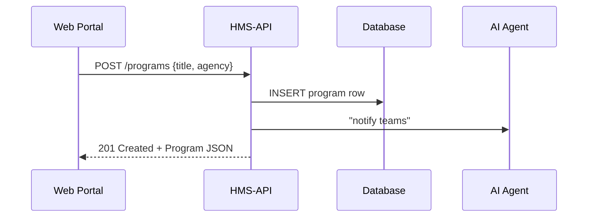

# Chapter 1: Program Model (Core Service Catalogue)

> “Where do I hang new policy data?”  
> The **Program Model** is the answer.

---

## 1 — Why do we need a Program Model?

Imagine you work at HUD on **“Affordable Housing 2030.”**  
There are:

* budget lines coming from Congress,  
* rules enforced by the Wage and Hour Division,  
* health-related metrics tracked by NIDCD,  
* and deadlines that must show up on public portals.

Without a single **anchor record**, every team would make its own spreadsheets and URLs.  
The Program Model is that anchor—one **authoritative folder** inside HMS-API that every other object (budget, protocol, KPI, etc.) can attach to.

---

## 2 — Key Ideas in Plain English

| Idea | Think of it as… |
|------|----------------|
| Program ID | The folder label in the federal filing cabinet. |
| Metadata | Sticky notes on the folder (title, owner agency, fiscal year). |
| Relationships | Staples that hold extra sheets (budgets, protocols, metrics). |
| Versioning | A new edition of the folder when Congress amends the law. |
| Ownership Boundary | Tells other agencies “hands-off unless you own this.” |

---

## 3 — A 60-Second Code Tour

Below is **all** you need to create and retrieve a program entry.

```php
// 1. Create a Program ---------- (file: routes/web.php)
Route::post('/programs', function () {
    $program = \App\Models\Core\Program\Program::create([
        'title' => 'Affordable Housing 2030',
        'owner_agency' => 'HUD',
        'fiscal_year' => 2024,
    ]);
    return $program;          // JSON response
});
```
The route makes a new folder labeled “Affordable Housing 2030.”

```php
// 2. Fetch a Program ---------- (file: routes/web.php)
Route::get('/programs/{id}', function ($id) {
    return \App\Models\Core\Program\Program::with('protocols')->findOrFail($id);
});
```
Calling `/programs/1` returns the folder *plus* its attached protocols (execution playbooks covered in [Protocol Model (Execution Playbook)](02_protocol_model__execution_playbook__.md)).

---

## 4 — What Happens Under the Hood?



1. The portal sends a POST request.  
2. HMS-API writes a new row into the `programs` table.  
3. An AI agent (see [AI Representative Agent](13_ai_representative_agent__hms_agt___agx__.md)) alerts relevant teams.  
4. JSON comes back to the caller.

---

## 5 — Inside `Program.php`

```php
<?php
// app/Models/Core/Program/Program.php
namespace App\Models\Core\Program;

use Illuminate\Database\Eloquent\Model;

class Program extends Model
{
    protected $fillable = ['title', 'owner_agency', 'fiscal_year'];

    // Hook: every time we update, bump the version number
    protected static function booted()
    {
        static::updating(function ($program) {
            $program->version = $program->version + 1;
        });
    }

    // Relationship: one program has many protocols
    public function protocols()
    {
        return $this->hasMany(\App\Models\Core\Protocol\Protocol::class);
    }
}
```
Explanation:

* `fillable` keeps mass-assignment safe.  
* `booted` adds automatic versioning—no manual chores.  
* `protocols()` gives you the list of execution playbooks.

---

## 6 — Attaching Other Objects

Need to add a compliance checklist?

```php
$program = Program::find(1);
$protocol = $program->protocols()->create([
    'name' => 'Prevailing Wage Checklist',
    'deadline' => '2024-09-30',
]);
```
The new checklist is now **stapled** to the folder.  
Details of the Protocol object come next chapter.

---

## 7 — Government Analogy Cheat-Sheet

Program Model      | Real-World Counterpart
-------------------|-----------------------
`Program` record   | Official OMB Catalogue Entry
`owner_agency`     | “Office of Affordable Housing” stamp
`version`          | Federal Register amendment number
`protocols()`      | Binder of SOPs on the shelf

---

## 8 — Things a Beginner Might Trip On

1. **Version Jumps**  
   Updating any column (even a typo) increments `version`. Use wisely.
2. **Ownership**  
   Only the agency listed in `owner_agency` flag has write access.
3. **Orphaned Data**  
   Deleting a Program cascades—budgets and protocols vanish unless preserved.

---

## 9 — Try It Yourself: Mini-Exercise

1. POST a new program named “Cybersecurity Grants 2025.”  
2. Attach a protocol called “Zero-Trust Checklist.”  
3. GET the program and confirm the embedded protocol list.

If all went well you should see:

```json
{
  "id": 2,
  "title": "Cybersecurity Grants 2025",
  "protocols": [
    { "name": "Zero-Trust Checklist" }
  ]
}
```

---

## 10 — Recap

You learned how the **Program Model** acts as the master folder that everything else in HMS-API hangs on. Creating, reading, or updating a Program automatically informs downstream services and keeps the public record clean.

Ready to put **instructions** inside those folders?  
Jump to [Protocol Model (Execution Playbook)](02_protocol_model__execution_playbook__.md).

---

Generated by [AI Codebase Knowledge Builder](https://github.com/The-Pocket/Tutorial-Codebase-Knowledge)