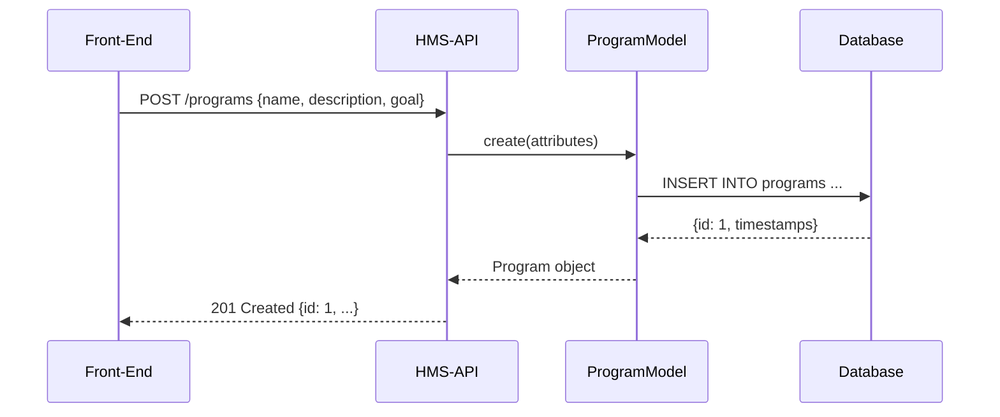

# Chapter 1: Program Model

Welcome to HMS-API! In this chapter, we introduce the **Program Model**, the high-level “charter” you use to define government or organizational initiatives. Think of it like drafting a program plan—defining goals, participants, and structure for public services or social projects.

---

## 1. Why Do We Need a Program Model?

Imagine a policy team wants to launch **“No Poverty”**, a program to end poverty in all its forms everywhere. They need to:

- Give the program a clear name and description  
- Set a measurable goal  
- List involved agencies (participants)  
- Tie related policies or protocols  

Without a Program Model abstraction, every service or API call would handle these details separately—leading to inconsistent data and duplication. The **Program Model** centralizes this information so every part of HMS-API can reference the same program charter.

---

## 2. Key Concepts in the Program Model

1. **Attributes**  
   Each program has core attributes (name, description, goal, start/end dates).

2. **Participants**  
   Agencies or teams involved—e.g., Department of Social Services, local NGOs.

3. **Protocols Relationship**  
   Links to related protocols (you’ll learn more in [Protocol Model](02_protocol_model_.md)).

4. **UI Components**  
   When building admin interfaces:
   - **v-tag-elevated** to highlight program tags
   - **input-disabled** to display read-only IDs
   - **slider-squared** to set priority or funding levels

---

## 3. Creating a Program: Code Example

Here’s how you create a new Program in HMS-API:

```php
use App\Models\Core\Program\Program;

// 1. Instantiate with attributes
$program = new Program([
  'name'        => 'No Poverty',
  'description' => 'End Poverty in All Its Forms Everywhere',
  'goal'        => 'No Poverty'
]);

// 2. Save to the database
$program->save();

// 3. Result: the program now has an ID and timestamps
echo $program->id;      // e.g. 1
echo $program->created_at;
```

Explanation:
- We pass core details into the constructor.
- Calling `save()` inserts a new record, giving us an `id` we can share across the API.

---

## 4. Retrieving an Existing Program

```php
use App\Models\Core\Program\Program;

// Find by ID
$program = Program::find(1);

// Access attributes
echo $program->name;        // "No Poverty"
echo $program->description; // "End Poverty in All Its Forms Everywhere"
```

Behind the scenes, HMS-API handles the database query so you get a ready-to-use object.

---

## 5. Under the Hood: What Happens When You Create a Program

Before diving into code, here’s a step-by-step overview:

1. **Front-End** sends `POST /programs` with JSON payload.  
2. **HMS-API** controller validates the data and calls the Program model.  
3. **Program Model** builds an SQL `INSERT` query.  
4. **Database** stores the record and returns a new ID.  
5. **API** responds `201 Created` with the full program object.

### Sequence Diagram



---

## 6. Diving Deeper: Program Model Code

File: `app/Models/Core/Program/Program.php`

```php
<?php
namespace App\Models\Core\Program;

use Illuminate\Database\Eloquent\Model;

class Program extends Model
{
    // Allow mass assignment of these fields
    protected $fillable = ['name', 'description', 'goal'];

    // Define relationship to protocols
    public function protocols()
    {
        // One Program has many Protocols
        return $this->hasMany(\App\Models\Core\Protocol\Protocol::class);
    }
}
```

Explanation:
- `protected $fillable` tells Laravel which attributes we can bulk-assign.
- `protocols()` sets up an Eloquent relationship, so you can call `$program->protocols` to fetch linked protocols.

---

## 7. Putting It All Together with UI Components

A simple form to create a program:

```vue
<template>
  <form @submit.prevent="save">
    <v-tag-elevated text="New Program" />
    <input v-model="name" placeholder="Program Name" />
    <textarea v-model="description" placeholder="Description" />
    <slider-squared v-model="goalPriority" label="Priority" />
    <button type="submit">Create</button>
  </form>
</template>
```

Once you hit **Create**, the flow follows the sequence diagram above.

---

## 8. Conclusion

In this chapter, you learned how the **Program Model**:
- Captures high-level program details  
- Centralizes goals and participants  
- Links to related protocols  

This foundation ensures every service in HMS-API references the same program charter. Next, we’ll explore how to define the **[Protocol Model](02_protocol_model_.md)** and link detailed policy steps to your program.

---

Generated by [AI Codebase Knowledge Builder](https://github.com/The-Pocket/Tutorial-Codebase-Knowledge)