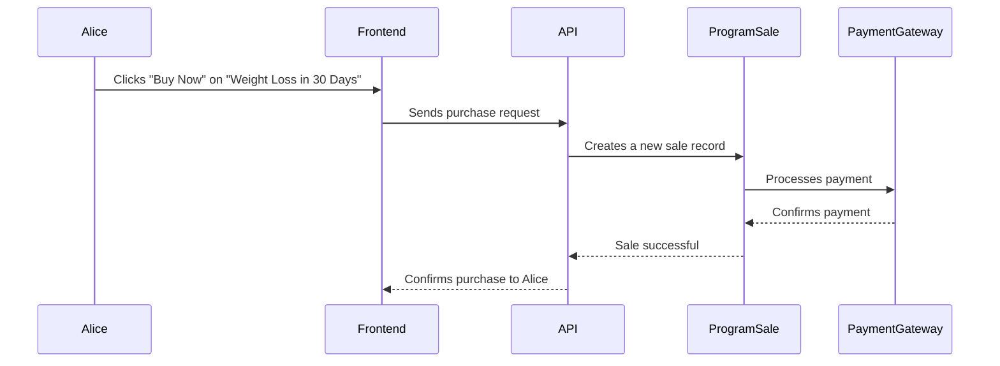

# Chapter 1: Program Sales

Imagine you're a health coach offering online programs like "Weight Loss in 30 Days" or "Mindfulness for Beginners". You want to sell these programs online, manage payments, and track your sales.  That's exactly what Program Sales helps you do! Think of it as your online store specifically designed for health programs.

## The Use Case: Buying a Program

Let's say a user named Alice wants to buy your "Weight Loss in 30 Days" program.  We'll walk through how Program Sales makes this happen.

## Key Concepts

1. **Program:**  A structured plan or course created by a health coach (like you!).  It could include videos, articles, exercises, and other resources.

2. **Sale:**  The act of a user purchasing a program.

3. **Payment:** The transaction where the user pays for the program.

## Buying a Program: Step-by-Step

Here's a simplified look at what happens when Alice buys your program:



## Under the Hood: Code Implementation

The core logic for handling program sales resides in the `TenantProgramSaleController.php` file.  Specifically, the `buy` method handles the purchase request.

```php
// File: app/Http/Controllers/Tenant/TenantProgramSaleController.php

// ... other code ...

public function buy(Request $request)
{
    // 1. Get program details and user information.
    $program = Program::find($request->input('program_id'));
    $user = auth()->user();

    // 2. Process payment (simplified - see [Payments](future_payments_chapter.md) for details).
    // ... payment processing logic ...

    // 3. Create a new sale record.
    $sale = new ProgramSale();
    $sale->user_id = $user->id;
    $sale->program_id = $program->id;
    // ... other sale details ...
    $sale->save();

    // 4. Return success message.
    return response()->json(['message' => 'Purchase successful!']);
}

// ... other code ...
```

**Explanation:**

1. The `buy` method receives a request containing the program ID.
2. It retrieves the program and user details.
3. It processes the payment (we'll cover payment details in a later chapter - imagine a magical function here for now).
4. It creates a new `ProgramSale` record, linking the user and the purchased program.
5. It returns a success message.

The frontend ([Frontend CMS](03_frontend_cms_.md)) then displays a confirmation message to Alice.

## Internal Implementation Details

The `tenant.php` route file defines the API endpoint for the `buy` method:

```php
// File: routes/tenant.php

// ... other code ...

Route::group(['prefix' => 'program-sale'], function (): void {
    Route::post('buy', [TenantProgramSaleController::class, 'buy']);
});

// ... other code ...
```

This route listens for POST requests to the `/program-sale/buy` URL.  When Alice clicks "Buy Now", the frontend sends a POST request to this URL, triggering the `buy` method.

## Conclusion

In this chapter, we explored the Program Sales concept, understanding how it manages the process of selling and purchasing programs. We walked through a simple example of Alice buying a program and looked at the code that makes it happen.  Next, we'll delve into [API Resources](02_api_resources_.md) to understand how the frontend and backend communicate.


---

Generated by [AI Codebase Knowledge Builder](https://github.com/The-Pocket/Tutorial-Codebase-Knowledge)