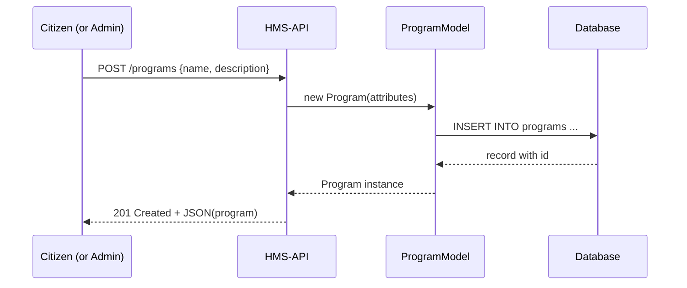

# Chapter 1: Program

Welcome to HMS-API! In this chapter, we’ll explore the **Program**—the top-level container that represents a government initiative or service offering. Think of a Program like a big folder in which all the rules, policies, and workflows for, say, a transportation grant or health outreach effort live.

## Why “Program” Matters

Imagine the Department of Transportation wants to launch a new “Electric Bus Grant.” They need a way to:

1. Define the program’s name, description, and dates  
2. Attach policies or protocols (e.g., eligibility checks)  
3. Track workflows (applications, reviews, approvals)  

The **Program** abstraction solves this by being the single place where metadata and relationships come together.

## Key Concepts

1. **Attributes**  
   Every Program has core fields:  
   - `name` (e.g. “Electric Bus Grant”)  
   - `description`  
   - `start_date`, `end_date`  

2. **Metadata**  
   Extra details like:  
   - `agency` (e.g. “Federal Transit Administration”)  
   - `tags` (e.g. `["environment", "transport"]`)  

3. **Relationships**  
   A Program “owns” protocols, workflows, policies. In code, you’ll see a `protocols()` method that links to protocols you’ll define in [Protocol](02_protocol_.md).

## A Simple Use Case

Let’s create a new “Public Health Outreach” Program:

```php
use App\Models\Core\Program\Program;

// 1. Instantiate with basic attributes
$program = new Program([
  'name' => 'Public Health Outreach',
  'description' => 'Community vaccination and education drive',
]);

// 2. Save to the database
$program->save();

// 3. Check related protocols (empty for now)
$related = $program->protocols();
```

Explanation:  
- We pass an array of fields into the constructor.  
- `save()` stores it.  
- `$program->protocols()` returns any linked protocols (we’ll add those in Chapter 2).

## Under the Hood: What Happens Step-by-Step

Before we dive into code, here’s a simple flow:



1. **API receives** the request.  
2. **ProgramModel** wraps attributes.  
3. **Database** stores the record.  
4. **API returns** the new Program data.

## Inside `Program.php`

File: `app/Models/Core/Program/Program.php`

```php
<?php
namespace App\Models\Core\Program;

class Program {
    // Holds the program's fields
    protected $attributes = [];

    public function __construct(array $attrs = [])
    {
        $this->attributes = $attrs;
    }

    // Link to all protocols under this program
    public function protocols()
    {
        // Imagine this returns a list of Protocol models
        // using program_id behind the scenes
    }

    public function save()
    {
        // Pseudo: write $this->attributes to the DB
    }
}
```

- **`$attributes`**: where name/description live.  
- **`protocols()`**: sets up a relationship to the Protocol model.  
- **`save()`**: persists the Program.

## Real-World Analogy

Think of a Program as a new government office:

- You fill out its **profile** (attributes).  
- You assign **teams** (protocols) to handle each step—eligibility, application, review.  
- Everything about that office is tracked under one roof.

## Summary

In this chapter, you learned:

- What a **Program** is and why it’s the top-level container  
- Core pieces: attributes, metadata, and relationships  
- How to create and save a Program  
- A peek at the code in `Program.php` and the lifecycle of a create request  

Up next, we’ll dive into the rules and workflows themselves: the [Protocol](02_protocol_.md) abstraction.

---

Generated by [AI Codebase Knowledge Builder](https://github.com/The-Pocket/Tutorial-Codebase-Knowledge)