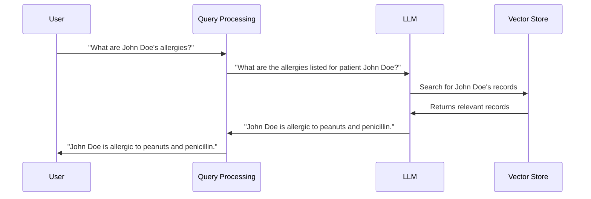

# Chapter 1: Prompt

Imagine you have a super smart helper (an LLM) that can answer any question, write stories, or even translate languages. But this helper needs clear instructions.  That's where a "prompt" comes in.

A prompt is like a carefully worded question or instruction you give to the LLM. A well-crafted prompt guides the LLM to generate the desired response, like a recipe guides a chef to create a delicious dish.

Let's say you want the LLM to write a short story about a cat.  A simple prompt could be:

```
Write a short story about a cat.
```

This prompt is okay, but it doesn't give the LLM much direction.  A better prompt might be:

```
Write a short story about a cat who lives in a library and befriends a lonely librarian.
```

This improved prompt gives the LLM more details, resulting in a more focused and interesting story.

## How Prompts Work

Think of the LLM as a powerful engine and the prompt as the steering wheel. The prompt directs the LLM's vast knowledge and abilities towards a specific task.  The clearer and more specific the prompt, the better the LLM can understand what you want.

## Using Prompts in HMS-MED

In HMS-MED, prompts are used to interact with the [LLM (Large Language Model)](02_llm__large_language_model_.md) to answer questions about medical records.  For example, if you want to know a patient's allergies, you might use a prompt like this:

```
What are the allergies listed for patient John Doe?
```

The LLM then uses this prompt, along with information retrieved from the [Vector Store](06_vector_store.md), to generate a response.

## Internal Implementation

Let's look at a simplified example of how a prompt is processed in HMS-MED:



1. The user asks a question.
2. The Query Processing component formulates the question into a prompt for the LLM.
3. The LLM receives the prompt and queries the Vector Store.
4. The Vector Store returns relevant information.
5. The LLM generates a response based on the prompt and retrieved information.
6. The Query Processing component relays the answer back to the user.

Code examples for prompt usage can be found in files like `HMS-EHR/_scripts/evaluate_chains.py` and `HMS-EHR/_scripts/evaluate_chains_improved_chain.py`.  Look for the `CONDENSE_QUESTION_PROMPT` and other prompt templates. These files demonstrate how prompts are used within the larger context of the application.  However, the code in these files is quite complex.  For a beginner, it's best to focus on understanding the concept of a prompt and how it guides the LLM.

## Conclusion

Prompts are the key to effectively communicating with LLMs.  By crafting clear and specific prompts, you can unlock the LLM's potential and get the desired responses. Now that we understand prompts, let's move on to understanding the LLMs themselves: [LLM (Large Language Model)](02_llm__large_language_model_.md).


---

Generated by [AI Codebase Knowledge Builder](https://github.com/The-Pocket/Tutorial-Codebase-Knowledge)