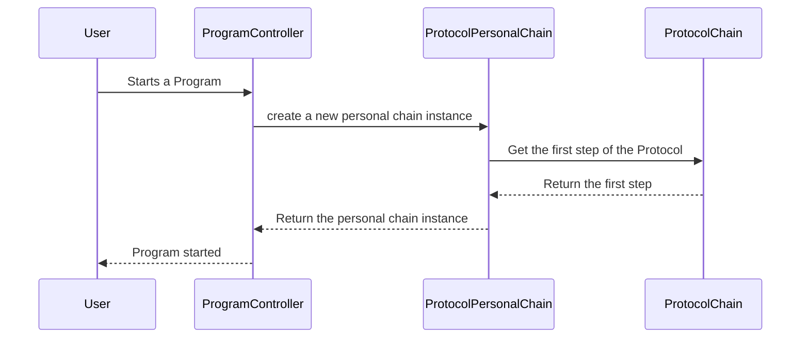

# Chapter 1: Protocols and Programs

Imagine you're a coach creating a training plan for your athletes. You might have a general template for the training process, outlining the different stages like warm-up, exercises, and cool-down. This template is like a **Protocol** in our app.  Then, when you create a specific training plan for a particular athlete, with specific exercises and durations, that's a **Program**.

This chapter explains how Protocols and Programs work in our app, allowing you to create reusable templates and specific program instances.

## Why Protocols and Programs?

Protocols and Programs help us avoid repetition and manage different versions of a process. Instead of creating each training plan from scratch, you can use a Protocol as a starting point and customize it into a Program for each athlete.

## Understanding Protocols

A Protocol is a blueprint or template.  Think of it like a recipe for baking a cake. It defines the steps involved but doesn't specify the exact ingredients or quantities for a particular cake.  In our coaching example, the Protocol would outline the general stages of the training plan.

The `Protocol` model (in `Models/Core/Protocol/Protocol.php`) stores the basic information about a Protocol, like its name, owner, and description.  The actual steps within a Protocol are defined using [Modules](02_modules.md), which we'll cover in the next chapter.

## Understanding Programs

A Program is a specific instance of a Protocol.  It's like actually baking a cake using the recipe. You use the Protocol as a guide but specify the exact ingredients and quantities.  In our coaching example, the Program would be the specific training plan for an athlete, with details like which exercises to do and for how long.

Programs can have different access levels:

- **Public:** Free for everyone.  Like a free online training plan.
- **Premium:** Available to subscribers.  Like a premium training plan for members of your coaching website.
- **Private:** Paid access.  Like a personalized training plan that you sell to individual athletes.
- **Personal:** Only for the creator. Like a draft training plan you're still working on.

The `Program` model (in `Models/Core/Program/Program.php`) stores information about a Program, like its name, description, associated Protocol, and access type (defined in `Enums/ProgramTypes.php`).

## Creating a Program from a Protocol

Let's say you have a Protocol called "General Fitness Training" and you want to create a Program called "Beginner Strength Training" based on it.

1. You would select the "General Fitness Training" Protocol.
2. Create a new Program and give it the name "Beginner Strength Training".
3. Choose the access type (Public, Premium, Private, or Personal).
4. Customize the Program by adding specific [Modules](02_modules.md) and details to each step, following the structure defined in the Protocol.

```php
// Models/Core/Program/Program.php (simplified)
$programData = [
    'name' => 'Beginner Strength Training',
    'protocol_id' => 1, // ID of the "General Fitness Training" Protocol
    'access_type' => ProgramTypes::Public,
    // ... other program details
];

$program = Program::create($programData);
```

This code snippet (simplified from `Http/Controllers/Core/ProgramController.php`) creates a new `Program` record in the database.

## Internal Implementation

When a user starts a Program, the `ProtocolPersonalChain` model (in `Models/Core/Protocol/ProtocolPersonalChain.php`) is used to track their progress.  It stores the user's current step in the Program and their status (Running, Finished, or Failed, defined in `Enums/ProtocolStatuses.php`).



The `ProtocolChain` model (in `Models/Core/Protocol/ProtocolChain.php`) stores the individual steps within a Protocol.  We'll explore this in more detail in the next chapter.

## Conclusion

In this chapter, we learned about Protocols and Programs, which are fundamental concepts in our app. Protocols provide reusable templates for processes, while Programs are specific instances of those Protocols.  We also saw how different access levels can be applied to Programs.

Next, we'll dive deeper into [Modules](02_modules.md), which are the building blocks of Protocols.


---

Generated by [AI Codebase Knowledge Builder](https://github.com/The-Pocket/Tutorial-Codebase-Knowledge)