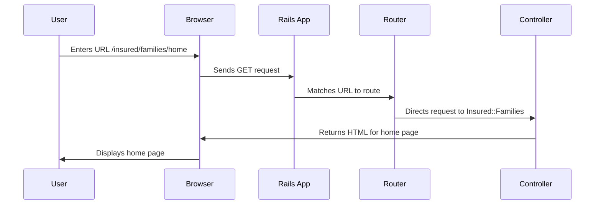

# Chapter 1: Routing (`routes.rb`)

Imagine you're building a website where users can log in and view their insurance information.  When a user types in a URL like `yourwebsite.com/insured/families/home`, how does the application know what to display? This is where routing comes in. Routing is like a receptionist for your application, directing incoming requests to the correct department (controller) and person in charge (action).  The `routes.rb` file is where you define this map.

## The `routes.rb` File: Your Application's Receptionist

The `routes.rb` file, located in the `config` directory, is the central hub for defining how your application responds to different URLs.  Each line in this file maps a specific URL pattern to a controller and action.

Let's look at a simplified example:

```ruby
# config/routes.rb
Rails.application.routes.draw do
  get 'insured/families/home', to: 'insured/families#home'
end
```

This single line tells our application:

* **`get`**:  This specifies that the route should respond to HTTP GET requests.  GET requests are typically used to retrieve information.
* **`insured/families/home`**: This is the URL path that the route will match.  If a user visits `yourwebsite.com/insured/families/home`, this route will be triggered.
* **`to:`**: This keyword separates the URL path from the controller and action.
* **`insured/families#home`**: This specifies the controller (`insured/families`) and the action (`home`) that should handle the request.  This means the `home` method within the `Insured::FamiliesController` will be executed.

## Understanding Controllers and Actions

Think of controllers as departments within your application. The `Insured::FamiliesController` is responsible for handling everything related to insured families.  Actions are specific tasks within a controller.  The `home` action might display the family's home page.

## How Routing Works Under the Hood

When a request comes in, Rails consults the `routes.rb` file to find a matching route.  It goes through the routes from top to bottom, and the first matching route is used.  Once a match is found, Rails determines the appropriate controller and action.



The Router, using the `routes.rb` file, acts as the receptionist, directing the request to the correct controller. The controller then performs the necessary logic (the `home` action in this case) and sends back a response.

## More Complex Routing

The `routes.rb` file can handle much more complex scenarios, including dynamic URLs, nested resources, and different HTTP verbs (like `POST`, `PUT`, and `DELETE`).  We'll explore these in later chapters.

## Conclusion

In this chapter, we learned the basics of routing in Rails and how the `routes.rb` file acts as a map for incoming requests.  We saw how a simple route connects a URL to a controller and action.  Understanding routing is fundamental to building any web application in Rails.

Next, we'll explore how to add authentication to your application using Devise: [Authentication (Devise)](02_authentication__devise_.md).


---

Generated by [AI Codebase Knowledge Builder](https://github.com/The-Pocket/Tutorial-Codebase-Knowledge)