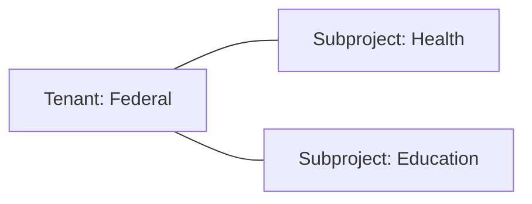
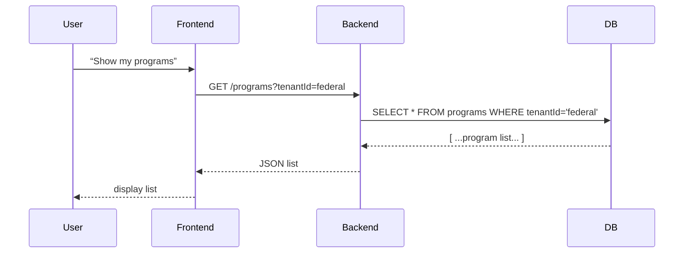

# Chapter 1: Tenant & CodifySubprojects

Welcome to the first chapter of the HMS-NFO tutorial! In this chapter, you’ll learn how we partition our platform into isolated “silos” so that each government department or agency only sees its own data, policies, and users. This is done with two core abstractions:

- **Tenant** – represents an organization (federal, state, local, or agency).
- **CodifySubproject** – represents a sub-department, program office, or subproject under that tenant.

---

## 1. Why Tenants and Subprojects?

Imagine the federal government wants to run a “No Poverty” program, and each state has its own version. We need to make sure:

- **California** only sees California’s poverty data and rules.
- **Texas** only sees Texas’s poverty data and rules.
- The **Federal** office sees all state reports, but states can’t see each other.

Tenants and Subprojects give us exactly this: separated data, policies, and user groups.

---

## 2. Key Concepts

### 2.1 Tenant
A Tenant is like a top-level department or agency:
- id: unique identifier (e.g., `federal`, `california`)
- name: human-readable name (e.g., “Federal Gov”)

### 2.2 CodifySubproject
A CodifySubproject is like a program office within that tenant:
- id: unique (e.g., `federal-health`)
- tenantId: which tenant it belongs to
- name: e.g., “Health Department”



---

## 3. Using Tenants & Subprojects

### 3.1 Defining Models

```js
// src/models/tenant.js
class Tenant {
  constructor(id, name) {
    this.id = id
    this.name = name
  }
}
module.exports = Tenant

// src/models/codifySubproject.js
class CodifySubproject {
  constructor(id, tenantId, name) {
    this.id = id
    this.tenantId = tenantId
    this.name = name
  }
}
module.exports = CodifySubproject
```
*Above: basic constructors for our two models.*

### 3.2 Creating Instances

```js
const Tenant = require('./models/tenant')
const CodifySubproject = require('./models/codifySubproject')

// Create a federal tenant
const fed = new Tenant('federal', 'Federal Government')
// Create two subprojects under Federal
const health = new CodifySubproject('federal-health', fed.id, 'Health Dept')
const edu   = new CodifySubproject('federal-edu',   fed.id, 'Education Dept')

console.log(fed, health, edu)
```
*This prints our objects. In real code you’d save them to a database.*

---

## 4. High-Level Flow

When a user requests data, we check which tenant & subproject they belong to, then filter data accordingly:



---

## 5. Under the Hood: How It Works

### 5.1 Request Handling
1. **Auth Middleware** reads user session → extracts `tenantId`.
2. **Router** attaches `tenantId` to request context.
3. **Service Layer** calls repositories with `tenantId` filter.

### 5.2 Sample Repository

```js
// src/repositories/subprojectRepo.js
const db = require('../db') // assume simple query API

function listSubprojects(tenantId) {
  return db.query(
    'SELECT id,name FROM codify_subprojects WHERE tenant_id = ?', 
    [tenantId]
  )
}

module.exports = { listSubprojects }
```

*Beginner note: repositories encapsulate SQL so our services stay clean.*

---

## 6. Step-by-Step Example

1. **Create Tenant**  
   Input: `{ id: 'california', name: 'State of CA' }`  
   Output: new row in `tenants` table.
2. **Create Subproject**  
   Input: `{ id: 'ca-housing', tenantId: 'california', name: 'Housing Services' }`  
   Output: new row in `codify_subprojects`.
3. **Fetch Subprojects**  
   - Call `listSubprojects('california')`  
   - Returns `[ { id: 'ca-housing', name: 'Housing Services' } ]`

---

## 7. UI Components & Error Handling

When you build a form to create a tenant you might use government-style UI components:

```html
<textarea-addon label="Tenant Name"></textarea-addon>
<v-button-placeload @click="saveTenant()">Save</v-button-placeload>
<notyf-error v-if="error">{{ error }}</notyf-error>
```

- **textarea-addon**: styled input with a label.
- **v-button-placeload**: shows loading spinner on click.
- **notyf-error**: pops up friendly error messages.

---

## 8. Conclusion & Next Steps

Congratulations! You’ve learned how **Tenant** and **CodifySubprojects** isolate data per agency and program. Next, we’ll see how domains and routing connect these silos and lead into the services you build on top.

Continue to [Chapter 2: Domain Structure & Routing](02_domain_structure___routing_.md) to learn how requests get directed to the right code paths.

---

Generated by [AI Codebase Knowledge Builder](https://github.com/The-Pocket/Tutorial-Codebase-Knowledge)