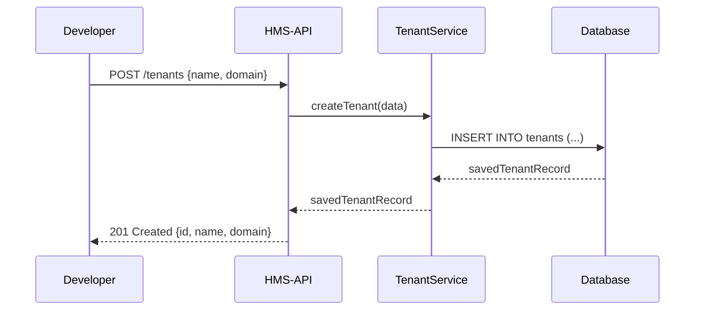
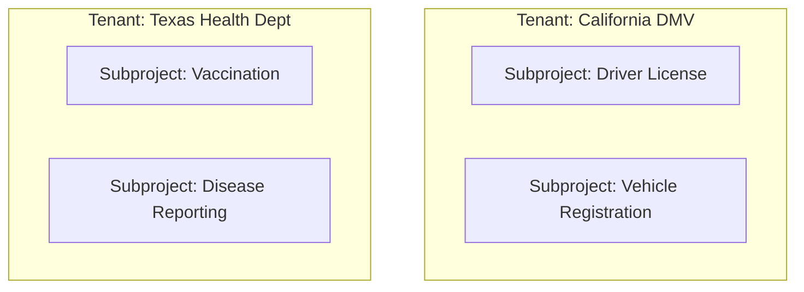

# Chapter 1: Tenant & Subproject Management

Welcome to the first chapter! In this section, we’ll learn how **tenants** and **subprojects** let different agencies share the same HMS-API platform while keeping their data and rules completely separate—like separate “floors” in a government building.

---

## 1. Motivation: One API, Many Agencies

Imagine the state of California’s DMV and the Texas Health Department both want to use HMS-API:

- California DMV needs its own users, drivers-license programs, and renewal rules.
- Texas Health Dept needs its own users, vaccination programs, and reporting policies.

We don’t want them seeing each other’s data. By using **tenants** and **subprojects**, HMS-API stores each agency’s programs and policies in its own “floor” of the building. They share the same platform, but stay fully isolated.

---

## 2. Key Concepts

### 2.1 Tenant
A **tenant** is like a “floor” in the building.  
- Holds programs, users, policies.  
- Completely isolated from other tenants.

Analogy:  
- Floor 1: California DMV  
- Floor 2: Texas Health Dept  

### 2.2 Subproject
A **subproject** (sometimes called a CodifySubproject) is like a “room” on that floor.  
- Represents a specific program or department within an agency.  
- Example: “Driver License Program” on DMV’s floor.  

---

## 3. Getting Started: Create a Tenant & Subproject

Below is a minimal Node.js example. We’ll:
1. Create a tenant for “CA DMV”
2. Create a subproject for “Driver License Program”

```js
// index.js
const { TenantService } = require('hms-api')  // HMS-API SDK

async function setupAgency() {
  // 1. Create a new tenant (CA DMV)
  const tenant = await TenantService.createTenant({
    name: 'California DMV',
    domain: 'ca-dmv.gov'
  })
  console.log('✅ Tenant created:', tenant.id)

  // 2. Create a subproject under that tenant
  const subproject = await TenantService.createSubproject(tenant.id, {
    name: 'Driver License Program',
    config: { maxRenewalsPerYear: 2 }
  })
  console.log('✅ Subproject created:', subproject.id)
}

setupAgency().catch(console.error)
```

Explanation:
1. `createTenant({ name, domain })` returns a tenant record with a unique `id`.
2. `createSubproject(tenantId, { name, config })` returns a subproject tied to that tenant.
3. On the front-end you could use `dropdown-colors` to pick a theme, `v-imask-input` to validate the domain, and `v-button-colors` for a nice “Create” button.

---

## 4. Under the Hood: What Happens Step-by-Step

Before we look at code, here’s a simple flow of how HMS-API processes our `createTenant` call:



1. **Developer** calls the HTTP endpoint `/tenants`.
2. **HMS-API** routes it to `TenantService.createTenant`.
3. **Service** saves a new row in the database.
4. The newly created tenant record is returned back to the developer.

---

## 5. Diving Deeper: Internal Implementation

Here’s a simplified view of the service code in `src/services/tenant.service.ts`:

```ts
// src/services/tenant.service.ts
import { v4 as uuid } from 'uuid'
import { tenantRepo } from '../repositories/tenant.repo'

export async function createTenant(data: { name: string; domain: string }) {
  // 1. Generate a unique ID
  const id = uuid()
  // 2. Insert into database
  const record = await tenantRepo.insert({ id, ...data })
  // 3. Return the saved tenant
  return record
}
```

- We use `uuid()` to ensure each tenant has a unique identifier.
- `tenantRepo.insert()` handles the actual SQL (or ORM) logic.
- The returned `record` includes `id`, `name`, and `domain`.

---

## 6. Visualizing Tenants & Subprojects

Here’s a simple component diagram to show how tenants and subprojects fit together:



- Each **subgraph** is a tenant floor.
- Each box inside is a subproject room.
- No lines connect the floors—data stays isolated!

---

## 7. Conclusion & What’s Next

You now understand how **tenants** and **subprojects** keep agency data separated on a shared HMS-API platform. You learned:

- The “floor and room” analogy for isolation.
- How to call `createTenant` and `createSubproject`.
- A peek under the hood at service code.
- A visual map of tenants and their subprojects.

Up next, we’ll see how **users** and **authentication** tie into our tenants in  
[Chapter 2: Core User Model & Auth](02_core_user_model___auth_.md)  
– where we’ll assign people to floors and rooms, control access, and enforce secure logins.

---

Generated by [AI Codebase Knowledge Builder](https://github.com/The-Pocket/Tutorial-Codebase-Knowledge)