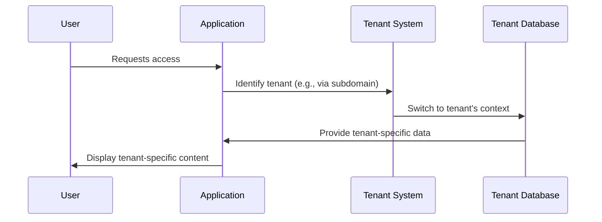

# Chapter 1: Tenant

Imagine a large apartment building. This building houses many different businesses, each operating independently within their own apartments.  Each apartment represents a "tenant."  Just like in a real building, each tenant in our application has its own separate space, preventing businesses from accidentally accessing each other's data, settings, and users. This is the core idea behind multi-tenancy.

## Why Use Tenants?

Let's say we're building software for managing projects.  We want many different companies to use our software, but each company needs its own private projects, users, and customized settings.  Tenants make this possible!

## Understanding the Tenant Abstraction

A tenant is like a container that holds everything related to a specific business or organization using our application. This includes:

* **Data:**  Each tenant has its own database or a dedicated section within a shared database. This ensures data isolation. Think of it as each apartment having its own separate set of keys and locks.
* **Settings:** Tenants can customize the application's appearance and behavior to fit their needs.  This might include things like company logos, color schemes, or specific features they want enabled.  Imagine each apartment decorating their space to their liking.
* **Users:** Each tenant manages its own users and their permissions.  Only users belonging to a specific tenant can access that tenant's data and settings.  This is like each apartment having its own list of residents.

## Using the Tenant Abstraction

In our application, the `Tenant` model represents a single tenant.  We can use this model to access and manage tenant-specific information.

For example, to get a tenant's domain name:

```php
$tenant = Tenant::find(1); // Find the tenant with ID 1
$domain = $tenant->domain; // Access the domain property
echo $domain; // Output the domain name
```

This code snippet retrieves the `Tenant` object with ID 1 and then accesses its `domain` property.  This would output the domain name associated with that tenant.

## Under the Hood: How Tenants Work

When a user accesses our application, the system first identifies which tenant they belong to (usually based on their subdomain or a unique identifier).  Then, the application switches to that tenant's context. This is like a building manager directing a visitor to the correct apartment.



The `Tenant` model, along with the `tenancy` helper provided by the Stancl Tenancy package, handles this context switching.  The `UserTenantMap` model helps link users to their respective tenants.  You'll learn more about [Program](02_program.md) and other related concepts in later chapters.

Here's a simplified example of how the `Tenant` model is used internally:

```php
// Inside a service or controller
$tenantId = getCurrentTenantId(); // Simplified example - actual implementation may vary
tenancy()->initialize($tenantId); // Switch to the tenant's context

// Now, all database queries and operations will be scoped to the current tenant
$programs = Program::all(); // This will only retrieve programs belonging to the current tenant
```

This code snippet demonstrates how the `tenancy()->initialize()` method is used to switch to a specific tenant's context.  After this call, all database operations are scoped to that tenant.

The `Tenant` model also handles settings related to the tenant, such as maintenance mode:

```php
// Inside the Tenant model (simplified)
public function applySettings($requestData) {
    // ... other code ...

    if ($requestData['maintenance']) {
        $this->putDownForMaintenance(); // Put the tenant into maintenance mode
    } else {
        $this->update(['maintenance_mode' => null]); // Exit maintenance mode
    }

    // ... other code ...
}
```

This simplified code snippet shows how the `Tenant` model manages the maintenance mode setting.

## Conclusion

In this chapter, we learned about the `Tenant` abstraction, which is fundamental to building multi-tenant applications.  We explored how tenants provide data isolation, personalized settings, and user management for different businesses using the same application.  In the next chapter, we'll delve into [Program](02_program.md).


---

Generated by [AI Codebase Knowledge Builder](https://github.com/The-Pocket/Tutorial-Codebase-Knowledge)