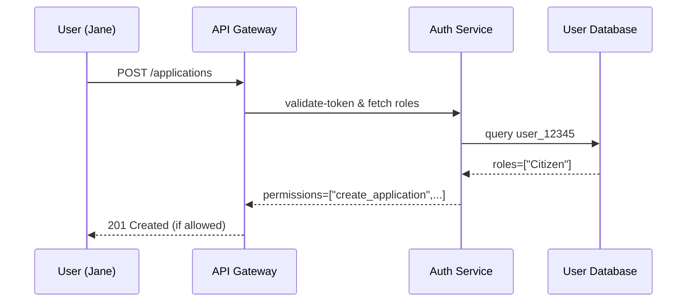

# Chapter 1: User Model

Welcome to the first chapter of the HMS-API tutorial! In this chapter, we’ll discover the **User Model**, which represents anyone interacting with the HMS ecosystem—citizens, agency staff, or policymakers. Think of it like a government office’s ID-badge database: each record holds identity, roles, and permissions. This lets HMS-API know whether someone can submit a benefit application, approve a policy change, or simply view public reports.

---

## 1.1 Why a User Model?

**Use Case:**  
A citizen logs in to apply for unemployment benefits. Behind the scenes, the system must:

1. Recognize they’re a “Citizen”
2. Allow them to fill out and submit forms
3. Prevent them from approving other citizens’ applications

Without a User Model, HMS-API can’t enforce these rules. With it, we secure each API endpoint and UI component in a **role-based** way.

---

## 1.2 Key Concepts

1. **Identity**  
   Uniquely identifies who you are (e.g., email, government‐issued ID).  
2. **Roles**  
   A collection of capabilities, like `Citizen`, `Caseworker`, or `Policymaker`.  
3. **Permissions**  
   Fine-grained actions you’re allowed to perform, such as `create_application` or `approve_policy`.

> Analogy:  
> - Identity = your name on an ID badge  
> - Role = the department printed on it  
> - Permissions = the doors you can open

---

## 1.3 Solving the Use Case

### 1.3.1 Registering a New User

Here’s how a citizen registers:

```http
POST /api/users
Content-Type: application/json

{
  "email": "jane.doe@example.gov",
  "name": "Jane Doe",
  "roles": ["Citizen"]
}
```

> What happens:  
> - HMS-API validates the data  
> - Stores a new record in the **users** table  
> - Returns the new user’s ID and assigned roles

```json
{
  "id": "user_12345",
  "email": "jane.doe@example.gov",
  "roles": ["Citizen"]
}
```

### 1.3.2 Checking Permissions

Later, when Jane calls `POST /api/applications`, HMS-API verifies she has the `create_application` permission (granted by the `Citizen` role). If not, it responds with `403 Forbidden`.

---

## 1.4 What Happens Under the Hood?

Below is a simple sequence of events when a request to create an application comes in:



1. **API Gateway** receives Jane’s request.  
2. It calls the **Auth Service** to validate her token and fetch her roles.  
3. Auth Service queries the **User Database**.  
4. The database returns her roles.  
5. Auth Service computes permissions.  
6. Gateway lets Jane proceed or rejects her.

---

## 1.5 Internal Implementation

### 1.5.1 File: models/user_model.js

```js
// models/user_model.js
class User {
  constructor({ id, email, name, roles }) {
    this.id = id
    this.email = email
    this.name = name
    this.roles = roles
  }

  // Check if user has a certain permission
  hasPermission(action) {
    // rolesPermissions is a simple map: role -> [permissions]
    const rolesPermissions = {
      Citizen: ["create_application"],
      Caseworker: ["approve_application", "view_reports"],
      Policymaker: ["propose_policy", "vote_policy"]
    }
    return this.roles
      .flatMap(r => rolesPermissions[r] || [])
      .includes(action)
  }
}

module.exports = User
```

> Explanation:  
> - We store `id`, `email`, `name`, and `roles` on each User.  
> - `hasPermission` looks up allowed actions per role.

### 1.5.2 Authorization Middleware

```js
// middleware/auth.js
const User = require("../models/user_model")

async function authorize(req, res, next) {
  // 1. Extract token & find user
  const userData = await AuthService.verifyToken(req.headers.authorization)
  const user = new User(userData)

  // 2. Check permission
  if (!user.hasPermission(req.requiredAction)) {
    return res.status(403).json({ error: "Forbidden" })
  }
  req.user = user
  next()
}
module.exports = authorize
```

> Explanation:  
> - Verify the token to fetch user data  
> - Wrap in our `User` class  
> - Reject if they lack the needed permission

---

## 1.6 UI Docs Tips

To make your government-facing documentation user-friendly, consider these components:

- `<content-dividers>`: Break long pages into clear sections  
- `<tabs-toggle>`: Let users switch between “Citizen” vs “Admin” view  
- `<tabs-right>`: Place help or external references in a right-side tab  

---

## Conclusion

You’ve learned:  
- Why we need a **User Model** in HMS-API  
- Core ideas: identity, roles, permissions  
- How a request flows through authentication and authorization  
- A peek at the minimal code behind it

Next, we’ll see how to group users under agencies and departments with tenant isolation.  
[👉 Chapter 2: Tenant Management](02_tenant_management_.md)

---

Generated by [AI Codebase Knowledge Builder](https://github.com/The-Pocket/Tutorial-Codebase-Knowledge)