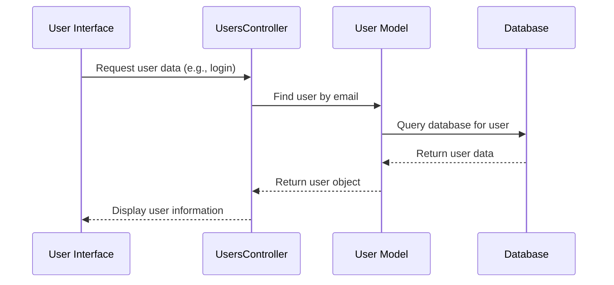

# Chapter 1: User

Imagine you're building an online store. You need a way to represent your customers, right? That's where the `User` concept comes in.  A `User` represents anyone interacting with the system, whether it's a customer placing an [Order](02_order.md), an employee managing those orders, or an administrator overseeing the entire system.

## What is a User?

Think of a `User` as a digital representation of a person (or sometimes even a system) within the HMS-OMS application.  Each user has information associated with them, like their name, email address, and what role they play in the system (e.g., regular user, VIP customer, administrator).

## Key Concepts

* **Attributes:**  These are pieces of information that describe a user.  Think of them like characteristics.  Examples include:
    * `name`: The user's first name.
    * `last_name`: The user's last name.
    * `email`: The user's email address.
    * `role`: The user's role (e.g., `admin`, `user`, `vip`).  This determines what they can do in the system.  More on roles later!

* **Roles:** A user's role determines their permissions and access within the system. For example, an `admin` user can typically do anything, while a regular `user` might only be able to place [Order](02_order.md)s.  You'll learn more about roles in the [Profile](06_profile.md) chapter.

## Using the User Concept

Let's say a new customer signs up on your online store.  HMS-OMS creates a new `User` object to represent them.  Here's a simplified look at how that might happen in the code:

```ruby
# app/controllers/users_controller.rb
def add
  @user = User.new(name: "Alice", last_name: "Smith", email: "alice@example.com", role: "user")

  if @user.save
    # User was successfully created!
  else
    # Something went wrong.
  end
end
```

This code creates a new `User` object with Alice's information and attempts to save it to the database.  If successful, Alice is now a registered user!

## Under the Hood

When a user interacts with the system, like logging in or placing an [Order](02_order.md), the application interacts with the `User` model.  Here's a simplified sequence diagram:



The `User` model, defined in `app/models/user.rb`, handles database interactions related to users.  For example, the `find_by` method is used to retrieve a user from the database based on their email:

```ruby
# app/models/user.rb (simplified)
user = User.find_by(email: "alice@example.com")
```

This code searches the database for a user with the email address "alice@example.com" and returns the corresponding `User` object.

## Roles and HasRole

The `HasRole` module (located in `app/models/concerns/has_role.rb`) provides the functionality for managing user roles. It defines the available roles (e.g., `user`, `vip`, `admin`) and methods to work with them.  For example:

```ruby
# app/models/user.rb
user.admin? # Returns true if the user is an admin, false otherwise
```

## Conclusion

You've learned about the `User` concept, its attributes, and how it represents users within HMS-OMS.  You've also seen how roles are managed and how the `User` model interacts with the database.  Next, let's explore how users interact with the system by placing [Order](02_order.md)s!  [Next: Order](02_order.md)


---

Generated by [AI Codebase Knowledge Builder](https://github.com/The-Pocket/Tutorial-Codebase-Knowledge)