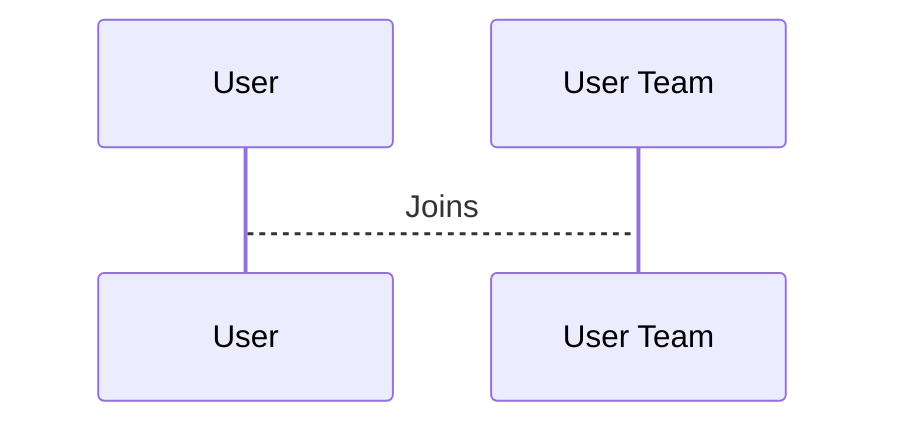

# Chapter 1: Users

Imagine you're building an app where people can share and follow workout routines.  Users are the heart of this app – they're the people creating and using these workout routines.  This chapter will introduce you to the concept of "Users" and how they fit into our project.

Think of it like a cooking website. Users are like the chefs who use the recipes (workout routines) or the recipe authors who create new ones.

## What is a User?

A User represents an individual in our system.  They have information associated with them, like their name, email address, and profile picture.  Users can participate in [Programs](02_programs.md) (our workout routines) and create [Protocols](03_protocols.md) (the templates for workout routines).

## User Data

Let's look at some of the information we store about a User.  Imagine we have a user named Alice.  Here's some of the data we might have about her:

* **username:** alice_fit
* **full_name:** Alice Smith
* **email:** alice@example.com
* **password:** (a securely stored password)

This information is stored in a database table called `users`.  Here's a simplified version of what that table might look like:

```
| id | username     | full_name    | email            | ... |
|----|--------------|--------------|-------------------|-----|
| 1  | alice_fit    | Alice Smith  | alice@example.com | ... |
```

## Creating a User

Let's see how we create a new User in our code.  We use a "factory" to generate realistic fake data for testing.  Here's a simplified example:

```php
// File: factories/Core/User/UserFactory.php

use App\Models\Core\User\User;

$user = User::factory()->create([
    'username' => 'bob_lifts',
    'full_name' => 'Bob Johnson',
    'email' => 'bob@example.com',
    'password' => bcrypt('securepassword'), // Password is encrypted
]);
```

This code creates a new User in the `users` table with the given information.  The `bcrypt` function encrypts the password for security.

## User Relationships

Users can be part of [User Teams](07_user_teams.md) and are associated with [Tenants](08_tenants.md).  We'll learn more about these concepts in later chapters.  For now, just know that Users can be connected to other parts of our system.  For example, a User might be the owner of a Tenant, or a member of multiple User Teams.  The `potential_user_team_invites` table, shown in a code snippet earlier, helps manage invitations for users to join teams.



## Under the Hood

When you create a User, the code interacts with the database to store the user's information.  The `CreateUsersTable` migration file defines the structure of the `users` table.  Other migration files, like `ExtendUsersTable`, add more columns to the `users` table over time as we add new features.

```php
// File: migrations/2013_09_17_100008_create_users_table.php
// ... code to create the users table ...
```

## Conclusion

In this chapter, we learned about Users, the individuals who interact with our system.  We saw how user data is stored and how to create new users.  In the next chapter, we'll explore [Programs](02_programs.md), the workout routines that Users can create and follow.


---

Generated by [AI Codebase Knowledge Builder](https://github.com/The-Pocket/Tutorial-Codebase-Knowledge)