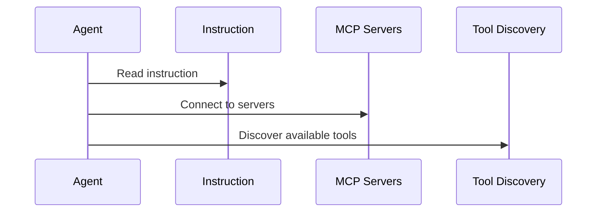

# Chapter 2: Agent

In the previous chapter, [MCPApp](01_mcpapp.md), we learned about the conductor of our AI orchestra. Now, let's meet the musicians: the *Agents*.

## What problem does an Agent solve?

Imagine our news summarization AI assistant from Chapter 1.  We need something to actually *do* the work of fetching articles and summarizing them.  An Agent is that "something." It's like a specialized worker with a specific job description.

## Key Concepts

An Agent has two key attributes:

1. **Instruction:** This is the Agent's job description. It tells the Agent what it's supposed to do.  Think of it like a carpenter's blueprint.

2. **Access to Tools (MCP Servers):**  Agents need tools to do their jobs. These tools are provided by [MCP Servers](04_mcp_server.md).  Our carpenter needs a toolbox with a hammer, saw, etc.  An Agent might need access to a "fetch" server to download web pages or a "filesystem" server to read files.

## Using an Agent

Let's create a simple Agent that can greet the user:

```python
from mcp_agent.agents.agent import Agent
from mcp_agent.workflows.llm.augmented_llm_openai import OpenAIAugmentedLLM

# Create a greeting agent
greeter_agent = Agent(
    name="greeter",
    instruction="Greet the user politely.",
    server_names=[], # No MCP servers needed for this simple example
)

async with greeter_agent:
    llm = await greeter_agent.attach_llm(OpenAIAugmentedLLM)
    greeting = await llm.generate_str("Say hello")
    print(greeting) # Output: (Something like) "Hello there!"
```

This code creates a `greeter_agent`. The `instruction` tells it to greet the user. We don't need any MCP servers for this simple example, so `server_names` is empty.  We then attach an [AugmentedLLM](05_augmentedllm.md) to the agent (more on this in a later chapter) and ask it to generate a greeting.

## Internal Implementation

When you create an Agent and enter its context (`async with greeter_agent:`), several things happen:

1. **Initialization:** The Agent reads its `instruction` and prepares to use the specified `server_names`.

2. **Connecting to Servers:** If `server_names` is not empty, the Agent establishes connections to the specified [MCP Servers](04_mcp_server.md).

3. **Tool Discovery:** The Agent queries the connected servers to discover what tools are available.



Here's a simplified look at the `initialize` function from `src/mcp_agent/agents/agent.py`:

```python
async def initialize(self):
    # ... other initialization steps ...
    await self.connect_to_servers()
    # ...
```

And the `connect_to_servers` function:

```python
async def connect_to_servers(self):
    # ... code to connect to MCP servers ...
```

When the `async with` block exits, the Agent automatically disconnects from the servers, cleaning up resources. This is handled by the `__aexit__` method.

## Conclusion

Agents are the workers of our AI application. They have instructions and access to tools ([MCP Servers](04_mcp_server.md)) to complete tasks.  Now that we understand Agents, let's explore how to combine them into powerful sequences of actions called [Workflows](03_workflow.md).


---

Generated by [AI Codebase Knowledge Builder](https://github.com/The-Pocket/Tutorial-Codebase-Knowledge)