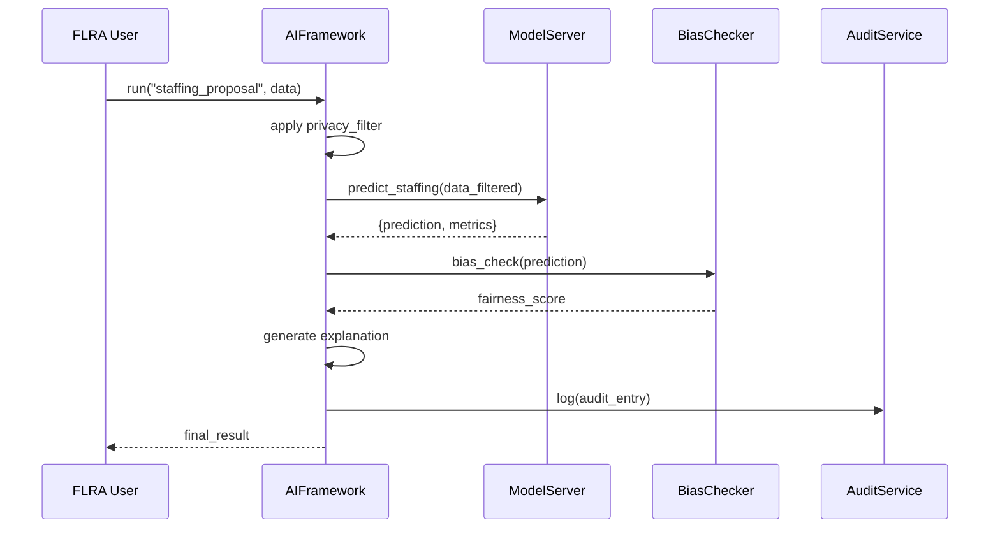

# Chapter 2: AI Governance Framework

In the last chapter we saw how the [Governance Layer](01_governance_layer_.md) acts like a constitutional court for data and APIs. Now, we’ll build on that and introduce the **AI Governance Framework**—our “oversight committee” for any AI-driven decision or policy proposal.

---

## 2.1 Why an AI Governance Framework?

Imagine the Federal Labor Relations Authority (FLRA) wants to use AI to recommend optimal staffing levels at field offices. Without guardrails, the AI could:

- Make unfair suggestions that favor one group of employees.
- Produce results that nobody can explain or audit.
- Violate privacy by exposing sensitive HR data.

The **AI Governance Framework** solves this by enforcing:

- **Transparency**: Every recommendation is explainable.
- **Truth**: Models are checked against real data and facts.
- **Safety**: Outputs avoid harmful or illegal actions.
- **Ethics**: Bias is detected and mitigated.
- **Privacy**: Sensitive details are masked or removed.

---

## 2.2 Key Concepts

1. **Policy Template**  
   A structured rule that every AI task must follow.  
   Example: “Any staffing proposal must include a fairness check.”

2. **Audit Trail**  
   A record of inputs, outputs, decisions, and checks.  
   Think of it as minutes from each oversight committee meeting.

3. **Bias Checker**  
   A tool that runs statistical tests to spot unfair patterns.

4. **Explainability Module**  
   A component that generates human-readable reasons for each AI output.

5. **Privacy Filter**  
   A step that redacts or anonymizes personal data before or after AI runs.

---

## 2.3 Using the AI Governance Framework

Let’s walk through a simplified example. The FLRA calls an endpoint to get an AI staffing recommendation.

### 2.3.1 Define an AI Policy

```yaml
# ai_policies.yaml
ai_policies:
  staffing_proposal:
    steps:
      - name: privacy_filter
      - name: predict_staffing
      - name: bias_check
      - name: explain
    thresholds:
      fairness: 0.8
      accuracy: 0.9
```

This says:  
1. Run privacy filtering  
2. Predict staffing numbers  
3. Check for bias (must ≥80% fairness)  
4. Produce an explanation  

### 2.3.2 Invoke the Framework in Code

```python
# flra_service.py
from ai_framework import AIFramework

framework = AIFramework("ai_policies.yaml")

def propose_staffing(data):
    result = framework.run("staffing_proposal", input_data=data)
    return result

# Sample call
input_data = {"office_id": 42, "historical_requests": [100, 120, 110]}
output = propose_staffing(input_data)
print(output)
```

Beginner-friendly explanation:  
- We load our `ai_policies.yaml`.  
- We call `framework.run(...)`.  
- We pass in data about office requests.  
- The framework returns a structured result (prediction, checks, explanation).

### 2.3.3 Sample Output

```json
{
  "prediction": 115,
  "fairness_score": 0.92,
  "accuracy": 0.94,
  "explanation": "Based on last 3 quarters, staffing of 115 balances workload evenly.",
  "audit_id": "AUD-20240701-001"
}
```

- `prediction`: recommended staff count  
- `fairness_score` & `accuracy`: show threshold compliance  
- `explanation`: human-readable reason  
- `audit_id`: reference for the audit trail  

---

## 2.4 Under the Hood: Sequence Walkthrough

When `framework.run(...)` is called, here’s what happens:



1. **Privacy Filter**: strip or mask PII.  
2. **ModelServer**: get a raw prediction.  
3. **BiasChecker**: compute a fairness score.  
4. **Explain**: craft a short reason.  
5. **AuditService**: store all inputs, steps, outputs.  
6. Return the result to the user.

---

## 2.5 Inside the AI Framework (Code)

Let’s peek at a simplified `ai_framework.py`:

```python
# ai_framework.py
import yaml, datetime

class AIFramework:
    def __init__(self, policy_file):
        self.policies = yaml.safe_load(open(policy_file))["ai_policies"]

    def run(self, policy_name, input_data):
        steps = self.policies[policy_name]["steps"]
        ctx = {"data": input_data, "log": []}

        for step in steps:
            fn = getattr(self, step)
            ctx = fn(ctx)

        audit_id = self.log_audit(policy_name, ctx)
        ctx["result"]["audit_id"] = audit_id
        return ctx["result"]

    # Step implementations (simplified)
    def privacy_filter(self, ctx):
        # ... mask or remove PII ...
        ctx["log"].append("privacy_filter")
        return ctx

    def predict_staffing(self, ctx):
        # Imagine a call to an ML model here
        ctx["result"] = {"prediction": 115, "accuracy": 0.94}
        ctx["log"].append("predict_staffing")
        return ctx

    def bias_check(self, ctx):
        # Compute fairness_score
        ctx["result"]["fairness_score"] = 0.92
        ctx["log"].append("bias_check")
        return ctx

    def explain(self, ctx):
        ctx["result"]["explanation"] = "Balanced forecast based on trends."
        ctx["log"].append("explain")
        return ctx

    def log_audit(self, policy, ctx):
        audit_id = f"AUD-{datetime.datetime.now().strftime('%Y%m%d%H%M%S')}"
        # Send ctx (steps, inputs, outputs) to AuditService
        return audit_id
```

- `run()` loads the steps defined in YAML.  
- Each method updates context (`ctx`) with data and logs.  
- Finally, we generate an audit ID and include it in the result.

---

## 2.6 Conclusion

In this chapter, you learned:

- Why AI needs its own governance framework—especially for public-sector use cases like FLRA staffing proposals.  
- The core principles: transparency, truth, safety, ethics, and privacy.  
- How to define an AI policy in YAML and call it in code.  
- What happens under the hood (sequence flow and simplified implementation).  

Next up, we’ll see how these AI controls fit into the broader **Management Layer**, where human workflows and approvals happen.  
[Management Layer](03_management_layer_.md)

---

Generated by [AI Codebase Knowledge Builder](https://github.com/The-Pocket/Tutorial-Codebase-Knowledge)