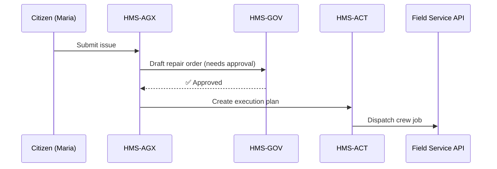

# Chapter 2: AI Representative Agent (HMS-AGX)


*[Jump back to Chapter&nbsp;1: Governance Layer / Admin Portal (HMS-GOV)](01_governance_layer___admin_portal__hms_gov__.md)*  

---

## 1. Why Do We Need HMS-AGX?

Picture a citizen, Maria, using a city app to report:  

> “The pedestrian signal outside Union Station is stuck on **DON’T WALK**—please fix it before tonight’s game.”  

In a traditional setup her request would:

1. Land in an overflowing email inbox.  
2. Get forwarded (and maybe lost) between departments.  
3. Sit for days until an engineer visits the intersection.

With **HMS-AGX** it instead works like this:

1. Maria’s message is read by the AI Representative Agent.  
2. The agent checks live traffic-flow data, safety rules, and staffing schedules.  
3. It drafts a “Signal Repair Order,” asks HMS-GOV for approval, and—once green-lighted—pushes the order straight to the field crew system.  
4. All steps are logged, and Maria receives a status SMS in minutes.

Think of AGX as a 24/7 digital chief-of-staff who reads, thinks, writes, and routes policy on everyone’s behalf.

---

## 2. Key Concepts in Plain English

| Term                       | Analogy                                                               |
|----------------------------|-----------------------------------------------------------------------|
| Representative Agent       | A super-smart policy intern who never sleeps.                         |
| Prompt / Issue             | The “email” or “memo” the agent receives (e.g., Maria’s complaint).   |
| Knowledge Pack             | Its backpack of laws, manuals, and data tables.                       |
| Draft Action / Proposal    | The memo it writes for humans to bless.                               |
| Push-to-Execution          | Walking the signed memo to every department’s inbox.                  |

---

## 3. A 3-Minute Hands-On Tour

Below is a **toy script** that sends a request to HMS-AGX and polls its response.  
*(No install needed—just read the comments.)*

```python
# demo_agx_request.py (≤20 lines)
import httpx, time, json

issue = {                    # 1. Maria's request
  "from":  "maria@example.com",
  "body":  "Pedestrian signal stuck on DON'T WALK at Union Station.",
  "tags":  ["safety", "traffic"]
}

# 2. Send to AGX
ticket = httpx.post("https://api.hms/agx/issues", json=issue).json()
print("Ticket ID:", ticket["id"])

# 3. Poll status
while True:
    state = httpx.get(f"https://api.hms/agx/issues/{ticket['id']}").json()
    print("→", state["status"])
    if state["status"] == "READY_FOR_APPROVAL":          # 4. Done drafting
        print("Draft:", json.dumps(state["draft"], indent=2))
        break
    time.sleep(1)
```

Explanation:

1. We create a simple JSON issue.  
2. A POST sends it to HMS-AGX.  
3. We poll until the agent finishes thinking.  
4. It returns a **draft action** ready for someone in [HMS-GOV](01_governance_layer___admin_portal__hms_gov__.md) to approve.

---

## 4. What Happened Under the Hood?



Step-by-step (non-code):

1. **Intent Parsing** – AGX classifies Maria’s message as **Critical Safety / Traffic Signal**.  
2. **Knowledge Lookup** – It fetches repair guidelines from the [Central Data Repository](07_central_data_repository__hms_dta__.md).  
3. **Draft Generation** – It writes a structured “Repair Order.”  
4. **Approval Loop** – The draft lands in HMS-GOV where a traffic supervisor hits **Approve**.  
5. **Execution Push** – After approval, AGX asks the [Agent Orchestration Engine (HMS-ACT)](06_agent_orchestration_engine__hms_act__.md) to run the task, which calls the field crew service.  
6. **Feedback** – Status flows back to Maria automatically.

---

## 5. Peeking at the Core Files

### 5.1 Intent Parser (Python, 12 lines)

`services/hms-agx/intent_parser.py`

```python
import re

def classify(text: str) -> str:
    rules = {
        "traffic": r"(signal|light|intersection)",
        "passport": r"(visa|passport)",
        "energy":  r"(offshore|wind|drilling)"
    }
    for label, pattern in rules.items():
        if re.search(pattern, text, re.I):
            return label
    return "general"
```

Explain: Tiny regex rules slot each incoming message into a bucket. A real system would use an ML model, but this keeps the idea crystal-clear.

### 5.2 Draft Generator (Python, 15 lines)

`services/hms-agx/draft_generator.py`

```python
def make_repair_order(issue):
    return {
        "title": f"Fix signal at {issue['body'].split(' at ')[-1]}",
        "agency": "District Traffic Ops",
        "priority": "HIGH",
        "actions": [
            "Send crew with lift truck",
            "Replace pedestrian push-button",
            "Test 30-sec WALK cycle"
        ],
        "citizenContact": issue["from"]
    }
```

Explain: Converts Maria’s free-text into a structured plan.

### 5.3 Push-to-Execution (Node, 17 lines)

`services/hms-agx/push.js`

```js
// push.js
const bus = require('../lib/messageBus'); // wraps RabbitMQ

async function push(order) {
  await bus.publish('traffic.repair.created', order); // fan-out
  console.log('Order dispatched:', order.title);
}

module.exports = { push };
```

Explain: After approval, we broadcast the order. Other services subscribe without tight coupling.

---

## 6. How to Talk to AGX from Other Layers

| Caller               | Typical Method             | Example |
|----------------------|----------------------------|---------|
| HMS-GOV UI           | REST → `/agx/issues`       | Show “suggested actions” panel |
| Backend Services     | Message Bus Topic          | `agx.suggest.policy`           |
| External Portals     | GraphQL or Webhook         | Auto-file FOIA request drafts  |

*(We’ll wire this up officially in later chapters.)*

---

## 7. Common Questions

**“Is the agent allowed to act without humans?”**  
No. Every drafted action passes through [Human-in-the-Loop (HITL) Oversight](03_human_in_the_loop__hitl__oversight_.md) unless an emergency policy marks it *pre-approved*.

**“What if the draft conflicts with federal law?”**  
The Legal & Compliance Module (HMS-ESQ) reviews every outgoing action against statutory rulesets and may block it.

**“Can we train it on my agency’s private docs?”**  
Yes—upload to the Central Data Repository and tag visibility levels. AGX automatically indexes new material.

---

## 8. What You Learned

• HMS-AGX is the system’s **virtual civil-servant**, translating raw issues into executable, approved actions.  
• You saw a 15-line demo turning a citizen complaint into a ready-to-sign repair order.  
• Under the hood, AGX chains intent parsing, knowledge lookup, draft generation, approval, and execution.  

Ready to see how real humans stay in the driver’s seat?  
Continue to [Human-in-the-Loop (HITL) Oversight](03_human_in_the_loop__hitl__oversight_.md).

---

Generated by [AI Codebase Knowledge Builder](https://github.com/The-Pocket/Tutorial-Codebase-Knowledge)