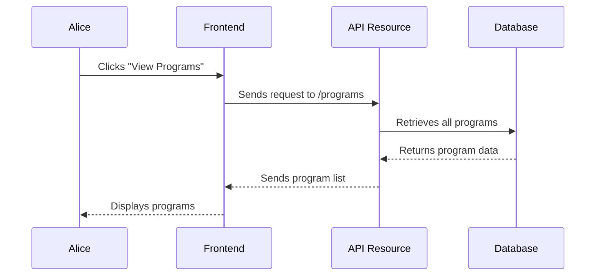

# Chapter 2: API Resources

In the previous chapter, [Program Sales](01_program_sales_.md), we saw how Alice could buy a program.  We glossed over how the frontend (the website Alice interacts with) talks to the backend (the server that handles the purchase).  This is where API Resources come in. They make communication between the frontend and backend much smoother.

## The Use Case: Viewing Available Programs

Let's say Alice wants to see all the programs you offer before she decides to buy one.  API Resources make it easy to fetch this list.

## What Problem Do API Resources Solve?

Imagine having to write separate routes for every action: one for viewing programs, another for creating a program, yet another for updating a program, and so on. This can quickly become messy and repetitive. API Resources solve this by providing a pre-built structure for these common actions.

## Key Concepts

1. **Resource:**  Think of a resource as a "thing" you want to manage, like a program, a user, or a sale.

2. **CRUD Operations:** CRUD stands for Create, Read, Update, and Delete. These are the basic actions you can perform on a resource.

3. **Routes:** Routes define how the frontend can access different parts of your backend. API Resources automatically generate these routes for you.

## Viewing Available Programs: Step-by-Step

Here's a simplified look at how API Resources help Alice view your programs:



## Under the Hood: Code Implementation

The `routes/api.php` file defines the API Resource for programs:

```php
// File: routes/api.php

// ... other code ...

Route::apiResources([
    'program' => Core\ProgramController::class,
    // ... other resources ...
]);

// ... other code ...
```

This single line automatically creates several routes:

* `GET /program`:  Retrieves a list of all programs (what Alice uses to see available programs).
* `POST /program`: Creates a new program.
* `GET /program/{program}`: Retrieves a specific program by its ID.
* `PUT /program/{program}`: Updates a specific program.
* `DELETE /program/{program}`: Deletes a specific program.

**Explanation:**

The `apiResources` method takes an array where the key is the URL segment (e.g., 'program') and the value is the controller that handles the resource (e.g., `Core\ProgramController`).

The `ProgramController` contains methods like `index` (for retrieving all programs), `store` (for creating a program), `show` (for retrieving a specific program), `update` (for updating a program), and `destroy` (for deleting a program).  These methods are automatically mapped to the corresponding routes generated by the `apiResources` method.

## Example: Retrieving a Specific Program

If the frontend wants to retrieve program with ID 123, it would send a GET request to `/program/123`.  The `show` method in the `ProgramController` would be called, retrieving the program details from the database and returning them to the frontend.

```php
// File: app/Http/Controllers/Core/ProgramController.php (simplified)

// ... other code ...

public function show(Program $program)
{
    return $program; // Returns the program data
}

// ... other code ...
```

## Conclusion

In this chapter, we learned about API Resources and how they simplify building RESTful APIs. We saw how a single line of code can generate multiple routes for common CRUD operations.  Next, we'll explore how to build the frontend that interacts with these API Resources in [Frontend CMS](03_frontend_cms_.md).


---

Generated by [AI Codebase Knowledge Builder](https://github.com/The-Pocket/Tutorial-Codebase-Knowledge)