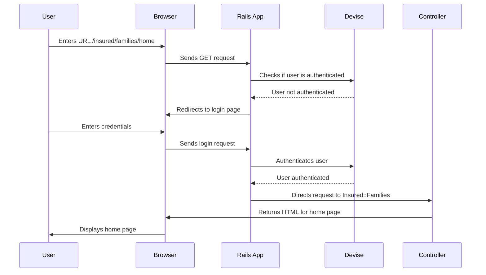

# Chapter 2: Authentication (Devise)

In the previous chapter, [Routing (`routes.rb`)](01_routing__routes_rb_.md), we learned how our application directs incoming requests. Now, let's imagine that some parts of our website, like viewing insurance details, should only be accessible to registered users.  This is where authentication comes in.  Authentication is like a security guard for your application, ensuring that only authorized users can access certain areas.  In Rails, we often use a gem called Devise to handle this.

## Devise: Your Application's Security Guard

Devise is a powerful authentication solution that takes care of many common security tasks, such as:

* **User Registration:** Allowing new users to create accounts.
* **Login/Logout:**  Managing user sessions.
* **Password Management:** Handling password resets and changes.
* **Security Features:** Protecting against common vulnerabilities.

Think of Devise as a pre-built security system that you can easily integrate into your application.

## Adding Devise to Your Application

Let's say we want users to log in before they can access the `insured/families/home` page from our previous example.  Here's a simplified look at how Devise helps:

First, you'd add Devise to your `routes.rb` file:

```ruby
# config/routes.rb
devise_for :users
```

This single line tells Rails to use Devise for user authentication.  It automatically creates routes for registration, login, logout, and other Devise functionalities.

Next, you would need to add authentication checks in your controller:

```ruby
# app/controllers/insured/families_controller.rb
class Insured::FamiliesController < ApplicationController
  before_action :authenticate_user!

  def home
    # Code to display the family's home page
  end
end
```

The `before_action :authenticate_user!` line acts as the security guard, ensuring that only logged-in users can access the `home` action.  If a user tries to access this page without logging in, Devise will redirect them to the login page.

## How Devise Works Under the Hood



Devise intercepts the request and checks if the user is logged in. If not, it redirects to the login page. After successful login, Devise allows access to the requested page.

## Devise Configuration and Customization

Devise is highly configurable. You can customize things like the email templates, password requirements, and other security settings.  These configurations are typically done in the `config/initializers/devise.rb` file.  For example:

```ruby
# config/initializers/devise.rb
Devise.setup do |config|
  config.mailer_sender = 'your_email@example.com'
  config.password_length = 12..128
end
```

This snippet configures the sender email address for Devise emails and sets the minimum and maximum password length.  You can explore the Devise documentation for more configuration options.  Devise also interacts with your [Models (Mongoid)](06_models__mongoid_.md) to manage user data.

## Conclusion

In this chapter, we learned how Devise acts as a security guard for our application, handling user authentication and protecting access to sensitive areas. We saw how to integrate Devise into our `routes.rb` file and controllers.  We also touched upon Devise's configuration options.

Next, we'll explore how to manage client-specific configurations: [Client Configuration (client_config)](03_client_configuration__client_config_.md).


---

Generated by [AI Codebase Knowledge Builder](https://github.com/The-Pocket/Tutorial-Codebase-Knowledge)