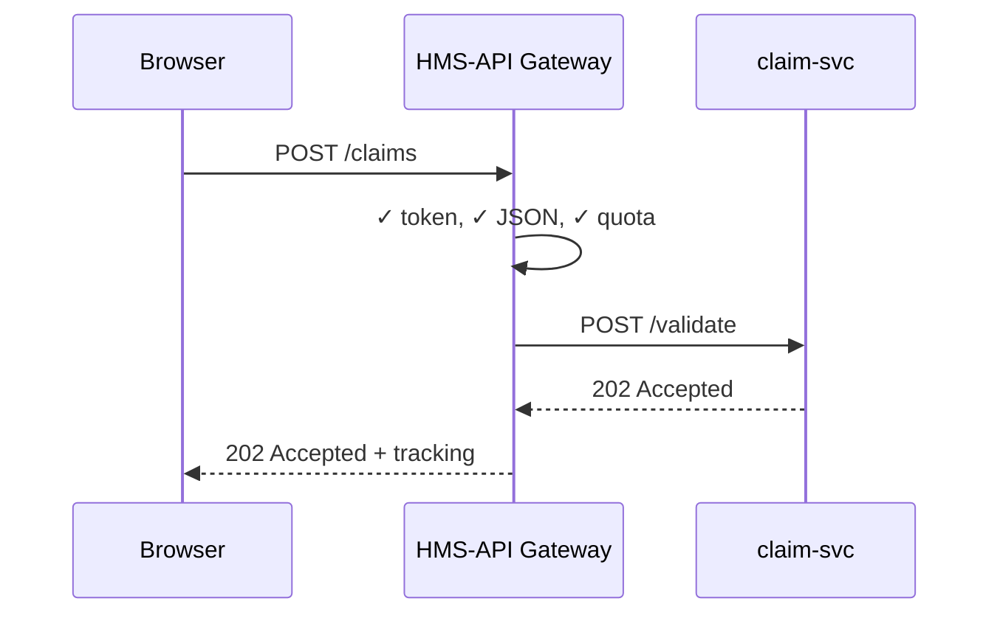

# Chapter 2: Backend API Gateway (HMS-SVC / HMS-API)

*(A friendly follow-up to [Chapter 1: Multi-Layered Micro-services Architecture](01_multi_layered_micro_services_architecture_.md))*  

---

## 1. Why Does HMS-GOV Need a “Post Office”?

Picture Farmer George in Iowa.  
Every spring he files a **Crop-Insurance Claim** through a USDA web page:

1. George clicks “Submit Claim.”  
2. His browser shoots a request to **HMS-API Gateway**.  
3. The gateway checks his ID token, stamps the request, and decides where it goes.  
4. It forwards the parcel to:
   * `claim-svc` (validates claim numbers)  
   * `payment-svc` (starts reimbursement)  
5. George instantly sees **“Claim Received – tracking #1234.”**

If 50,000 farmers submit in the same hour, we *still* want each parcel routed safely, quickly, and with proof of delivery.  
That is the whole job of **HMS-SVC / HMS-API** – the city’s central post office for bits.

---

## 2. What Exactly *Is* an API Gateway?

Think of a single front door in a secure federal building:

| Real Door            | HMS-API Equivalent                     |
|----------------------|----------------------------------------|
| Guard checks badge   | JWT / OAuth token validation           |
| Directs you to floor | URL → micro-service routing            |
| Limits crowd size    | Rate-limiting & throttling             |
| CCTV on every hall   | Telemetry & tracing headers            |

Without this door, every micro-service would need to do its own security, logging, and crowd control. That’s like giving every office its own mini-guard—not fun to maintain!

---

## 3. Five Superpowers of HMS-API

1. **Routing** – Maps `/claims/**` to `claim-svc`, `/pay/**` to `payment-svc`, etc.  
2. **Authentication & Authorization** – Verifies signed tokens issued by Login.gov or internal SSO.  
3. **Rate Limiting** – “Max 5 requests/sec per citizen” keeps bad actors at bay.  
4. **Schema Validation** – Rejects malformed JSON before it hits internal code.  
5. **Observability** – Adds trace IDs so ops teams can answer “Why was George’s request slow?” in Grafana.

---

## 4. A 15-Line Mini-Gateway (Educational Only)

The real HMS-API uses Envoy + Kubernetes Ingress + custom policy engines.  
Below is a *toy* Node.js example to see the idea in motion.

```javascript
// gateway/index.js
const express = require("express");
const { createProxyMiddleware } = require("http-proxy-middleware");
const rateLimit = require("express-rate-limit");
const jwt = require("express-jwt");
const app = express();

// 1) Basic JWT check (public key usually loaded from JWKS)
app.use(jwt({ secret: "demo-secret", algorithms: ["HS256"] }));

// 2) Rate-limit every client IP
app.use(rateLimit({ windowMs: 60_000, max: 60 }));

// 3) Simple routers
app.use("/claims", createProxyMiddleware({ target: "http://claim-svc:4000", changeOrigin: true }));
app.use("/pay",    createProxyMiddleware({ target: "http://payment-svc:5000", changeOrigin: true }));

app.listen(80, () => console.log("🎫 HMS-API up on port 80"));
```

Explanation for beginners:

1. `express-jwt` rejects any request lacking a valid token.  
2. `express-rate-limit` caps each IP to 60 calls/min.  
3. `createProxyMiddleware` forwards traffic to internal service URLs—your micro-services stay private.

---

## 5. The Travel Path of Farmer George’s Claim



A failure anywhere past the gateway is isolated; HMS-API can return helpful error codes without leaking internal details (“database timed out” becomes “503 – Try again later”).

---

## 6. Peeking Under the Hood (High-Level Steps)

1. **Ingress Controller** receives HTTPS traffic from the internet.  
2. **Envoy** sidecars implement JWT, rate limits, and traffic shaping.  
3. **Policy Engine** (Open Policy Agent) decides *who* may call *what*.  
4. **Service Discovery** finds a healthy pod for `claim-svc`.  
5. **Tracing Middleware** injects `X-Trace-Id` header for end-to-end logs.

All of this is wired through Kubernetes manifests and Helm charts so dev teams rarely touch YAML manually.

---

## 7. How Developers Extend the Gateway

### 7.1 Adding a New Endpoint

Suppose the Oak Ridge National Laboratory (ORNL) launches a **Material-Research Submission API**:

1. A dev writes `ornl-svc` (micro-service).  
2. They open `gateway/routes.yaml` and add:

```yaml
- path: /materials/**
  service: ornl-svc
  port: 4200
  auth: gov_researcher_only
```

3. A CI pipeline lints the change, updates Swagger docs, and rolls it into staging.

### 7.2 Generating Swagger / OpenAPI Docs

The gateway auto-scans routes and publishes a single URL:

```
GET https://api.hms.gov/swagger.json   --> giant, machine-readable catalog
```

Frontend teams, Postman users, or even other agencies (hello FCSIC 👋) can explore the contract without touching source code.

---

## 8. Common Beginner Questions

**Q: Can micro-services bypass the gateway to call each other?**  
A: Internally, yes, but we *prefer* service-to-service mesh calls with mutual TLS. External clients must always enter through HMS-API.

**Q: Does the gateway slow things down?**  
A: Latency is typically < 5 ms because checks are in-memory. Bulk crypto is offloaded to specialized TLS chips when needed.

**Q: How does rate limiting distinguish citizens vs. agencies?**  
A: We slice quotas by the `sub` claim in the JWT for citizens and by API key for system-to-system calls, then apply different limits.

---

## 9. Hands-On Challenge (Optional)

Spin up the toy gateway above, plus a stub `claim-svc`:

```bash
# claim-svc/index.js (8 lines, omitted for brevity)
npm install
node gateway/index.js      # Port 80
node claim-svc/index.js     # Port 4000
curl -H "Authorization: Bearer <demo-jwt>" -d '{}' http://localhost/claims
```

You should see **“202 Accepted”** from the proxy and console logs in both services.

---

## 10. Key Takeaways

• HMS-API is the one-stop front door for every REST, GraphQL, or gRPC parcel.  
• It gives routing, security, limits, and visibility “for free” to all micro-services.  
• Developers focus on domain logic; ops teams watch telemetry; admins browse beautifully generated Swagger docs.  

Next we’ll see how the **front-end** world plugs into this door using tiny, independent micro-frontends.

➡️ Continue to [Front-end Micro-Frontend Framework (HMS-MFE)](03_front_end_micro_frontend_framework__hms_mfe__.md)

---

Generated by [AI Codebase Knowledge Builder](https://github.com/The-Pocket/Tutorial-Codebase-Knowledge)