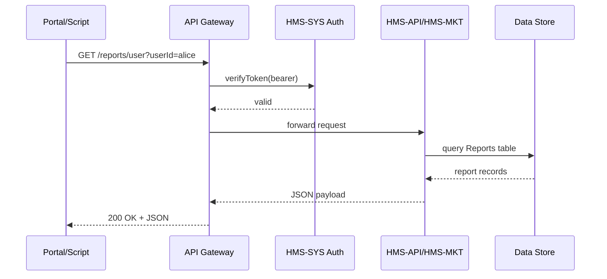
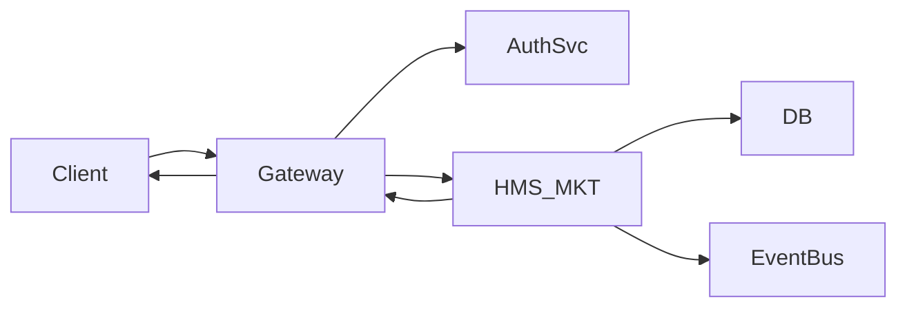

# Chapter 2: Backend API (HMS-API/HMS-MKT)

In [Chapter 1: Core System Platform (HMS-SYS)](01_core_system_platform__hms_sys__.md) we built our foundation for identity, security, messaging, and logging. Now, we’ll open the front door of our building by creating the **Backend API**—the official “reception desk” where all clients, scripts, and AI agents come to ask for data or kick off business processes.

---

## 1. Why We Need a Backend API

Imagine a citizen portal for the Wireless Telecommunications Bureau (WTB).  A front-end dashboard needs to:

- Fetch a user’s license applications  
- Submit a new license request  
- Deploy updated spectrum-allocation policies  
- Sync schedules with the engineering calendar  

Rather than every portal, script, or bot writing raw database queries, we provide a secure set of HTTP endpoints.  These endpoints:

- Enforce authentication and authorization (via HMS-SYS)  
- Validate and route requests to the correct business module (HMS-MKT)  
- Return consistent JSON responses  

Think of the Backend API as the receptionist counter in a federal agency: it checks your badge, takes your request form, and forwards you to the right office.

---

## 2. Key Concepts

We’ll break the Backend API into three beginner-friendly pieces:

1. **API Gateway & Routing**  
   - A single entry point that checks your token and directs you to `/hms-api/v1/...`.  
   - Example: `POST /hms-api/v1/policies` → policy-deployment handler.  

2. **Business Services (HMS-MKT)**  
   - The department offices that run core business logic: policies, reports, schedules.  
   - Example: `PolicyService.deploy()` takes a policy document, saves it, publishes an event.

3. **Request & Response Models**  
   - JSON schemas that validate inputs and shape outputs.  
   - Example input:  
     ```json
     { "title": "New Spectrum Rule", "details": { ... } }
     ```
   - Example output:  
     ```json
     { "status": "success", "policyId": 42 }
     ```

---

## 3. Calling the API: A Simple Example

Let’s say a developer wants to fetch user reports.  They’d:

```python
import requests

BASE_URL = "https://api.hms.gov/hms-api/v1"
token = "eyJhbGciOi..."  # from HMS-SYS

resp = requests.get(
    f"{BASE_URL}/reports/user?userId=alice",
    headers={"Authorization": f"Bearer {token}"}
)
print(resp.json())
```

Explanation:  
1. We pass the bearer token issued by [HMS-SYS](01_core_system_platform__hms_sys__.md).  
2. We call the `/reports/user` endpoint with a query parameter.  
3. The API returns JSON containing all of Alice’s reports.

---

## 4. Under the Hood: Request Flow

What happens when our code above runs?



1. **API Gateway** checks the token with the Auth Service.  
2. If valid, it routes the call to the HMS-MKT reporting handler.  
3. The handler queries the database and returns structured JSON.

---

## 5. Inside the Backend API

### 5.1 Defining an Endpoint (Flask Example)

```python
# hms_mkt/handlers/reports.py
from flask import Flask, request, jsonify
from hms_sys.auth import verify_token
from hms_mkt.services import ReportService

app = Flask(__name__)

@app.route('/hms-api/v1/reports/user', methods=['GET'])
def get_user_reports():
    user = verify_token(request.headers)
    user_id = request.args.get('userId')
    reports = ReportService.fetch_for_user(user_id)
    return jsonify({'reports': reports}), 200
```

_Explanation:_  
- We verify the token via `hms_sys.auth` (see [Chapter 1](01_core_system_platform__hms_sys__.md)).  
- We read `userId` from the query string, call our business service, and return JSON.

### 5.2 Business Logic (Policy Deployment)

```python
# hms_mkt/services/policy_service.py
class PolicyService:
    @staticmethod
    def deploy(policy_data):
        # 1. Validate schema (omitted)
        # 2. Save to database
        new_id = Database.insert('policies', policy_data)
        # 3. Publish event for other systems
        EventBus.publish('PolicyDeployed', {'id': new_id})
        return new_id
```

_Explanation:_  
- `deploy()` saves the new policy and emits a `PolicyDeployed` event via our messaging bus (see [Chapter 1](01_core_system_platform__hms_sys__.md)).

---

## 6. Putting It All Together

1. A client calls `/hms-api/v1/policies` with JSON.  
2. The **Gateway** verifies the token.  
3. The request arrives at `deploy_policy()` in HMS-MKT.  
4. Business logic saves the policy and publishes an event.  
5. The API returns `{"status":"success","policyId":…}`.



---

## 7. Summary & Next Steps

In this chapter, you learned how the **Backend API (HMS-API/HMS-MKT)** acts as the secure receptionist for all data reads, writes, and business workflows. We saw:

- How the API Gateway checks tokens with [HMS-SYS](01_core_system_platform__hms_sys__.md)  
- How routes map to simple Flask handlers  
- How business services in HMS-MKT implement core processes  

Up next, we’ll build the **Interface Layer** to glue these endpoints into real-world deployments:

[Chapter 3: Interface Layer](03_interface_layer_.md)

---

Generated by [AI Codebase Knowledge Builder](https://github.com/The-Pocket/Tutorial-Codebase-Knowledge)