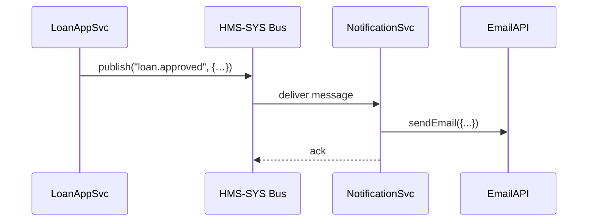
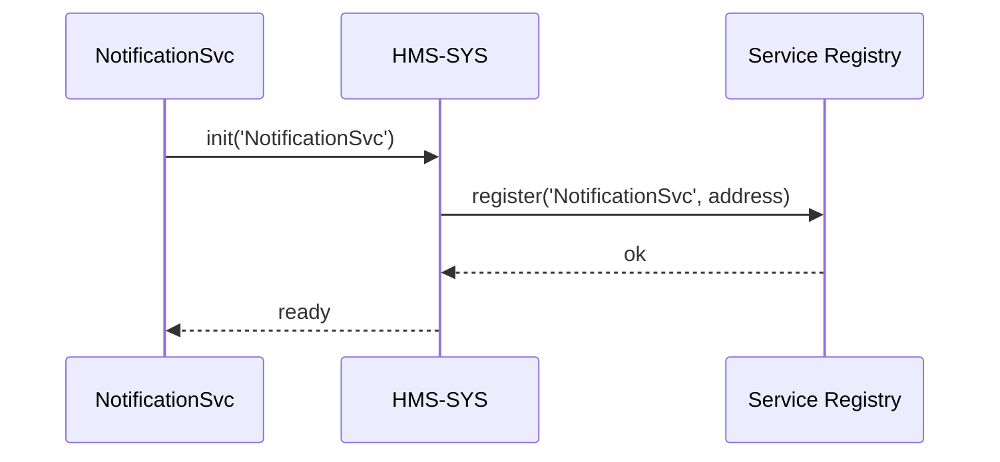

# Chapter 2: Backend Microservices Layer (HMS-SVC)

Welcome back! In [Chapter 1: Core Infrastructure (HMS-SYS)](01_core_infrastructure__hms_sys__.md) we saw how HMS-SYS gives us auth, logging, messaging and service registry “plumbing.” Now we’ll build on that to create **independent business services**—the “shop windows” of our platform.

---

## 1. Why a Microservices Layer?

Imagine a government agency with one giant room where every task happens—citizen intake, licensing, inspections, payments—all mixed together. It’s hard to maintain, test or scale.

Instead, think of separate offices:

- **User Office** handles sign-ups and profiles  
- **Notification Office** sends emails or SMS  
- **Payment Office** processes fees  

Each can be staffed, upgraded, or expanded independently. That’s HMS-SVC: a suite of small, focused microservices for tasks like user management, notifications, payments, etc.

### Concrete Use Case: Student Loan Portal

A student applies for a federal loan. We need to:

1. Create a user account  
2. Validate enrollment status  
3. Send an approval email  
4. Charge an origination fee  

With microservices, we can build four small services—**UserSvc**, **EnrollmentSvc**, **NotificationSvc**, **PaymentSvc**—that each do one job well.

---

## 2. Key Concepts

1. **Single Responsibility**  
   One microservice = one business capability.  
2. **Independent Deployment**  
   Each service has its own code, config, and release cycle.  
3. **Isolation & Scaling**  
   If notifications spike, only **NotificationSvc** needs more instances.  
4. **Communication**  
   Services talk via messages (HMS-SYS bus) or HTTP APIs.  
5. **Service Registry**  
   Each service registers itself so others can discover its address.

---

## 3. Building Your First Microservice

Let’s scaffold **NotificationSvc** that listens for approved loans and sends an email.

```javascript
// file: notification-service/index.js
const core = require('hms-sys').init({ serviceName: 'NotificationSvc' })

// 1) Subscribe to the bus topic "loan.approved"
core.onMessage('loan.approved', async (payload) => {
  // payload = { userId, email, loanId }
  console.log(`Sending email to ${payload.email} for loan ${payload.loanId}`)
  // pretend to call an Email API...
})
```

Explanation:

- `hms-sys.init()` wires in auth, logging, messaging, registry.
- `core.onMessage(...)` subscribes to a topic on the HMS-SYS message bus.
- Inside the handler you add your business logic (send email).

Try publishing a message (e.g., from a test script) and watch your service log the email action.

---

## 4. Message Flow Inside HMS-SVC

What happens when **LoanAppSvc** publishes `loan.approved`?  



1. **LoanAppSvc** publishes an event.  
2. The **HMS-SYS bus** routes it to **NotificationSvc**.  
3. **NotificationSvc** calls an external Email API.  
4. **NotificationSvc** acknowledges so the bus can clean up.

---

## 5. Under the Hood: Service Registration & Startup

When each microservice starts, it registers itself so others can find it:

```javascript
// file: notification-service/bootstrap.js
const core = require('hms-sys').init({ serviceName: 'NotificationSvc' })

async function start() {
  // 1) Register in the Service Registry
  await core.registry.register(core.serviceName, core.address)
  // 2) Subscribe to topics
  core.onMessage('loan.approved', handleLoanApproved)
  // 3) (Optional) Start HTTP endpoints
  core.http.listen(process.env.PORT || 3000)
}

start()
```

Step-by-step:

1. **registry.register** publishes “NotificationSvc @ host:port”  
2. **onMessage** ties your business function to a topic  
3. **http.listen** exposes any HTTP routes you define  

### 5.1 Sequence Diagram: Registration



---

## 6. Summary

In this chapter you learned:

- Why separate microservices are like different government offices.  
- Core concepts: single responsibility, independent scaling, registry.  
- How to build and run **NotificationSvc** using HMS-SYS.  
- The internal flow from event publication to handling.  
- How each service registers itself for discovery.

Up next: the layer that sits in front of these services—routing, aggregation, and gateway logic.  
[Chapter 3: Backend API Layer](03_backend_api_layer_.md)

---

Generated by [AI Codebase Knowledge Builder](https://github.com/The-Pocket/Tutorial-Codebase-Knowledge)