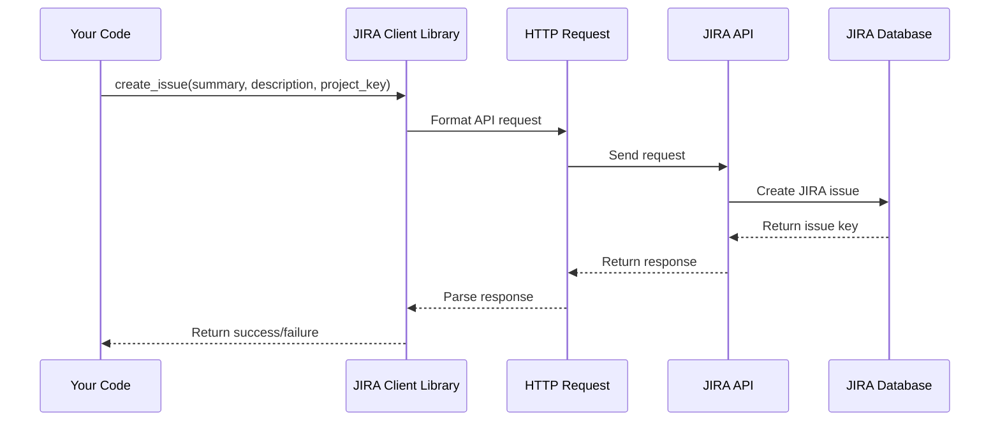

# Chapter 2: Client Libraries (API Wrappers)

Coming from our understanding of [ESRs (Engineering Support Requests)](01_esr__engineering_support_request__.md), we now need a way to actually manage them.  Imagine you want to create an ESR in JIRA.  You could manually log into JIRA, navigate to the correct project, fill out all the fields, and submit the issue.  But what if you need to create ESRs in GitHub, Bugsnag, or other services too?  Doing this manually for each service would be a lot of work!  That's where client libraries come in.

## What are Client Libraries?

Client libraries, also known as API wrappers, are like translators for talking to different services.  They simplify communication by handling the technical details, so you can focus on *what* you want to do, not *how* to do it.

Think of it like ordering food at a restaurant. You tell the waiter what you want (the "what"), and they handle communicating that to the kitchen and bringing you your food (the "how"). You don't need to know how to cook the food yourself.

Similarly, a client library lets you say "create an ESR" and it handles the details of communicating with the service's API.

## Example: Creating an ESR in JIRA

Let's say we want to create an ESR in JIRA using the `HMS-ESR Library`.  Here's a simplified example:

```ruby
# Assume 'jira_client' is an instance of the JIRA client library
jira_client.create_issue(
  summary: "User unable to log in",
  description: "User reports receiving an error message...",
  project_key: "MYPROJECT"
)
```

This code snippet tells the `jira_client` to create a JIRA issue.  The client library handles the complexities of formatting the request, sending it to the JIRA API, and processing the response.

## Internal Implementation (Simplified)

Here's a simplified sequence diagram showing how the `create_issue` method might work internally:



## Code Example:  `KibanaClient`

The `HMS-ESR Library` includes several client libraries, one for each service it integrates with.  Let's look at a simplified snippet from the `kibana_client.rb` file:

```ruby
# File: kibana_client.rb
module KibanaClient
  def self.search_logs(query:, hours:)
    # ... (Code to build and send request to Kibana API) ...
    # ... (Code to parse the response and return formatted logs) ...
  end
end
```

This `search_logs` method takes a `query` and a time range (`hours`) as input.  It then constructs an API request to Kibana, sends the request, and processes the response to return a list of matching logs.  The details of how the API request is formatted and how the response is parsed are handled within the client library, hiding the complexity from the user.

Other client libraries, like the one for GitHub (`github_client.rb`), Bugsnag (`bugsnag_client.rb`), AWS (`aws_client.rb`), and Sentry (`sentry_client.rb`), follow a similar pattern.  They provide simplified methods for interacting with their respective services.  You'll learn more about how these client libraries are used in later chapters, such as when we discuss [Live Mode Manager (Real-time Event Monitoring)](07_live_mode_manager__real_time_event_monitoring__.md) and [SidekiqMonitor (Background Job Monitoring)](08_sidekiqmonitor__background_job_monitoring__.md).

## Conclusion

In this chapter, we learned about client libraries and how they act as translators for communicating with different services.  We saw a simplified example of how a client library works internally and looked at a code snippet from the `KibanaClient`.  In the next chapter, we'll explore [Types (Data Structures)](03_types__data_structures__.md), which are used to organize and represent the data exchanged between the `HMS-ESR Library` and these external services.


---

Generated by [AI Codebase Knowledge Builder](https://github.com/The-Pocket/Tutorial-Codebase-Knowledge)