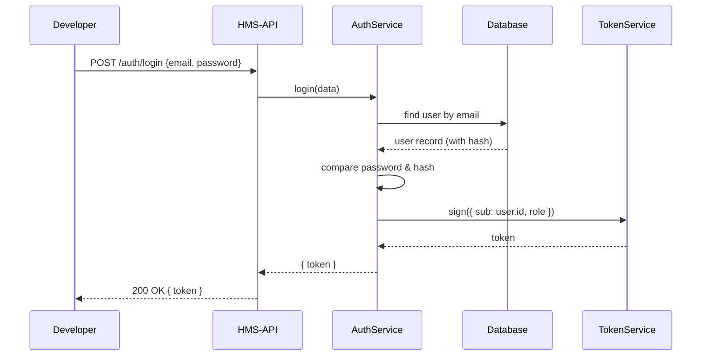
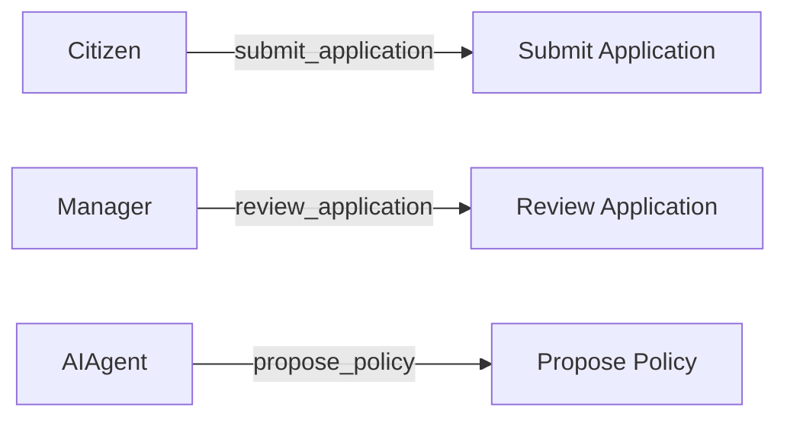

# Chapter 2: Core User Model & Auth

Welcome back! In [Chapter 1: Tenant & Subproject Management](01_tenant___subproject_management_.md) we learned how to isolate agencies into “floors” and “rooms.” Now it’s time to assign badges and clearances at the security desk so only the right people can enter.

---

## 1. Motivation: Secure Government Workflows

Imagine a citizen wants to submit a passport application, a DMV manager needs to review driver-license renewals, and an AI agent suggests policy updates on traffic safety. We can’t let everyone do everything—only:

- **Citizens** can submit forms.
- **Managers** can review and approve.
- **AI Agents** can propose new rules.

Our **Core User Model & Auth** handles:

- User accounts  
- Roles (badges)  
- Permissions (clearances)  
- Secure login (ID check)

Think of it like a security desk that scans badges before you enter a sensitive room.

---

## 2. Key Concepts

### 2.1 User  
An account with email, password hash, and assigned role.

Analogy: A person standing at the security desk.

### 2.2 Role  
A badge type: e.g., `Citizen`, `Manager`, `AIAgent`.

Analogy: Colored badge—green for citizens, blue for managers, gold for AI.

### 2.3 Permission  
Fine-grained actions granted by roles, e.g.:

- `submit_application`  
- `review_application`  
- `propose_policy`

Analogy: Which rooms you can enter once your badge is approved.

---

## 3. Getting Started: Register & Login

Let’s register a DMV manager and log in to get a JWT token:

```js
// index.js
const { AuthService } = require('hms-api')

async function demoAuth() {
  // 1. Register a new user (Manager badge)
  const user = await AuthService.register({
    email: 'manager@ca-dmv.gov',
    password: 'SafePass#1',
    role: 'Manager'
  })
  console.log('✅ Registered user:', user.id)

  // 2. Login to receive a token
  const session = await AuthService.login({
    email: 'manager@ca-dmv.gov',
    password: 'SafePass#1'
  })
  console.log('🔑 JWT token:', session.token)
}

demoAuth().catch(console.error)
```

Explanation:
1. `register({ email, password, role })` creates the account and stores a secure hash.
2. `login({ email, password })` verifies credentials and returns a signed JWT.
3. Use this `session.token` to call protected endpoints.

---

## 4. Under the Hood: Auth Flow

Here’s what happens when you call `AuthService.login()`:



1. **Dev** submits credentials.  
2. **AuthService** looks up the user, checks the password.  
3. On success, a JWT is minted by **TokenService**.  
4. The token returns to the developer.

---

## 5. Internal Implementation

### 5.1 Registration (`src/services/auth.service.ts`)

```ts
// src/services/auth.service.ts
import { userRepo } from '../repositories/user.repo'
import bcrypt from 'bcrypt'

export async function register({ email, password, role }) {
  const hash = await bcrypt.hash(password, 10)            // secure hash
  const newUser = await userRepo.insert({ email, hash, role })
  return newUser                                        // { id, email, role }
}
```

- We hash passwords with bcrypt (salt rounds = 10).  
- `userRepo.insert()` saves the user to the database.

### 5.2 Login & Token (`src/services/auth.service.ts`)

```ts
import jwt from 'jsonwebtoken'

export async function login({ email, password }) {
  const user = await userRepo.findByEmail(email)
  const ok = user && await bcrypt.compare(password, user.hash)
  if (!ok) throw new Error('Invalid credentials')       // reject bad logins

  const payload = { sub: user.id, role: user.role }
  const token = jwt.sign(payload, process.env.JWT_SECRET, { expiresIn: '1h' })
  return { token }                                      // short-lived JWT
}
```

- We verify the password.  
- We sign a JWT containing `sub` (user id) and `role`.  
- Clients include this token in `Authorization: Bearer …`

---

## 6. Roles & Permissions Map

Here’s a simple view of which roles get which permissions:



- The system checks your token’s `role` before running each endpoint.  
- You can extend this map as new badges or clearances are needed.

---

## 7. Conclusion & Next Steps

You now know how to:

- Register users with a secure password hash.  
- Assign badges (roles) like `Citizen`, `Manager`, `AIAgent`.  
- Log in and get a JWT token for protected calls.  
- See the step-by-step flow and peek at the service code.

Up next, we’ll see how programs tie into users:

[Chapter 3: Core Program Model](03_core_program_model_.md)

---

Generated by [AI Codebase Knowledge Builder](https://github.com/The-Pocket/Tutorial-Codebase-Knowledge)