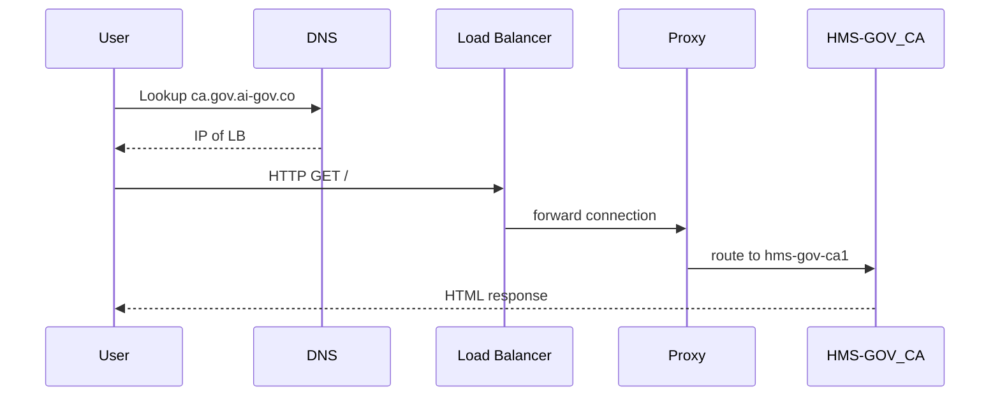

# Chapter 2: Domain Structure & Routing

In [Chapter 1: Tenant & CodifySubprojects](01_tenant___codifysubprojects_.md) we saw how data and users are isolated into Tenants and Subprojects. Now we’ll learn how our users actually reach the right silo over the internet—using domain names and routing—so each request lands on the correct HMS-GOV (admin) or HMS-MKT (public marketplace) instance.

---

## 1. Why Domains & Routing Matter

Imagine a citizen in California wants to check their housing benefits:
- They type `housing.ca.us.ai-gov.co` in their browser.
- DNS “reads” that address like a postal code and sends the request to the California-region HMS-GOV server.
- Meanwhile, someone in Texas browsing the public marketplace goes to `mkt.tx.us.ai-gov.co` and ends up at the Texas HMS-MKT server.

Just like postal codes guide mail to the right post office, our domain structure guides traffic to the right service.

---

## 2. Key Concepts

### 2.1 Hierarchical Domain Scheme

We use subdomains to encode:
- Region or jurisdiction (e.g., `us`, `ca`, `tx`)
- Service type (`gov` for admin, `mkt` for marketplace)
- Root domain (`ai-gov.co`)

Example domains:
- `us.gov.ai-gov.co` → Federal HMS-GOV  
- `ca.gov.ai-gov.co` → California HMS-GOV  
- `us.mkt.ai-gov.co` → Federal HMS-MKT  
- `tx.mkt.ai-gov.co` → Texas HMS-MKT  

### 2.2 DNS & Reverse Proxy Routing

1. **DNS**: Translates `ca.gov.ai-gov.co` to an IP (our load balancer).
2. **Load Balancer / Reverse Proxy**: Reads the incoming host header, then forwards traffic to the correct internal service instance (HMS-GOV or HMS-MKT) for that region.

---

## 3. How to Use Domain Routing

### 3.1 Define DNS Records

In a simple `config/dnsRecords.js` we map each host to a service:

```js
// config/dnsRecords.js
module.exports = {
  "us.gov.ai-gov.co":  "hms-gov-us1",
  "ca.gov.ai-gov.co":  "hms-gov-ca1",
  "us.mkt.ai-gov.co":  "hms-mkt-us1",
  "tx.mkt.ai-gov.co":  "hms-mkt-tx1"
}
```
This object tells our proxy server which internal instance handles each domain.

### 3.2 Reverse Proxy Logic

We use Express and a simple proxy to forward requests:

```js
// proxyServer.js
const express = require('express')
const proxy = require('http-proxy').createProxyServer()
const dnsRecords = require('./config/dnsRecords')
const app = express()

app.use((req, res) => {
  const target = dnsRecords[req.headers.host]
  proxy.web(req, res, { target: `http://${target}` })
})

app.listen(80, () => console.log('Proxy listening on port 80'))
```
*Explanation: We read `req.headers.host`, look up the target service in `dnsRecords`, then forward (`proxy.web`) to that internal address.*

---

## 4. Under the Hood: Request Flow

Below is a simple sequence of what happens when someone visits `ca.gov.ai-gov.co`:



1. **DNS** returns the IP of our load balancer.  
2. **User**’s browser connects to the load balancer.  
3. **Load Balancer** passes the request to our **Proxy**.  
4. **Proxy** reads `Host: ca.gov.ai-gov.co` and picks `hms-gov-ca1`.  
5. **HMS-GOV_CA** serves the page.

---

## 5. Internal Implementation Details

### 5.1 Proxy Configuration

We keep our routing logic in a small module:

```js
// src/proxy/routing.js
const dnsRecords = require('../../config/dnsRecords')

function getTarget(host) {
  return dnsRecords[host] || 'hms-gov-us1' // default
}

module.exports = { getTarget }
```
*`getTarget` returns the internal service name, defaulting to the federal admin.*

### 5.2 Main Proxy Server

```js
// src/proxy/index.js
const express = require('express')
const { getTarget } = require('./routing')
const proxy = require('http-proxy').createProxyServer()
const app = express()

app.use((req, res) => {
  const service = getTarget(req.headers.host)
  proxy.web(req, res, { target: `http://${service}:3000` })
})

app.listen(80)
```
Here we assume each internal service listens on port 3000 under its DNS name in our cluster.

---

## 6. Example: Adding a New Region

1. In `config/dnsRecords.js`, add:
   ```
   "ny.gov.ai-gov.co": "hms-gov-ny1"
   ```
2. Deploy a new `hms-gov-ny1` instance in New York region.
3. DNS propagation makes `ny.gov.ai-gov.co` start resolving to the load balancer.
4. Users in New York browse `ny.gov.ai-gov.co` and reach the correct server.

---

## 7. Conclusion & Next Steps

You’ve learned how we turn domain names into precise “postal codes” for our services—so every user lands on the right server for their region and interface (admin vs marketplace). Next, we’ll dive into our data foundations in [Chapter 3: Core Models (Program & Protocol)](03_core_models__program___protocol__.md).

---

Generated by [AI Codebase Knowledge Builder](https://github.com/The-Pocket/Tutorial-Codebase-Knowledge)