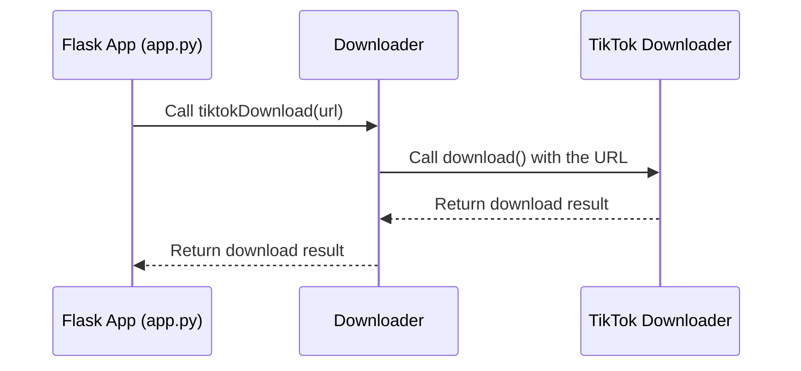

# Chapter 2: Downloader

In the previous chapter, [Flask App (app.py)](01_flask_app__app_py_.md), we learned how `app.py` acts as the central receptionist, receiving download requests. Now, let's meet the `Downloader`: the person who actually fetches the videos.

## What Problem Does the `Downloader` Solve?

Imagine our receptionist receives a request for a TikTok video. The receptionist doesn't know how to download TikTok videos directly.  That's where the `Downloader` comes in. It's like a universal remote control for downloading media.  It knows how to handle requests for different platforms (TikTok, YouTube, Instagram) and uses the correct "specialized remote" (platform-specific downloader) to get the job done.

## Understanding the `Downloader`

The `Downloader` is a Python class.  Think of a class as a blueprint for creating objects.  Each object created from this blueprint can perform specific actions, like downloading videos.

### Key Concepts:

1. **Platform-Specific Downloaders:** These are like specialized remotes for each platform (TikTok, YouTube, Instagram).  They handle the specifics of downloading from their respective platforms. We'll learn more about these in the next chapter: [Platform-Specific Downloaders (TikTok, YouTube, Instagram)](03_platform_specific_downloaders__tiktok__youtube__instagram_.md).

2. **Download Functions:** The `Downloader` has specific functions for each platform, like `tiktokDownload()`, `youtubeDownload()`, and `instagramDownload()`.  These functions use the appropriate platform-specific downloader to perform the download.

## Using the `Downloader`

Let's say we want to download a TikTok video. Here's how the `Downloader` would be used:

```python
# ... (other code)
dl = Downloader() # Create a Downloader object
download_result = dl.tiktokDownload("https://www.tiktok.com/@example/video/12345") # Download the TikTok video
# ... (process the download_result)
```

This code creates a `Downloader` object and then calls the `tiktokDownload()` function, passing the TikTok video URL. The `tiktokDownload()` function returns the download result, which contains information about whether the download was successful and the downloaded video information.

## Internal Implementation

Here's a simplified sequence diagram showing how the `Downloader` works:



When `app.py` calls `tiktokDownload()`, the `Downloader` creates a `TikTok` downloader object and calls its `download()` function. The `TikTok` downloader handles the actual download process and returns the result to the `Downloader`, which then returns it to `app.py`.

### Code Example: `downloader.py`

```python
# --- File: media-downloader/downloader.py ---
from lib.tiktok import TikTok # Import the TikTok downloader

class Downloader:
    def tiktokDownload(self, url):
        tiktok = TikTok(url) # Create a TikTok downloader object
        return tiktok.download() # Call the download function and return the result
```

This simplified code snippet shows the `tiktokDownload()` function. It creates a `TikTok` object (the specialized remote) and uses it to download the video.  Similar functions exist for YouTube and Instagram, using their respective downloaders.


## Conclusion

In this chapter, we learned how the `Downloader` acts as a universal remote control, handling downloads from different platforms using platform-specific downloaders. Next, we'll explore these [Platform-Specific Downloaders (TikTok, YouTube, Instagram)](03_platform_specific_downloaders__tiktok__youtube__instagram_.md) in more detail.


---

Generated by [AI Codebase Knowledge Builder](https://github.com/The-Pocket/Tutorial-Codebase-Knowledge)