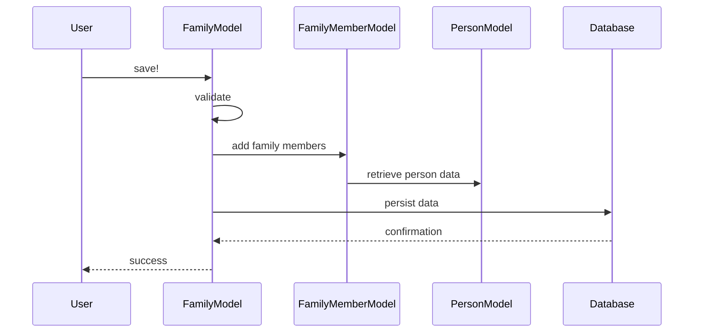

# Chapter 2: Family

In the previous chapter, [Person](01_person.md), we learned how to represent individuals in our system.  Now, let's explore how these individuals are grouped into families.

## What problem does `Family` solve?

Imagine Alice is applying for health insurance, and she wants to include her spouse, Bob, and her child, Charlie, in her application. How do we group Alice, Bob, and Charlie together as a single unit? The `Family` model solves this by representing a family unit. It's like a container that holds all the insurance-related information for everyone in the family.

## Key Concepts:

1. **Family Members:** A `Family` contains one or more [Person](01_person.md) objects as `family_members`. Each `family_member` has information about their relationship to the primary applicant (e.g., spouse, child).

2. **Primary Applicant:** Every `Family` has one designated `primary_applicant`. This is usually the person who initiates the application process.

3. **Households:** A `Family` can have one or more [Households](XX_household.md) (though usually just one active household).  A household contains financial and insurance application information.  We'll learn more about households in a later chapter.

4. **Enrollments:**  A `Family` tracks the family's [HbxEnrollment](06_hbxenrollment.md) records, which represent their health plan enrollments. We'll dive into enrollments in a later chapter.

## Using the `Family` model

Let's create a `Family` for Alice, Bob, and Charlie:

```ruby
# ... other code ...

alice = Person.find_by(first_name: "Alice") # Assuming Alice already exists
bob = Person.find_by(first_name: "Bob") # Assuming Bob already exists
charlie = Person.find_by(first_name: "Charlie") # Assuming Charlie already exists

family = Family.new
family.add_family_member(alice, is_primary_applicant: true)
family.add_family_member(bob, is_coverage_applicant: true) # Bob is applying for coverage
family.add_family_member(charlie, is_coverage_applicant: true) # Charlie is applying for coverage
family.save!

# ... other code ...
```

This code creates a new `Family` and adds Alice, Bob, and Charlie as `family_members`. Alice is designated as the `primary_applicant`.  Bob and Charlie are marked as `is_coverage_applicant: true`, indicating they are also applying for coverage under the family's application.

## Under the Hood

When you call `family.save!`, the `Family` model validates the data, ensures there's only one primary applicant, and persists the `Family` object and its associated `family_members` to the database.



The `add_family_member` method in `family.rb` handles adding members to the family:

```ruby
# family.rb
class Family
  # ... other code ...

  def add_family_member(person, opts = {})
    # ... other code (simplified for brevity) ...

    family_member = family_members.build(person: person, is_primary_applicant: opts[:is_primary_applicant])
    # ... other code ...
  end

  # ... other code ...
end
```

This simplified code snippet shows how the `add_family_member` method creates a new `family_member` embedded document and associates it with the given `person`.

## Conclusion

This chapter introduced the `Family` model, which groups individuals into family units for managing health insurance applications and enrollments. We learned about its key concepts and how to use it. In the next chapter, we'll explore [EmployerProfile](03_employerprofile.md).


---

Generated by [AI Codebase Knowledge Builder](https://github.com/The-Pocket/Tutorial-Codebase-Knowledge)