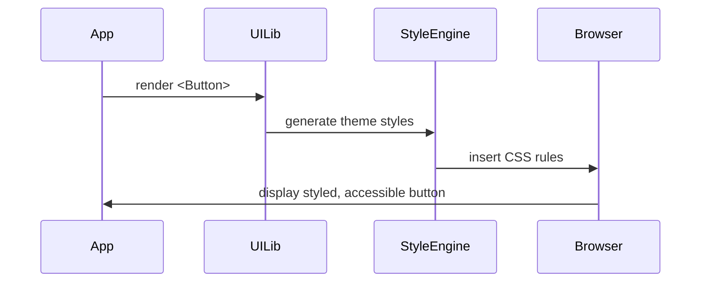

# Chapter 2: Frontend Interface Library

Welcome back! In [Chapter 1: Intent-Driven Navigation](01_intent_driven_navigation_.md), we learned how users pick a goal and see the right forms. Now, let’s build those forms with consistent, accessible UI—across both HMS-MFE and HMS-GOV—using our **Frontend Interface Library**.

---

## 1. Why a Frontend Interface Library?

Imagine two government portals:

  • **HMS-MFE** (public-facing)  
  • **HMS-GOV** (internal staff tools)

Without a shared toolkit, both teams redo buttons, modals, form fields—and risk drifting from accessibility or branding rules. Our **Frontend Interface Library** solves this by providing:

  • Prebuilt UI **components** (buttons, inputs, tables)  
  • A unified **theme** and **styles** (colors, spacing)  
  • Handy **utilities** (format dates, validate forms)  

It’s like a “Government Design System” in a box—plug in reliable, tested pieces instead of reinventing the wheel.

---

## 2. Key Concepts

1. **Components**  
   Reusable building blocks: `<Button>`, `<Modal>`, `<DataTable>`.  

2. **Styles & Theme**  
   Central definitions of colors, font sizes, spacing. Applied via a `ThemeProvider`.  

3. **Accessibility**  
   Every component meets WCAG standards (aria-labels, keyboard nav).  

4. **Utilities**  
   Helpers for common tasks: date formatting, API error handling, form validation.

---

## 3. Using the Library

Let’s walk through a simple citizen form with a submit button.

### 3.1 Install & Setup

First, install:

```bash
npm install @hms-mkt/ui-lib
```

Wrap your app in the theme:

```js
// src/index.js
import React from 'react'
import { ThemeProvider } from '@hms-mkt/ui-lib'
import App from './App'

ReactDOM.render(
  <ThemeProvider>
    <App />
  </ThemeProvider>,
  document.getElementById('root')
)
```

Explanation:  
`ThemeProvider` makes colors, fonts, and spacing rules available to all components.

### 3.2 Build a Simple Form

```js
// src/components/PermitForm.js
import React from 'react'
import { Input, Button } from '@hms-mkt/ui-lib'

export function PermitForm({ onSubmit }) {
  return (
    <form onSubmit={onSubmit}>
      <Input id="name" label="Your Name" required />
      <Input id="email" label="Email Address" type="email" required />
      <Button type="submit">Submit Application</Button>
    </form>
  )
}
```

What happens here:

  1. `<Input>` renders a styled, accessible text field.  
  2. `<Button>` uses our standard look—correct color contrast and hover states.  
  3. You get consistent spacing and focus outlines for keyboard users.

---

## 4. Under the Hood: How It Works

When you use `<Button>`, the library:

  1. Reads the theme (primary color, padding)  
  2. Generates CSS classes (via CSS-in-JS or SCSS)  
  3. Injects styles into the page  
  4. Renders a `<button>` with correct aria attributes

Here’s a minimal **sequence diagram**:



---

## 5. Inside the Library: A Peek at Code

Let’s see how `<Button>` might be built.

### 5.1 Theme Definition

```js
// ui-lib/theme.js
export const theme = {
  colors: { primary: '#005ea2', text: '#202124' },
  spacing: { small: '8px', medium: '16px' }
}
```

### 5.2 Theme Provider

```js
// ui-lib/ThemeProvider.js
import React, { createContext } from 'react'
import { theme } from './theme'

export const ThemeContext = createContext(theme)

export function ThemeProvider({ children }) {
  return (
    <ThemeContext.Provider value={theme}>
      {children}
    </ThemeContext.Provider>
  )
}
```

Explanation:  
We store `theme` in React Context so all components can read it.

### 5.3 Button Component

```js
// ui-lib/Button.jsx
import React, { useContext } from 'react'
import { ThemeContext } from './ThemeProvider'

export function Button({ children, ...props }) {
  const theme = useContext(ThemeContext)
  const style = {
    background: theme.colors.primary,
    color: '#fff',
    padding: theme.spacing.small
  }
  return (
    <button style={style} {...props}>
      {children}
    </button>
  )
}
```

Explanation:  
  • We grab colors and spacing from `ThemeContext`.  
  • Apply inline styles (or you could use a CSS-in-JS library).  
  • Spread extra props (`type`, `onClick`, etc.).

---

## 6. Analogy: Building with LEGO

Think of each UI component as a LEGO brick:

  • `<Input>` is a window brick (always the same shape).  
  • `<Button>` is a door brick (fits perfectly beside the window).  
  • The **theme** is the color scheme of your build.

You don’t carve each brick yourself—you trust the design system to give you quality, matching pieces.

---

## 7. Summary & Next Steps

You’ve seen how the **Frontend Interface Library**:

  • Provides reusable, accessible components  
  • Centralizes theme and styling  
  • Lets you build consistent government forms quickly  

Next up, we’ll learn how these components plug into the dynamic flows of our application—see [Chapter 3: Interface Layer](03_interface_layer_.md).

---

Generated by [AI Codebase Knowledge Builder](https://github.com/The-Pocket/Tutorial-Codebase-Knowledge)