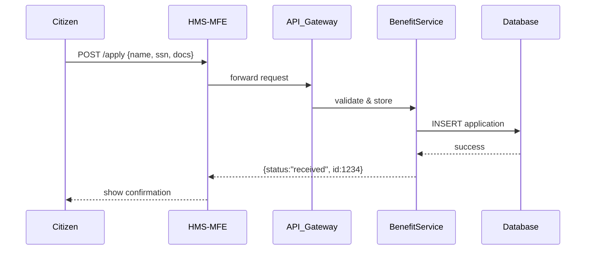
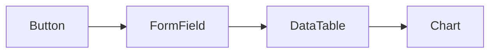

# Chapter 2: Frontend Interfaces (HMS-MFE / HMS-GOV)

Welcome back! In [Chapter 1: Interface Layer](01_interface_layer_.md), we saw how user requests flow into HMS-UHC. Now, let’s open the doors to the actual **web and mobile portals**—that’s what this chapter is all about.

---

## 1. Why Frontend Interfaces Matter

Imagine you’re applying for federal unemployment assistance online. You need:

- A **citizen portal** to fill out forms and upload documents.
- A **program manager dashboard** to review and verify applications.
- An **administrative console** for policy-makers to tweak eligibility rules.

HMS-UHC solves this by providing two tailored UIs:

- **HMS-MFE** (Micro-Frontend) for end users (citizens, case workers).  
- **HMS-GOV** for policy-makers and administrators.

Both use a **shared component library** so every button, form, and chart looks and behaves the same.

---

## 2. Key Concepts

1. **HMS-MFE (Citizen & Case-Worker UI)**  
   - Small, focused apps (micro-frontends) you load on demand.  
   - Examples: Benefit application form, document upload widget, status tracker.

2. **HMS-GOV (Policy-Maker Dashboard)**  
   - A single-page app with rich dashboards.  
   - Shows AI-generated flags (e.g., suspicious claims) and lets admins approve rules.

3. **Shared Component Library**  
   - Reusable building blocks (Buttons, DatePickers, DataTables).  
   - Ensures consistent branding and faster development.

---

## 3. Citizen Use Case: Applying for Benefits

Let’s walk through a simple scenario:  
**A citizen fills out a benefits application and sees a confirmation.**

### 3.1 High-Level Flow



1. **User** clicks “Submit Application.”  
2. **HMS-MFE** uses shared components to package the data.  
3. Request travels through our [Interface Layer](01_interface_layer_.md).  
4. **BenefitService** saves it, returns an ID.  
5. **HMS-MFE** displays a confirmation message.

### 3.2 Citizen Widget Example (React, <20 lines)

```jsx
// File: MFE/ApplyForm.jsx
import React, {useState} from 'react';
import api from './api'; // wraps fetch

export default function ApplyForm() {
  const [status, setStatus] = useState('');
  async function handleSubmit(e) {
    e.preventDefault();
    const payload = {name:e.target.name.value, ssn:e.target.ssn.value};
    const res = await api.post('/apply', payload);
    setStatus(`App ID: ${res.id}`);
  }
  return (
    <form onSubmit={handleSubmit}>
      <input name="name" placeholder="Full Name" required />
      <input name="ssn" placeholder="SSN" required />
      <button type="submit">Submit Application</button>
      <p>{status}</p>
    </form>
  );
}
```

Explanation:  
- We collect **name** and **ssn**, call our interface endpoint, and display the returned application ID.

---

## 4. Policy-Maker Use Case: Reviewing AI Recommendations

Policy-makers need to see which applications our AI flagged for manual review.

### 4.1 Dashboard Snippet (React + Shared Table)

```jsx
// File: GOV/Dashboard.jsx
import React, {useEffect, useState} from 'react';
import {DataTable} from 'shared-ui'; // from shared component library
import api from './api';

export default function Dashboard() {
  const [flags, setFlags] = useState([]);
  useEffect(() => {
    api.get('/flags').then(data => setFlags(data));
  }, []);
  return <DataTable columns={['AppID','Reason']} rows={flags} />;
}
```

Explanation:  
- On load, we `GET /flags` (requests routed via [Interface Layer](01_interface_layer_.md)).  
- We render the results in a **shared** `DataTable` component.

---

## 5. Under the Hood: Internal Implementation

### 5.1 Step-by-Step Walkthrough

1. **Component renders** and calls `api.get('/flags')`.  
2. **Interface Layer** proxies `/flags` to `HMS-SVC` service.  
3. **Service** queries the database for flagged apps.  
4. Data flows back through the same path to the UI.

### 5.2 Minimal Interface Layer Route (Node.js)

```js
// File: interface-layer/server.js
app.get('/flags', async (req, res) => {
  const resp = await fetch('http://hms-svc/flags');
  const data = await resp.json();
  res.json(data);
});
```

This is exactly like our `/apply` route, but in reverse (GET instead of POST).

---

## 6. Shared Component Library Highlights



- **Button**: Primary, Secondary, Disabled states.  
- **FormField**: Text, Date, File Upload.  
- **DataTable**: Sortable columns, pagination.  
- **Chart**: Line, Bar, Pie for reporting.

Shared-components are published as an NPM package. Both **HMS-MFE** and **HMS-GOV** simply import them.

---

## 7. Summary & Next Steps

In this chapter you learned:

- The difference between **HMS-MFE** (citizen/case-worker UI) and **HMS-GOV** (policy-maker dashboard).  
- How both portals share UI building blocks for consistency.  
- A walkthrough of submitting an application and reviewing AI flags.

Up next, we’ll make these portals *intelligent* by adding **Intent-Driven Navigation**.  
Continue to [Chapter 3: Intent-Driven Navigation](03_intent_driven_navigation_.md)!

---

Generated by [AI Codebase Knowledge Builder](https://github.com/The-Pocket/Tutorial-Codebase-Knowledge)