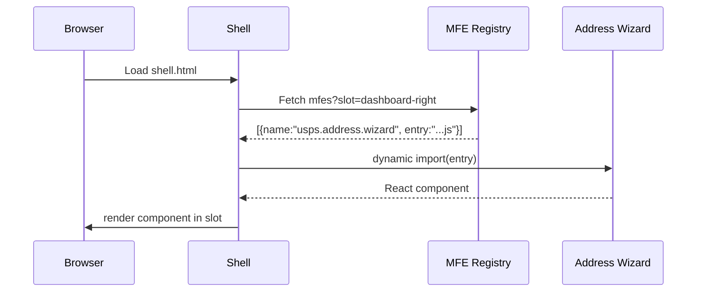
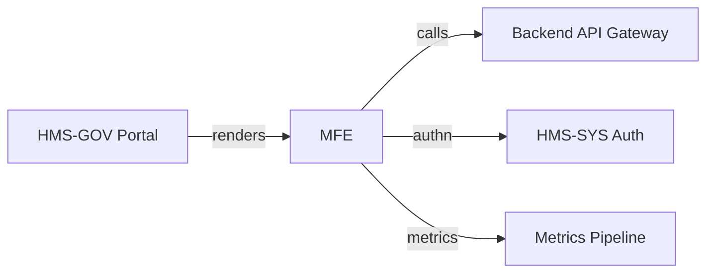

# Chapter 2: Frontend Micro-Frontend Layer (HMS-MFE)

*(A gentle sequel to [Gov / Admin Portal (HMS-GOV)](01_gov___admin_portal__hms_gov__.md))*  

---

## 1. Why Does HMS-MFE Exist?

Picture **Marcus**, an IT lead at the **U.S. Postal Service (USPS)**.  
This month his team must ship a new **“Change-of-Address”** wizard before tax-season traffic spikes.

Old way (monolith):  
1. Pull the entire portal down.  
2. Merge wizard code into a 300 k-line project.  
3. Coordinate a blanket release with five other agencies.  
4. Pray nothing breaks.

New way (HMS-MFE):  
1. Build the wizard as a *tiny* React app.  
2. Publish it behind a versioned URL.  
3. Tell the HMS shell, “Hey, load `usps.address.wizard` on demand.”  
4. Done—no portal-wide redeploy.

**HMS-MFE turns the portal into a smartphone-like home screen where every feature is its own app.**


---

## 2. Key Concepts in Plain English

| Term | Beginner Analogy | What It Means Here |
|------|------------------|--------------------|
| Shell | Your phone’s home screen | A lightweight page that never changes often. |
| Micro-Frontend (MFE) | An individual app icon | A mini-UI (JS + CSS + assets) for a single domain task. |
| Manifest | App Store listing | A JSON file saying *where* and *how* to load an MFE. |
| Slot | Empty parking space | A location in the shell where an MFE can appear. |
| Version Pinning | Choosing app version 1.2, not “latest” | Keeps critical workflows stable. |


---

## 3. A 5-Minute Hands-On Demo

Let’s add Marcus’s “Change-of-Address” wizard into the dev portal you spun up in Chapter 1.

### 3.1 Create the Wizard (stand-alone)

```tsx
// address-wizard/src/index.tsx
import React from 'react';
export default function Wizard() {
  return <h2>Change of Address Wizard 🚚📦</h2>;
}
```

*What you did*: wrote a *tiny* React component—nothing portal-specific yet.

---

### 3.2 Publish a Manifest

```json
// address-wizard/manifest.json
{
  "name": "usps.address.wizard",
  "version": "1.0.0",
  "entry": "https://cdn.usps.gov/mfe/address@1.0.0.js",
  "slot": "dashboard-right",
  "permissions": ["citizen.read", "address.update"]
}
```

Explanation (line-by-line):

1. `name` – unique key inside HMS-MFE registry.  
2. `entry` – URL for the compiled JS bundle.  
3. `slot` – tell the shell *where* it should show up.  
4. `permissions` – guardrails checked by [Role & Identity Management (HMS-SYS Auth)](10_role___identity_management__hms_sys_auth__.md).

---

### 3.3 Register With the Shell

```bash
hms-mfe add ./address-wizard/manifest.json
```

The CLI:

* uploads the manifest to the **MFE Registry**,  
* warms the CDN cache,  
* notifies running shells via WebSocket.

Refresh your browser—💥 the wizard pops into the right-hand panel!

---

## 4. What Just Happened? (Step-By-Step)



Plain English:

1. Shell loads, asks the registry “What MFEs belong in my slots?”  
2. For each manifest, it *dynamically imports* the JS bundle.  
3. The component mounts—no full-page reload, no redeploy.

---

## 5. Under the Hood (Simplified Code Tour)

### 5.1 Shell Loader

```ts
// shell/loadMfe.ts
export async function loadMfe(manifest) {
  // 1. Security check
  if (!userHas(manifest.permissions)) return;

  // 2. Dynamic import (Module Federation / ES import)
  const mod = await import(/* @vite-ignore */ manifest.entry);

  // 3. Mount into DOM slot
  const Slot = document.querySelector(`[data-slot=${manifest.slot}]`);
  Slot && mod.default?.(Slot);
}
```

Beginners’ view:

1. **Permission check** – call to Auth service.  
2. **Dynamic import** – browser downloads code on the fly.  
3. **Mount** – run the exported function/component inside the slot.

---

### 5.2 Tiny Registry Server (excerpt)

```ts
// registry/getManifests.ts
app.get('/mfes', (req, res) => {
  const slot = req.query.slot;
  // pretend DB query
  const list = db.find({ slot, enabled: true });
  res.json(list);
});
```

*Purpose*: give shells a filtered list so they only fetch what they need.

---

## 6. Handling Version Upgrades Safely

Scenario: USPS releases **v1.1** of the wizard.

1. Publish new manifest with `"version": "1.1.0"` and a *new* CDN URL.  
2. Mark **v1.0** as `deprecated` but keep it live for 30 days.  
3. Agencies pin a version in their tenant settings—zero surprises.

Need to roll back? Just flip the version pointer; users never feel downtime.


---

## 7. How HMS-MFE Plays with the Rest of the System



* MFEs **never** talk directly to microservices; they use the [Backend API Gateway](08_backend_api_gateway_.md).  
* Auth checks flow through [Role & Identity Management](10_role___identity_management__hms_sys_auth__.md).  
* Usage stats feed the [Metrics & Monitoring Pipeline](12_metrics___monitoring_pipeline_.md).


---

## 8. Recap

You learned:

• Why micro-frontends let each agency move at its own speed.  
• How a **manifest** plus a single CLI command can light up a new UI.  
• What happens behind the curtain when the shell loads an MFE.  

Up next we’ll see **how users *navigate* between all these MFEs without getting lost**—enter the intent-driven router.

👉 Continue to [Intent-Driven Navigation Engine](03_intent_driven_navigation_engine_.md)

---

Generated by [AI Codebase Knowledge Builder](https://github.com/The-Pocket/Tutorial-Codebase-Knowledge)