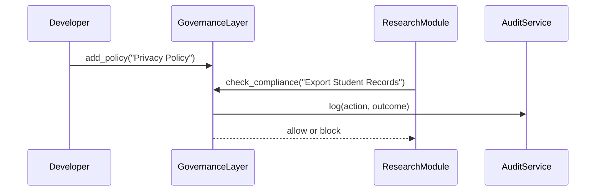

# Chapter 2: Governance Layer

In [Chapter 1: Hierarchical Model](01_hierarchical_model_.md), we organized our system into clear tiers: policy, operations, and interface. Now, we’ll dive into the **Governance Layer**—the top‐level “oversight committee” that ensures transparency, ethics, safety, and privacy across every component.

---

## 1. Why a Governance Layer?

Imagine you’re building a federal grants portal at the Institute of Education Sciences (IES). Researchers submit proposals, regional offices review them, and award decisions go out. Without strict oversight:

- Sensitive student data could leak.  
- Money might be awarded against ethics guidelines.  
- Audits become a manual headache.

The **Governance Layer** acts like an interagency council (think FFIEC or the Mississippi River Commission): it sets standards, enforces policies, and performs audits. Every action in your system—whether it’s exporting data, approving a request, or logging a transaction—must pass through this layer first.

---

## 2. Key Concepts

1. **Policy**  
   A named rule (e.g. “Privacy Policy”) that defines allowed or forbidden actions.  
2. **Compliance Check**  
   A function that queries policies before executing any critical operation.  
3. **Audit Log**  
   A record of all checks and their outcomes, ensuring transparency.  
4. **Oversight Committee**  
   The abstract governance body that holds every subsystem accountable.

---

## 3. Using the Governance Layer

Let’s see how you’d enforce a “no-export” rule on student records:

```python
# File: app.py
from hms_ach.governance_layer import GovernanceLayer

# 1. Initialize the governance layer
gov = GovernanceLayer()

# 2. Define a core policy
gov.add_policy(
    name="Privacy Policy",
    description="Block any export of raw student data."
)

# 3. When a module requests an action...
action = "Export Student Records"
if gov.check_compliance(action):
    print("✅ Action approved, proceeding...")
else:
    print("🚫 Blocked by governance layer")
```

Explanation:
- We create a `GovernanceLayer` instance.
- We register a `"Privacy Policy"`.
- Before exporting records, we call `check_compliance`.  
- The governance layer logs the check and returns `True` or `False`.

---

## 4. Under the Hood: What Happens Step‐by‐Step

Below is a simplified sequence of events when `check_compliance` runs:



1. **Policy registration**: the developer registers a rule.  
2. **Compliance request**: a subsystem asks, “Can I export?” 
3. **Audit logging**: every check goes into an audit log.  
4. **Decision**: governance returns “approved” or “blocked.”

---

## 5. Inside the GovernanceLayer Code

Let’s peek at a minimal implementation—file: `governance_layer.py`.

```python
# File: governance_layer.py

class GovernanceLayer:
    def __init__(self):
        self.policies = []    # list of dicts: {name, desc}
        self.audit_log = []   # records of all checks

    def add_policy(self, name, description):
        self.policies.append({"name": name, "desc": description})

    def check_compliance(self, action):
        # Very simple rule: if policy name contains "privacy"
        # and action mentions "export", we block it.
        violation = any(
            p["name"].lower().find("privacy") >= 0
            and "export" in action.lower()
            for p in self.policies
        )
        allowed = not violation
        # Record the check
        self.audit_log.append({"action": action, "allowed": allowed})
        return allowed
```

How it works:
- `self.policies` holds all registered rules.
- `check_compliance` scans each policy to spot violations.
- Every decision goes into `self.audit_log` for later review by auditors.

---

## 6. Conclusion

You’ve learned how the **Governance Layer**:

- Acts as an oversight committee, enforcing **transparency**, **ethics**, **safety**, and **privacy**.  
- Defines and checks **policies** before any critical action.  
- Logs every decision for **audits** and accountability.

Next up, we’ll see how department heads actually execute tasks under these rules in the [Management Layer](03_management_layer_.md).

---

Generated by [AI Codebase Knowledge Builder](https://github.com/The-Pocket/Tutorial-Codebase-Knowledge)