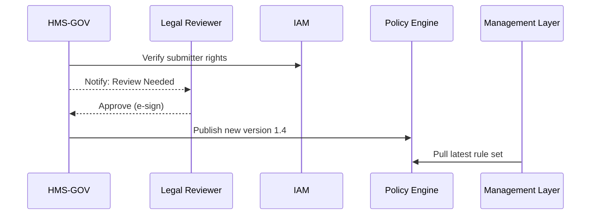

# Chapter 2: Governance Portal (HMS-GOV)


*(continuing from [Chapter 1: Three-Layer Architecture](01_three_layer_architecture__governance___management___interface__.md))*  

---

## 1. Why Do We Need a Governance Portal?

Imagine the *U.S. Department of Agriculture (USDA)* has five days to stand-up a **“Storm Relief Crop Subsidy”** program after a hurricane:

1. Congress passes an emergency bill late Friday.  
2. By Monday morning, field officers must know the *exact* eligibility rules.  
3. Citizens expect an online form by Tuesday.  
4. Auditors will inspect every penny next quarter.

Without a single “mission control room,” rules end up in e-mails, spreadsheets, and hallway conversations—​guaranteed chaos.  
**HMS-GOV** solves this by giving policy-makers one pane of glass to *write*, *approve*, and *publish* rules that every other HMS component can safely consume.

---

## 2. Mental Model: Control Tower for Government Programs ✈️

Think of flights (programs) arriving and departing:

| Control-Tower Screen | HMS-GOV Feature | Purpose |
|----------------------|-----------------|---------|
| Radar showing flights | **Program Catalog** | See every active grant, permit, or benefit |
| Flight path editor | **Policy Editor** | Change altitude = update eligibility formula |
| Clearance log | **Audit Trail** | Who gave permission, when |
| Weather alerts | **Live KPIs** | Real-time uptake, error rates |
| Co-pilot AI | **AI Policy Check** | Flags conflicts with existing laws |

---

## 3. Key Concepts Broken Down

### 3.1 Program Catalog
A searchable list of “artifacts” (policy bundles). Each item has:
- **Metadata:** agency, statute reference, funding cap.  
- **Current version:** e.g., `StormRelief_v1.3`.  
- **Lifecycle state:** Draft → Review → Published → Retired.

### 3.2 Policy Editor
A visual + YAML side-by-side editor. Non-technical staff drag sliders (“Max Subsidy $”) while power users tweak the YAML.

```yaml
# storm_relief.yml
eligibility:
  maxDamagePercent: 30   # % of crop lost
  regionCodes: ["LA-09", "TX-12"]
benefit:
  capUSD: 500000
version: 1.3
```

*One file, one source of truth.*

### 3.3 Version Control & Change Requests
Every save creates an immutable hash (like Git). A change request requires:
1. **Reviewer(s)** from Legal.
2. **Impact report** auto-generated by HMS-GOV.

### 3.4 Authority Matrix
Defines *who* may:
- Create a program
- Approve funding limits
- Retire a policy

Backed by [Identity & Access Management (IAM)](06_identity___access_management__iam__.md).

### 3.5 Live KPIs Dashboard
Pulls metrics from the [Observability Pipeline](14_observability___metrics_pipeline_.md). Shows:
- Applications/hour
- Average processing time
- Fraud alerts

### 3.6 AI Policy Assistant (Optional)
Runs large-language-model checks:
- Detects conflicting clauses.
- Suggests plain-language summaries.

---

## 4. Walking Through a Real Task: Raising the Subsidy Cap

Goal: Increase `capUSD` from $500,000 to $750,000.

### 4.1 In the Portal

1. **Search** “Storm Relief Crop Subsidy.”  
2. Click **“New Change Request.”**  
3. Edit the YAML or use the slider → `750 000`.  
4. Portal auto-fills *impact analysis*: “Raises projected outlay by $3.2 M.”  
5. Click **“Submit for Review.”**

### 4.2 What Happens Behind the Curtain?



Only five actors, yet the chain of custody is crystal-clear.

---

## 5. Consuming the New Policy Downstairs 🛗

Suppose the [Process & Policy Engine](03_process___policy_engine_.md) needs the latest rules. A **tiny** Python snippet:

```python
# management/pull_rules.py
import hms_sdk  # wrapper for internal APIs

rules = hms_sdk.governance.fetch("StormRelief_v1.4")
print(rules["benefit"]["capUSD"])   # ➜ 750000
```

Explanation:
1. `hms_sdk.governance.fetch()` hits a read-only endpoint.
2. No magic numbers—​everything flows from HMS-GOV.

---

## 6. A Peek at HMS-GOV Microservices (Simplified)

```
governance/
├─ api-gateway/        # REST & GraphQL facade
├─ policy-store/       # Git-style object store
├─ workflow-engine/    # Change-request state machine
├─ kpi-service/        # Streams metrics
└─ ai-policy-checker/  # Optional LLM microservice
```

### Example: Storing a New Version (Node.js, 14 lines)

```js
// policy-store/save.js
export async function savePolicy(doc) {
  const hash = sha256(JSON.stringify(doc));
  await db.put(hash, doc);        // immutable
  return { versionHash: hash };   // for audit trail
}
```

*Immutable writes guarantee auditors can replay history.*

---

## 7. Security & Audit Essentials

- **Digital Signatures**: Every approval is X.509-signed.  
- **Time-travel Queries**: “Show policy as of 2024-05-10.”  
- **Zero-Trust API**: All calls pass through [HMS-API Gateway](05_api_gateway___policy_endpoints__hms_api__.md) with JWTs issued by IAM.

---

## 8. Frequently Asked Beginner Questions

**Q1: Can developers skip HMS-GOV and hard-code rules?**  
A: Technically yes—but they’ll fail compliance checks, and the build pipeline will block deployment.

**Q2: How fast do changes propagate to live systems?**  
A: Default TTL is 60 seconds, configurable per program.

**Q3: What if two analysts edit the same field?**  
A: The portal detects conflicts and prompts a merge, just like GitHub.

---

## 9. Summary & What’s Next

You learned:

• HMS-GOV is the authoritative **mission control** for all rules.  
• Non-technical and technical users share one portal with strong audit guarantees.  
• A change request flows from edit → review → publish in minutes, feeding downstream layers automatically.

Ready to see how those freshly-minted policies get executed at scale?  
Jump to [Chapter 3: Process & Policy Engine](03_process___policy_engine_.md).

---

Generated by [AI Codebase Knowledge Builder](https://github.com/The-Pocket/Tutorial-Codebase-Knowledge)