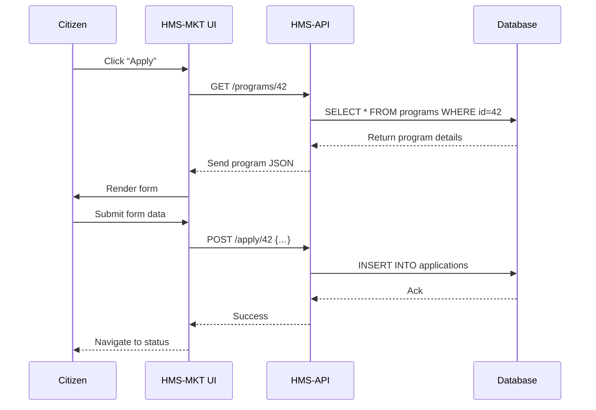

# Chapter 2: HMS-MKT (Citizen Portal)

In [Chapter 1: HMS-GOV (Admin/Gov Portal)](01_hms_gov__admin_gov_portal__.md), you saw how policymakers manage programs. Now we flip the view to citizens and public users: welcome to **HMS-MKT (Citizen Portal)**, the online kiosk where residents apply for services, track their requests, and chat with support.

---

## 1. Motivation & Central Use Case

**Problem:** Citizens bounce between paper forms, phone calls, and different websites to get help. They need a single, user-friendly portal to interact with government programs.

**Use Case Example:**  
Maria wants housing assistance:
1. She browses available programs.  
2. She fills out an online application.  
3. She checks her application status.  
4. She sends feedback or chats with a virtual agent.  

We’ll build a mini flow that:
- Lists programs  
- Opens an application form  
- Submits data  
- Shows status  

---

## 2. Key Concepts

1. **Program Catalog**  
   A storefront of all public programs, like a supermarket aisle of services.

2. **v-modal-forms**  
   A reusable form modal for applications, built to match government branding.

3. **Status Dashboard**  
   Shows real-time updates on each user’s application.

4. **Agent Chat**  
   A simple chat UI screen for citizen support.

5. **Template Marketplace**  
   Shared form templates (e.g., “Housing Aid Form v1.0”) for program builders.

---

## 3. Building Our Citizen Flow

### 3.1 Display the Program Catalog

```vue
<!-- src/pages/ProgramCatalog.vue -->
<template>
  <div>
    <h2>Available Programs</h2>
    <div v-for="p in programs" :key="p.id">
      <icon-box-colors :icon="'home'" />
      <span>{{ p.name }}</span>
      <button @click="startApplication(p.id)">
        Apply
      </button>
    </div>
  </div>
</template>

<script>
export default {
  data() { return { programs: [] } },
  async created() {
    this.programs = await this.$api.get('/programs') 
  },
  methods: {
    startApplication(id) { this.$router.push(`/apply/${id}`) }
  }
}
</script>
```
This component fetches all programs from **HMS-API** and lists them with an icon and an “Apply” button.

### 3.2 Open and Submit an Application

```vue
<!-- src/pages/ApplicationForm.vue -->
<template>
  <div>
    <h2>Apply for {{ program.name }}</h2>
    <v-modal-forms ref="appForm" :fields="program.fields" />
    <button @click="submit">Submit</button>
  </div>
</template>

<script>
export default {
  data() { return { program: {}, inputs: {} } },
  async created() {
    const id = this.$route.params.id
    this.program = await this.$api.get(`/programs/${id}`)
  },
  methods: {
    async submit() {
      const data = this.$refs.appForm.getData()
      await this.$api.post(`/apply/${this.program.id}`, data)
      this.$router.push('/status')
    }
  }
}
</script>
```
We use `v-modal-forms` to render fields and collect inputs, then POST them to HMS-API.

### 3.3 Check Application Status

```vue
<!-- src/pages/StatusDashboard.vue -->
<template>
  <div>
    <h2>Your Applications</h2>
    <ul>
      <li v-for="a in apps" :key="a.id">
        {{ a.programName }} – {{ a.status }}
      </li>
    </ul>
  </div>
</template>

<script>
export default {
  data() { return { apps: [] } },
  async created() {
    this.apps = await this.$api.get('/my-applications')
  }
}
</script>
```
This page pulls your application list and shows current statuses.

### 3.4 Chat with an Agent

```vue
<!-- src/components/AgentChat.vue -->
<template>
  <div class="chat-window">
    <gallery-images-curved />
    <!-- simplified chat UI -->
  </div>
</template>
<script>
export default { /* imagine a simple chat connection */ }
</script>
```
A placeholder for the chat screen where citizens can ask questions.

---

## 4. What Happens Under the Hood

When Maria applies, here’s a minimal flow:



---

## 5. Inside the Code

### 5.1 File Structure

```
hms-mkt/
├── src/
│   ├── pages/
│   │   ├── ProgramCatalog.vue
│   │   ├── ApplicationForm.vue
│   │   └── StatusDashboard.vue
│   └── components/
│       ├── AgentChat.vue
│       └── SharedComponents.js
└── plugins/
    └── api.js
```

### 5.2 API Wrapper (`plugins/api.js`)

```js
import axios from 'axios'
export const api = axios.create({
  baseURL: process.env.VUE_APP_API_URL
})
// In main.js: Vue.prototype.$api = api
```

### 5.3 Registering UI Components (`main.js`)

```js
import Vue from 'vue'
import { api } from './plugins/api'
import VModalForms from 'v-modal-forms'
import IconBox from 'icon-box-colors'
import Gallery from 'gallery-images-curved'

Vue.prototype.$api = api
Vue.component('v-modal-forms', VModalForms)
Vue.component('icon-box-colors', IconBox)
Vue.component('gallery-images-curved', Gallery)
```

These lines hook our HTTP client and branded form/chat components.

---

## 6. Conclusion & Next Steps

You’ve built a simple **Citizen Portal** that:
- Lists government programs  
- Lets users apply via a modal form  
- Shows application status  
- Prepares a chat interface  

Next up, we’ll break our UI into reusable pieces in [Chapter 3: HMS-MFE (Micro-Frontend Components)](03_hms_mfe__micro_frontend_components__.md). Stay tuned!

---

Generated by [AI Codebase Knowledge Builder](https://github.com/The-Pocket/Tutorial-Codebase-Knowledge)