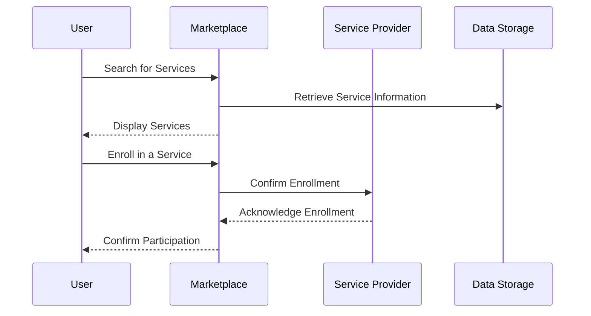

# Chapter 2: HMS-MKT

Welcome to Chapter 2 of our tutorial, where we explore `HMS-MKT`, the lively and interactive platform for accessing governmental services. In the first chapter, we learned about [HMS-A2A](01_hms_a2a_.md), the AI assistant that helps you navigate the complexities of government systems. Now, let's step into the vibrant world of `HMS-MKT`.

## What is HMS-MKT?

### Motivation and Use Case

Think of `HMS-MKT` as a bustling digital marketplace. Imagine needing to access several government services—whether it's finding information about local events, enrolling in a public program, or interacting with social support services. Instead of visiting different places or websites, `HMS-MKT` serves as a one-stop shop where you can explore, interact with, and share various governmental services.

`HMS-MKT` is designed to enhance your experience by:

- Offering an easy-to-navigate platform for accessing various services.
- Providing a space for interaction and feedback among citizens and service providers.
- Facilitating the sharing of information and support options.

## Understanding Key Concepts

### Key Concept 1: Interactive Platform

Just like a market, `HMS-MKT` lets you browse through different services. It visually organizes these options in a way that's user-friendly, allowing you to find what you need quickly.

### Key Concept 2: Community Involvement

Users (the citizens!) can interact with each other and with service providers. This interaction fosters a community where feedback can directly influence service improvements.

## How to Use HMS-MKT

Here’s a simple example of using `HMS-MKT`: finding and enrolling in a local community workshop.

```python
# Using HMS-MKT to enroll in a workshop

# Initialize the marketplace
marketplace = HMS_MKT()

# Search for a workshop
workshop_details = {
    "category": "Community Events",
    "location": "Downtown",
    "interest": "Art and Crafts"
}

# Enrolling in the workshop
marketplace.enroll_in_workshop(workshop_details)
```

### Explanation

- **Initialization**: We create an instance of `HMS-MKT`, the marketplace.
- **Searching**: We provide details to help locate workshops that match our interests and location.
- **Enrolling**: We use the platform to enroll in the chosen workshop, the system takes care of connecting us.

## Behind the Scenes

Curious about what happens when you interact with `HMS-MKT`? Let’s break it down in a simple sequence diagram:



### Step-by-Step Breakdown

1. **User Interaction**: You search for services or events using `HMS-MKT`.
2. **Data Retrieval**: The platform fetches details relevant to your search.
3. **Service Display**: It presents you with the available options.
4. **Enrollment**: When you decide to participate, it communicates with the service provider to complete your enrollment.
5. **Confirmation**: You receive a confirmation of your participation.

### Internal Implementation

Here’s a peek into how `HMS-MKT` might be implemented internally:

```plaintext
# Placeholder for HMS-MKT mechanics
class HMS_MKT:
    def enroll_in_workshop(self, details):
        # Step 1: Search matching events
        # Step 2: Connect with service provider
        # Step 3: Complete enrollment and notify user
        pass
```

This code snippet shows the essential steps: searching for events, connecting with providers, and confirming enrollment.

---

## Conclusion

In this chapter, you’ve discovered that `HMS-MKT` serves as a marketplace for citizens to explore and engage with various government services. It simplifies the process and fosters community interaction, enhancing the overall experience. You're now ready to explore [HMS-MFE](03_hms_mfe_.md) in the next chapter, where you'll dive deeper into the adaptability of these systems.

Eager for more insights? Let's continue our journey to [HMS-MFE](03_hms_mfe_.md) and see what lies ahead!

---

Generated by [AI Codebase Knowledge Builder](https://github.com/The-Pocket/Tutorial-Codebase-Knowledge)