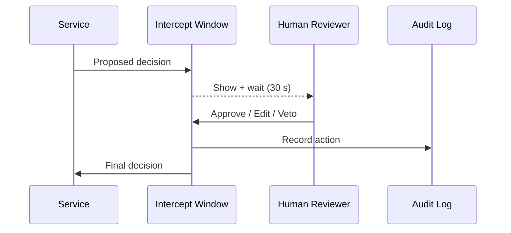

# Chapter 2: Human-in-the-Loop (HITL) Oversight Mechanism

*(Red-Phone Overrides for Sensitive AI Decisions)*  

[← Back to Chapter 1: Governance Layer](01_governance_layer__ai_governance_model__.md)

---

## 1. Why Add Humans When We Already Have Policies?

Picture this:

> An AI service auto-assigns disaster-relief grants after a flood in Kentucky.  
> At 2 a.m. it flags 42 families as **“ineligible”** because their addresses were mis-geocoded.  
> A county case-worker wakes up, sees the list, and instantly knows the data is wrong.

Without a **red phone** to intervene, payments will be blocked for a week while the code is patched.  
HITL makes sure a **human expert can step in, fix, or veto** any AI decision—*before* citizens feel the pain.

---

## 2. What Exactly Is HITL?

Think of HITL as:

* the Safety Switch on a factory robot,
* the Emergency Brake on a train,
* or—in government speak—the **“Administrator’s Override”** button.

Key promise:  
AI can act fast, **but a human remains the final authority**.  
Every touch is logged so we know *who* changed *what* and *why*.

---

## 3. HITL Building Blocks

| Block | Friendly Analogy | Role |
| --- | --- | --- |
| Intercept Window | 5-second TV broadcast delay | Small pause giving humans a chance to review. |
| Intervention Console | Air-traffic control screen | Where reviewers inspect, approve, or edit decisions. |
| Parameter Dashboard | Thermostat dial | Lets an expert gently nudge model thresholds. |
| Veto Button | Governor’s veto stamp | Hard rejection—decision never reaches production. |
| Immutable Audit Log | Security camera footage | Records every human action for later audits. |

---

## 4. Quick Story: “Stop the Bot” (U.S. Parole Commission)

1. **Bot** predicts whether a parole application is “Low”, “Med”, “High” risk.  
2. A *High Risk* prediction triggers automatic denial.  
3. Reviewer notices the applicant’s age was mis-parsed (19 ↔ 91).  
4. Reviewer hits **Veto**, changes risk to “Med”, adds note “DOB OCR error.”  
5. Audit Log keeps: *timestamp, old value, new value, reviewer ID*.

Result: justice served, no code deploy needed.

---

## 5. Using HITL in Your Service (Hands-On)

### 5.1 Mark a Decision as Interceptable

```python
# file: parole_bot.py
from hitl import interceptable

@interceptable(event="risk_assessment")
def assess_risk(record):
    score = model.predict(record)
    return "High" if score > 0.8 else "Med"
```

Explanation  
1. `@interceptable` tells HMS-CDF: “Hold this decision for human review.”  
2. The wrapper sends the raw result to the **Intercept Window** (default: 30 sec).

### 5.2 Override from the Console

```python
# In the Intervention Console (CLI snippet)
from hitl.console import override

override(decision_id="abc123",
         new_value="Med",
         comment="Age mis-parsed")
```

What happens:  
• Decision `abc123` is updated.  
• Audit log entry is written.  
• Workflow continues with the corrected value.

---

## 6. What Happens Under the Hood?



---

## 7. A Peek at the Implementation

### 7.1 Minimal Interceptor (18 lines)

```python
# file: hitl/core.py
import time, json, uuid

AUDIT = []

def interceptable(event):
    def decorator(fn):
        def wrapper(*args, **kw):
            decision = fn(*args, **kw)
            ticket = {
                "id": uuid.uuid4().hex,
                "event": event,
                "proposal": decision,
                "ts": time.time(),
                "status": "PENDING"
            }
            InterceptWindow.queue.append(ticket)
            return InterceptWindow.await_final(ticket["id"])
        return wrapper
    return decorator

class InterceptWindow:
    queue, overrides = [], {}
    @staticmethod
    def await_final(tid, pause=30):
        time.sleep(pause)               # 🔸 simple delay
        return InterceptWindow.overrides.get(tid,
                                             InterceptWindow.find(tid)["proposal"])
    @staticmethod
    def find(tid):
        return next(t for t in InterceptWindow.queue if t["id"] == tid)
```

Highlights  
* Wraps the original function.  
* Queues a **PENDING** ticket.  
* Waits 30 s for an override, then returns either new or original value.

### 7.2 Logging an Override (8 lines)

```python
# file: hitl/console.py
from hitl.core import InterceptWindow, AUDIT, time, json

def override(decision_id, new_value, comment=""):
    ticket = InterceptWindow.find(decision_id)
    ticket["status"] = "OVERRIDDEN"
    ticket["final"]  = new_value
    AUDIT.append({"id": decision_id,
                  "old": ticket["proposal"],
                  "new": new_value,
                  "comment": comment,
                  "ts": time.time()})
    print("OK – override recorded.")
```

Every entry in `AUDIT` can later be shipped to  
[System Observability & Ops Center](19_system_observability___ops_center__hms_ops__.md).

---

## 8. 60-Second Lab

1. Paste the two files above into a folder `hitl/`.  
2. Add the `parole_bot.py` function.  
3. Run:

```python
from parole_bot import assess_risk
print(assess_risk({"text": "dummy"}))   # pauses 30 s waiting for override
```

4. In another shell, call the CLI snippet using the printed `decision_id`.  
5. See the final decision appear. 🎉

---

## 9. How HITL Connects to Other Layers

* **Governance checks first**, then HITL adds a human safety net—see [Governance Layer](01_governance_layer__ai_governance_model__.md).  
* Overrides may trigger new regulations; those draft rules flow through the upcoming [HMS-CDF Legislative Workflow Engine](03_hms_cdf_legislative_workflow_engine_.md).  
* Audit records feed compliance metrics inside [Compliance Guardrail Framework (HMS-ESQ)](05_compliance_guardrail_framework__hms_esq__.md).

---

## 10. Recap & Next Steps

You learned:

1. Why fully automated AI is risky in public service.  
2. How HITL offers a **red-phone** override with clear accountability.  
3. How to mark functions as `@interceptable`, perform overrides, and view logs.  

Ready to see how new human insights turn into official policy?  
Continue to → [HMS-CDF Legislative Workflow Engine](03_hms_cdf_legislative_workflow_engine_.md)

---

Generated by [AI Codebase Knowledge Builder](https://github.com/The-Pocket/Tutorial-Codebase-Knowledge)