# Chapter 2: Intent-Driven Navigation & Guided Journeys

*(HMS-MKT Project)*  

[↠Back to Chapter 1: HMS-MFE Micro-Frontend Shell](01_hms_mfe_micro_frontend_shell_.md)

---

## 1. Why Bother?  
Picture Maria again. This time she clicks a single **“Renew my passport”** button on the HMS portal. She never cares which agency owns which step—the site should behave like a GPS:  

* Ask one question (“Where to?” → “Renew passport”).  
* Pick the fastest route (State Dept → DHS → USPS).  
* Reroute automatically if a toll road is closed (appointment slots full).  

Traditional menus make Maria hunt for the right page in three different agency sections. **Intent-Driven Navigation** hides that complexity by turning *outcomes* into *guided journeys*.

---

## 2. Key Ideas (Plain English)

| Term | What It Means |
|------|---------------|
| Intent | The citizen’s desired *outcome* (“renew-passport”, “apply-energy-rebate”). |
| Journey | Ordered list of steps that fulfil an intent. |
| Step | A single UI widget or API call (e.g., “Upload photo”). |
| Resolver | Tiny function that decides which journey to pick (e.g., adult vs. child passport). |
| Reroute | Dynamic swap of the remaining steps when something changes (missing document, outage). |

Keep these five words in mind—they are all we need for 80 % of use-cases.

---

## 3. Quick-Start: “Hello, Passport” Journey

We will describe, register, and launch a **renew-passport** intent in less than 30 lines of code.

### 3.1 Describe the Journey  
Create `journeys/renewPassport.json`:

```json
{
  "intent": "renew-passport",
  "title": "Renew Passport",
  "steps": [
    { "id": "eligibility", "widget": "state-eligibility-form" },
    { "id": "photo-upload", "widget": "photo-uploader" },
    { "id": "appointment", "widget": "usps-scheduler" },
    { "id": "payment", "widget": "treasury-pay" }
  ]
}
```

Explanation  
1. One *intent* maps to four *steps*.  
2. Each step points to a widget already pluggable in the [Micro-Frontend Shell](01_hms_mfe_micro_frontend_shell_.md).  

### 3.2 Register the Journey  
Inside the MFE shell, journeys are loaded at boot time:

```js
// mfe-shell/src/intentRegistry.js
import renewPassport from '../../journeys/renewPassport.json'

export const journeys = {
  [renewPassport.intent]: renewPassport
  // More journeys can be spread-in here
}
```

### 3.3 Navigate by Intent (1 line!)  

```js
import { navigateByIntent } from 'hms-intent-router'
navigateByIntent('renew-passport')
```

What happens?  
• The shell looks up the journey, mounts the first step, and shows a breadcrumb with *4 total steps*.  
• When `state-eligibility-form` emits `step:complete`, router loads the next widget automatically.

---

## 4. Under the Hood (No Scary Code)

```mermaid
sequenceDiagram
  participant U as User (Maria)
  participant S as MFE Shell
  participant R as Intent Router
  participant W as Current Widget
  U->>S: Click "Renew Passport"
  S->>R: navigateByIntent('renew-passport')
  R->>W: mount step #1 (eligibility)
  W-->>R: step:complete ✔
  R->>W: mount step #2 (photo-upload)
```



Only four moving parts. If *photo-upload* fails (e.g., camera denied), `step:error` event triggers Reroute logic—maybe skip to in-person USPS photo service.

---

## 5. Deeper Dive: Minimal Router Code

```js
// mfe-shell/src/intentRouter.js
export function navigateByIntent(intent) {
  const journey = journeys[intent]
  let idx = 0

  function mountStep() {
    const step = journey.steps[idx]
    shell.mountWidget(step.widget, {
      onComplete() { idx++; if (idx < journey.steps.length) mountStep() }
    })
  }

  mountStep()
}
```

Explanation  
1. `journey.steps[idx]` is the current road segment.  
2. Each widget calls `props.onComplete()` when done.  
3. Rerouting just changes `journey.steps` on the fly—no page reload.

---

## 6. Adding Intelligence: Resolvers & Branching

Citizens under 16 need parental consent. Let’s fork the journey with a simple resolver.

```js
export const resolvers = {
  'renew-passport': (context) =>
    context.age < 16 ? 'renew-passport-child' : 'renew-passport'
}
```

`navigateByIntent` first calls the resolver; result selects the right journey file. No huge if-else trees in widgets.

---

## 7. Real-World Agencies in the Mix

Step | Agency Widget | Example
-----|---------------|--------
`eligibility` | State Department | Checks prior passport number
`photo-upload` | National Council on Disability | Offers accessibility guidance
`appointment` | USPS | Picks a nearby office
`payment` | Treasury | Uses secure Pay.gov integration

Each agency owns its widget, but the citizen experiences *one* flow.

---

## 8. Testing Your Journey in 30 Seconds

```bash
# 1. Run shell in dev mode
npm run dev --workspace=mfe-shell

# 2. Open browser
# 3. Paste in console:
window.HMS.navigateByIntent('renew-passport')
```

You should see the eligibility form appear; complete it to auto-advance.

---

## 9. Where Is the Data Stored?  
Journey definitions live client-side for rapid UX tweaks, but every step’s **outputs** are persisted through the backend workflow engine found in [HMS-ACT Orchestration & Workflow Engine](08_hms_act_orchestration___workflow_engine_.md). That chapter will show how long-running processes survive browser crashes.

---

## 10. Recap

You learned to:  
• Think in *intents* instead of URLs.  
• Declare a journey in JSON.  
• Launch it with one JavaScript call.  
• Understand the tiny router that glues everything together.

Maria can now renew her passport without ever reading a site map. 🎉

[Next Chapter: HMS-MKT Agent & Data Marketplace](03_hms_mkt_agent___data_marketplace_.md)

---

Generated by [AI Codebase Knowledge Builder](https://github.com/The-Pocket/Tutorial-Codebase-Knowledge)