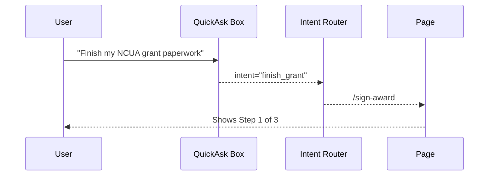

# Chapter 2: Intent-Driven Navigation & Journeys
*(GPS for Government Tasks)*  

[← Back to Chapter 1: Interface Layer (HMS-MFE)](01_interface_layer__hms_mfe__.md)

---

## 1. Why Bother?  
Picture Carla, a small-business owner who just won a **National Credit Union Administration (NCUA)** grant.  
She now needs to:

1. Sign the award letter  
2. Upload her W-9  
3. Register as a federal vendor

On most government sites she would:

• Click “Grants” → “Forms” → “Vendors” → *Oops, wrong agency* → back-button spiral → give up.  
Intent-Driven Navigation flips the script:

> App: “What do you need to accomplish?”  
> Carla: “Finish my NCUA grant paperwork.”  
> App: “Great! I’ll guide you—3 steps, ~10 min.”

Like a GPS, the platform **draws a route**, shows progress, and politely reroutes if Carla takes a detour.

---

## 2. Key Concepts (Plain English)

| Term | What It Means | Analogy |
|------|---------------|---------|
| Intent | A plain-language goal from the user. | “I want to renew my driver’s license.” |
| Journey | Ordered list of screens (waypoints) to fulfill an intent. | “Turn-by-turn directions.” |
| Waypoint | One discrete task/page in a journey. | “Stop at DMV form #DL-142.” |
| Nudge | Contextual hint or autofill suggestion. | “You’ve already entered your SSN earlier—reuse it?” |
| Abandon Guard | Detects when a user is stuck or idle and offers help. | “Still there? Need assistance?” |

---

## 3. A 2-Minute Code Peek

Below is an ultra-simplified **Intent Router** that lives in HMS-MFE.

```ts
// src/intent/intentRouter.ts
type Intent = "renew_license" | "submit_complaint" | "finish_grant";

const journeyMap = {
  renew_license: ["/ask-state", "/verify-id", "/payment"],
  submit_complaint: ["/choose-agency", "/details", "/review"],
  finish_grant: ["/sign-award", "/upload-w9", "/sam-registration"],
};

export function getJourney(intent: Intent) {
  return journeyMap[intent] || ["/unknown-intent"];
}
```

Explanation  
1. We define **3 intents** and their **journeys** (array of route paths).  
2. `getJourney("finish_grant")` returns an ordered list the router can iterate over.

```ts
// src/intent/goToNext.ts
export function goToNext(currentPath: string, journey: string[]) {
  const idx = journey.indexOf(currentPath);
  return journey[idx + 1] || "/done";
}
```

Carla completes `/upload-w9`; `goToNext` lands her on `/sam-registration`.

---

## 4. How It Feels for the User



---

## 5. Under the Hood (Step-by-Step)

1. **QuickAsk Box** sends Carla’s sentence to a tiny NLU model (or keyword lookup) to detect `intent`.  
2. **Intent Router** fetches the matching journey from `journeyMap`.  
3. **Progress Tracker Component** renders “Step 1 / 3”.  
4. When Carla hits “Next”, `goToNext()` decides the next waypoint.  
5. If she closes the tab, **Abandon Guard** sends her an email with a deep-link to resume.

---

## 6. Internal File Structure

```
hms-mfe/
  src/
    intent/
      intentRouter.ts      // maps intents ➜ journeys
      goToNext.ts          // step resolver
      nlu.ts               // super-light intent detection
    journeys/
      finishGrant/
        SignAward.tsx
        UploadW9.tsx
        SamRegistration.tsx
```

Each journey lives in its own folder—easy to version and A/B test.

---

## 7. Building a Tiny NLU (≤ 15 Lines)

```ts
// src/intent/nlu.ts
export function detectIntent(sentence: string) {
  const s = sentence.toLowerCase();
  if (s.includes("renew") && s.includes("license")) return "renew_license";
  if (s.includes("grant")) return "finish_grant";
  if (s.includes("complaint")) return "submit_complaint";
  return undefined;
}
```

Good enough for a demo—swap in a real AI model later.

---

## 8. Adding AI Nudges

```ts
// src/intent/nudge.ts
export function nudge(step: string) {
  const help = {
    "/upload-w9": "Tip: You can find a blank W-9 at irs.gov.",
    "/sam-registration": "Already have a SAM ID? We’ll auto-fill it.",
  };
  return help[step];
}
```

In any waypoint component:

```tsx
const hint = nudge(location.pathname);
{hint && <Alert info={hint} />}
```

Users feel guided, not lost.

---

## 9. Hands-On Exercise

1. Run `npm start`.  
2. Type “File a noise complaint” in the QuickAsk box.  
3. The app should jump to `/choose-agency` with **Step 1 / 3** at the top.  
4. Refresh the page—state persists via URL; you’re still on the same step. 🎉

---

## 10. Common Pitfalls & Fixes

| Pitfall | Symptom | Quick Fix |
|---------|---------|-----------|
| Unrecognized intent | User gets “Huh?” page | Add keywords to `nlu.ts` or train the model |
| Infinite loops | `goToNext` returns same page | Ensure every journey array has unique paths |
| Lost progress | Reload sends user to homepage | Persist `intent` & `currentStep` in `sessionStorage` |

---

## 11. Where This Connects

• The waypoints themselves are built with components from the [Modular Component Library](04_modular_component_library_.md).  
• Access to certain journeys is gated by [Role-Based Access Control (RBAC)](03_role_based_access_control__rbac__.md).

---

## 12. Summary & What’s Next

You learned how HMS turns a plain-language request into a **guided, AI-assisted journey**, reducing clicks and abandon rates.  

Next we’ll make sure only the right people can access the right journeys with [Role-Based Access Control (RBAC)](03_role_based_access_control__rbac__.md).

*Onward to secure, role-aware pathways!*

---

Generated by [AI Codebase Knowledge Builder](https://github.com/The-Pocket/Tutorial-Codebase-Knowledge)