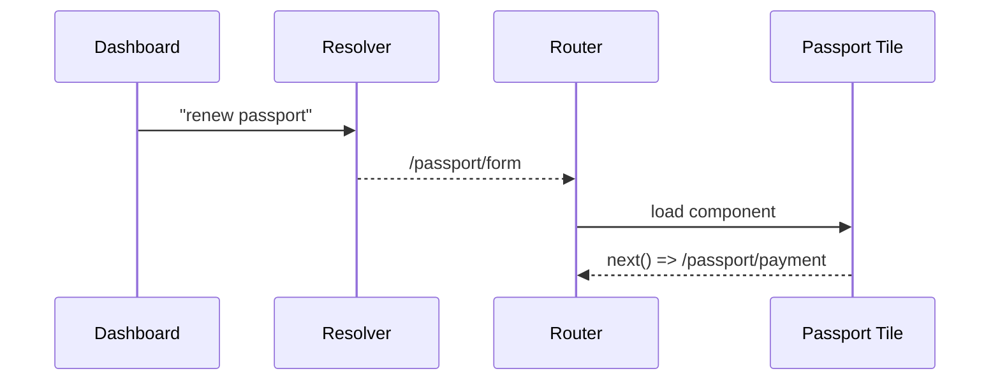

# Chapter 2: Intent-Driven Navigation


*(link back to [Chapter&nbsp;1: Policy Management UI](01_policy_management_ui_.md))*  

---

> “Tell the system **what** you need, not **where** to click.”  
> A citizen names the destination, HMS-GOV flies the whole route.

---

## 1. Why do we need Intent-Driven Navigation?

Picture Maria, a resident of **Springfield**, who just got married and now needs to **“update my last name on everything the city holds.”**

Traditional UI flow:

1. Search city website.  
2. Find DMV rename form.  
3. Discover voter-roll update lives on another site.  
4. Realize property-tax records require a third login.

Maria quits, phones city hall, everyone is frustrated.

**Intent-Driven Navigation (IDN)** flips the script.  
Maria types “change last name after marriage,” presses **Enter**, and HMS-GOV:

* Figures out three agencies are involved.  
* Creates a mini-workflow.  
* Opens the first required form, already pre-filled.

All Maria sees is *one* clear, linear path—no hunting for pages, no jargon.

---

## 2. Key Concepts in Plain English

| Term | Simple Analogy |
|------|----------------|
| Intent | A travel destination (“Go to Boston”) |
| Journey Map | The GPS itinerary (roads, toll booths) |
| Resolver | The dispatcher that picks the right itinerary |
| Step | A single screen/form in the path |
| Context | The passenger’s baggage—user ID, draft data, etc. |

We’ll build enough of this today to turn a short phrase—`"renew passport"`—into a working navigation flow.

---

## 3. The 30-Second Tour

1. **Clerk UI** (from Chapter 1) shows a search box.  
2. User enters an intent.  
3. `resolver.js` maps the phrase to a **Journey Map**.  
4. Router receives steps `/passport/form`, `/payment`, `/tracking`.  
5. Micro-frontends (tiles) open one after another.

---

## 4. Adding an Intent Box to the Dashboard

Open `components/PolicyDashboard.vue` and insert a tiny search bar.

```vue
<!-- PolicyDashboard.vue -->
<template>
  <div>
    <h1>Dashboard</h1>

    <!-- NEW: Intent box -->
    <input v-model="q" placeholder="What do you need?" />
    <button @click="go()">Go</button>
  </div>
</template>

<script setup>
import { ref } from 'vue'
import { resolveIntent } from '@/services/resolver.js'
import { useRouter } from 'vue-router'

const q = ref('')
const router = useRouter()

function go () {
  const firstStep = resolveIntent(q.value)          // 1. map phrase
  router.push(firstStep.path)                       // 2. open first tile
}
</script>
```

Explanation (beginner-friendly):

1. `q` stores what the user types.  
2. `resolveIntent()` converts any phrase into a **first** route.  
3. `router.push()` loads that page like normal Vue navigation.

---

## 5. The Smallest Possible Resolver

Create `services/resolver.js`.

```js
// resolver.js
const catalog = {
  'renew passport': [
    { path: '/passport/form'    },
    { path: '/passport/payment' },
    { path: '/passport/track'   }
  ],
  'file building complaint': [
    { path: '/buildings/complaint' }
  ]
}

export function resolveIntent(text) {
  text = text.toLowerCase().trim()
  return catalog[text]?.[0] || { path: '/not-found' }
}
```

How it works:

• `catalog` is a *baby* Journey Map library—just a JS object.  
• We pick the **first** step and return `/not-found` if we don’t know it yet.  
Later chapters will swap this file for an AI-powered lookup (see [AI Representative Agent](06_ai_representative_agent__hms_agt___hms_agx__.md)).

---

## 6. Chaining the Remaining Steps

Each page records completion and opens the next one.

```vue
<!-- pages/PassportForm.vue -->
<script setup>
import { useRouter, useRoute } from 'vue-router'
import { journey } from '@/services/journey.js'   // explained next
const router = useRouter()
const route  = useRoute()

function done() {
  const next = journey.next(route.path)          // figure out next hop
  if (next) router.push(next.path)
  else      alert('All finished! 🎉')
}
</script>

<template>
  <h2>Passport Form</h2>
  <!-- form fields here -->
  <button @click="done()">Continue</button>
</template>
```

Extra helper (`services/journey.js`)—10 lines:

```js
// journey.js
import { catalog } from './resolver.js'

export function next(currentPath) {
  for (const steps of Object.values(catalog)) {
    const idx = steps.findIndex(s => s.path === currentPath)
    if (idx >= 0) return steps[idx + 1]
  }
  return null
}
```

Now the sequence is automatic: Form → Payment → Tracking → Finished.

---

## 7. What Happens Under the Hood?



Only four moving parts—manageable for newcomers.

---

## 8. Hidden Helpers: Context & Pre-Fill

Real systems pre-fill forms with existing data.

```js
// very trimmed context store
export const ctx = {
  userId : 42,
  draft  : {}
}
```

Every tile can read/write `ctx.draft` and the next tile will see updated information—much like carrying your passport application from counter to counter.

---

## 9. Putting It All Together (A 60-Second Demo)

1. Run the dev server.  
2. In the Dashboard’s box type **renew passport** → press **Go**.  
3. `PassportForm.vue` appears. Fill one field, click **Continue**.  
4. Payment tile shows. Finish → Continue.  
5. “All finished! 🎉” pops up.

You never touched a URL; the system did the driving.

---

## 10. Under the Hood in the Wider HMS-GOV

Where does Intent-Driven Navigation connect to other layers?

* **Micro-Frontend Framework** handles page loading ([Chapter 3](03_micro_frontend_framework__hms_mfe__.md)).  
* **Governance API Layer** provides the data each tile needs ([Chapter 4](04_governance_api_layer__hms_svc___hms_api__.md)).  
* **AI Representative Agent** will later upgrade `resolver.js` so users can type natural language ([Chapter 6](06_ai_representative_agent__hms_agt___hms_agx__.md)).

Keep this map handy—the boxes will click together soon.

---

## 11. Recap

You learned:

✓ The pain Intent-Driven Navigation solves.  
✓ Key terms: intent, journey map, resolver, step, context.  
✓ How to add a search box that turns “renew passport” into a working flow.  
✓ Internals of the tiniest resolver and journey helper.  
✓ How this ties into the rest of HMS-GOV.

Ready to see how micro-frontends keep these tiles lightweight and independent? Jump to [Chapter 3: Micro-Frontend Framework (HMS-MFE)](03_micro_frontend_framework__hms_mfe__.md).

---

Generated by [AI Codebase Knowledge Builder](https://github.com/The-Pocket/Tutorial-Codebase-Knowledge)